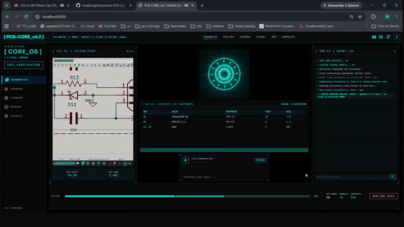
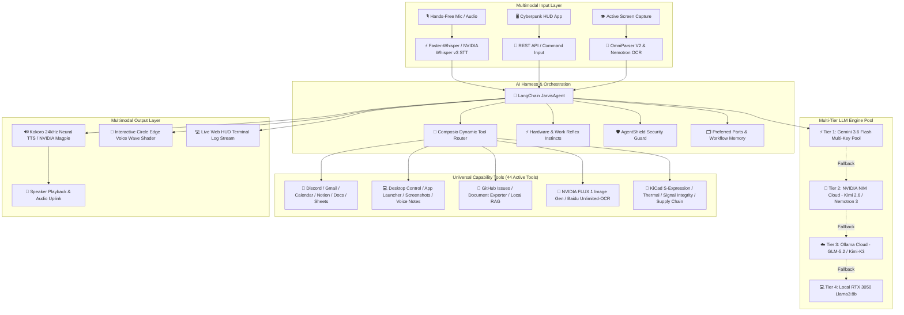

# 🤖 Jarvis AI — Universal Personal Assistant & Autonomous Work Copilot

A local, voice-activated "Jarvis-style" open-source AI assistant designed for **general productivity, daily work automation (Discord, Gmail, Calendar, Notion, Docs/Sheets), desktop app control, visual screen analysis, PDF document RAG, and specialized hardware/electronics engineering**.

<div align="center">

### 🎬 Live System Demo & Tactical HUD Walkthrough



[▶ Download / Watch Full Resolution Video (test.mp4)](https://raw.githubusercontent.com/medboughrara/Jarvis-PCB-Copilot/main/test.mp4)


</div>

---

> [!NOTE]
> **Universal Open-Source Personal Assistant**: Jarvis AI combines hands-free voice control, dynamic WebGL voice audio visualization, desktop app automation, real-time Discord & Google workspace messaging, document RAG, and domain-specific engineering solvers.

---

## 🏛️ Universal System Architecture & Execution Pipeline



---

## ⚡ Hardware Constraints & Local/Cloud Resource Distribution

Optimized to run seamlessly on a standard Windows laptop with an **Intel Core i5 CPU**, **24GB RAM**, and an **NVIDIA RTX 3050 GPU (6GB VRAM)**:

| Subsystem | Target Processor | Model / Framework | Optimization |
| :--- | :--- | :--- | :--- |
| **Wake Word Engine** | CPU | `openWakeWord` ("jarvis") | ONNX Runtime (CPU) |
| **Speech-to-Text (STT)** | CPU / Cloud | `Faster-Whisper` (`base.en`) / `NVIDIA Whisper v3` | `INT8` Quantization + Cloud API Fallback |
| **Text-to-Speech (TTS)** | CPU / Cloud | `Kokoro-82M` (24kHz) / `NVIDIA Magpie TTS` | ONNX Runtime + Cloud Neural Voice |
| **WebGL Voice Visualizer**| Web Browser | Custom GLSL Fragment Shader | Dynamic Standing Audio Wave on Arc Reactor Edge |
| **Orchestration & Harness** | CPU | LangChain + ECC Agent Harness | Reflex Rules + AgentShield + Context Compression |
| **LLM Tier 1 (Cloud Pool)** | Cloud Pool | `Google Gemini 3.6 Flash` (5 API Keys) | Round-Robin Rotation + 429 Rate Limit Cooling |
| **LLM Tier 2 (Cloud Pool)** | Cloud Pool | `Moonshot Kimi 2.6` & `NVIDIA Nemotron 3` | Deep Hardware & Logical Reasoning via NVIDIA NIM |
| **LLM Tier 3 (Cloud Pool)** | Cloud Pool | `Ollama Cloud` (`glm-5.2:cloud`, `kimi-k3:cloud`) | Secondary Cloud Fallback |
| **LLM Tier 4 (Local GPU)** | GPU RTX 3050 | `Llama 3 8B` (`ChatOllama`) | Zero-Downtime Offline Fallback |
| **Vision & Document OCR** | GPU / CPU | Baidu `Unlimited-OCR` & NVIDIA `Nemotron OCR v2` | Constant Memory R-SWA + Multi-Page Parsing |
| **App & Cloud Integrations**| Cloud / HTTP | Composio MCP Apps (1000+ Services) | **Discord**, Gmail, Calendar, Notion, Sheets, Docs |

---

## 🛠️ Complete Personal Assistant Capabilities Matrix (47 Active Tools)

| # | Capability Domain | Subsystem / Module | Key Functions & Features |
| :--- | :--- | :--- | :--- |
| **1** | **🎙️ Hands-Free Voice Pipeline** | `voice/` (`openWakeWord`, `Whisper`, `Kokoro`) | Voice wake word ("jarvis"), Faster-Whisper STT, and Kokoro 24kHz / NVIDIA Magpie neural speech synthesis. |
| **2** | **🌊 WebGL Voice Visualizer** | `ui/index.html` & `ui/app.js` | Interactive GLSL Arc Reactor fragment shader with dynamic standing audio wave undulating along the circle edge during speech. |
| **3** | **🕷️ Scrapling Adaptive Scraping** | `tools/scrapling_tool.py` | Adaptive web scraping & crawling with **Scrapling**: Cloudflare Turnstile bypass, Chrome TLS impersonation, adaptive element relocation, and AI-targeted markdown sanitization. |
| **4** | **💬 Discord Integration** | `tools/composio_apps_tool.py` | Direct **Discord** integration: send channel messages, fetch channel message history, and create new channels (`DISCORDBOT`). |
| **5** | **💻 Desktop & System Control** | `tools/system_control_tool.py` | Time/date & greetings, launch local apps (Notepad, Calculator, VS Code, Explorer), open URLs/websites, take screenshots, tell jokes, and log voice notes. |
| **6** | **📬 Workspace App Automation** | `tools/composio_apps_tool.py` | Full Composio integration for **Gmail** (fetch, send, search, drafts), **Google Calendar**, **Notion**, **Google Docs**, and **Google Sheets**. |
| **7** | **🧠 Multi-Tier LLM Brain Pool** | `agent/copilot.py` & `agent/key_manager.py` | 4-Tier Fallback: Tier 1 Gemini 3.6 Flash Pool -> Tier 2 NVIDIA NIM Cloud -> Tier 3 Ollama Cloud -> Tier 4 Local GPU `llama3:8b`. |
| **8** | **⚡ ECC Agent Harness Engine** | `agent/instincts.py`, `agent/security.py`, `agent/context_compressor.py` | Automatic hardware & work reflex rules, AgentShield workspace security guard, and incremental conversation history compressor. |
| **9** | **🗂️ Preferred Parts & Workflow Memory**| `tools/preferred_parts_tool.py` | User-preferred component library memory (JLCPCB basic parts, LDO regulators, passives, microcontrollers) persisting in `scratch/preferred_parts_library.json`. |
| **10**| **👁️ OmniParser Screen Vision** | `tools/omniparser_tool.py` | Active screen capture layout parsing with `RapidOCR` ONNX engine to inspect UI elements, component dialogs, and code editors. |
| **11**| **📚 Local PDF & Datasheet RAG** | `tools/datasheet_rag_tool.py` | Local document & datasheet RAG powered by **NVIDIA Nemotron 3 Embed 1B** and ChromaDB vector store. |
| **12**| **🌐 Live Web Search & Compliance** | `tools/reach_tool.py` | Live web search for technical datasheets, general information, and regulatory compliance (RoHS 3 / FCC Part 15). |
| **13**| **🎫 GitHub Issue & Repo Manager** | `tools/github_tool.py` | Log bugs, task reminders, or audit findings directly as labeled GitHub issues. |
| **14**| **📄 Engineering & General Doc Exporter**| `tools/doc_exporter_tool.py` | Formats and exports audit reports, meeting notes, or general document summaries to `docs/` and `scratch/` as Markdown/JSON. |
| **15**| **🎨 NVIDIA FLUX.1 Image Generator** | `tools/nvidia_nim_tool.py` | Text-to-Image generation for diagrams, UI concepts, and visuals via `black-forest-labs/flux.1-schnell`. |
| **16**| **🧩 Baidu Unlimited-OCR Long Parser** | `tools/unlimited_ocr_tool.py` | Long-horizon document parsing into structured Markdown using Baidu Reference Sliding Window Attention (`baidu/Unlimited-OCR`). |
| **17**| **📐 KiCad EDA & Circuit Parser** | `tools/kicad_tool.py` | KiCad `.kicad_sch` S-expression parser: builds `SchematicModel`, extracts components, generates power distribution trees, and runs ERC. |
| **18**| **🔥 IPC-2221 Thermal Trace Solver** | `tools/thermal_tool.py` | Calculates trace widths, copper $I^2R$ power loss, and junction temperature rise for voltage regulators ($T_j = T_a + P_d \cdot R_{\theta JA}$). |
| **19**| **⚡ Signal Integrity Bounds Solver** | `tools/signal_integrity_tool.py` | Calculates I2C pullup bounds ($R_{\min} / R_{\max}$), UART series damping resistors, and CAN bus split termination ($120\Omega$). |
| **20**| **📦 Supply Chain & Risk Tracker** | `tools/supply_chain_tool.py` | Evaluates component lifecycle (Active/NRND/EOL), distributor stock availability, and JLCPCB basic/extended part risk. |
| **21**| **📖 AAS & Claude Skill Playbooks** | `agent/skill_loader.py` & `skills/` | 11 Standardized SKILL.md playbooks: `web-scrapling`, `skill-comply`, `agentic-engineering`, `blueprint-architect`, `repo-scan`, `code-quality-auditor`, `pcb-thermal-analysis`, `emc-emi-hardening`, `sim2real-motor-calibration`, `github-pcb-issue-tracker`, `bom-cost-optimization`. |
| **22**| **🔌 Stdio MCP FastMCP Protocol** | `mcp_server.py` | Registers all 47 tools over stdio Model Context Protocol for direct integration into Cursor, Antigravity, Claude Code, and VS Code. |

---

## 🏗️ Project Architecture & Directory Layout

```
d:/aaaassistan_pcb/
├── config.py                 # Pydantic Settings & logger configuration
├── main.py                   # Async main execution loop (Wake Word -> STT -> LLM -> TTS)
├── mcp_server.py             # FastMCP Stdio MCP server for IDE integration
├── web_server.py             # Cyberpunk Tactical HUD REST API & static server
├── test_capabilities.py      # Standalone 18-capability system test suite
├── requirements.txt          # PyTorch CUDA 12.1, LangChain, & MCP dependencies
├── README.md                 # Project documentation
├── DISCORD_SETUP.md          # Setup guide for Discord Composio integration
├── demo.gif                  # Native GitHub animated video demo
├── test.mp4                  # High-resolution demonstration video
├── ui/                       # Cyberpunk Glassmorphic Tactical HUD Web Interface
│   ├── index.html            # Web HUD layout with Tailwind CSS & WebGL voice wave shader
│   └── app.js                # App logic, REST API bindings, & speech audio wave hooks
├── voice/
│   ├── wakeword.py           # openWakeWord CPU ONNX background listener
│   ├── stt.py                # Faster-Whisper STT + NVIDIA Whisper Large v3
│   └── tts.py                # Kokoro-82M 24kHz TTS + NVIDIA Magpie TTS
├── agent/
│   ├── copilot.py            # LangChain JarvisAgent with 47 active tools & multi-tier LLM pool
│   ├── session_context.py    # JarvisSessionContext per-session model container
│   ├── key_manager.py        # Multi-key Gemini rotation & real-time metrics manager
│   ├── composio_router.py    # Dynamic tool router & context optimizer
│   ├── skill_loader.py       # Standardized SKILL.md playbook loader
│   ├── instincts.py          # Automatic hardware & work reflex rules (ECC-inspired)
│   ├── security.py           # AgentShield workspace path & argument security guard
│   ├── context_compressor.py # Incremental token budget & history compressor
│   ├── workflows.py          # Autonomous multi-stage audit workflows
│   └── prompts.py            # System prompt persona configuration
├── skills/                   # AAS & Claude-style SKILL.md playbooks (11 Active Skills)
│   ├── web-scrapling/SKILL.md         # Scrapling adaptive stealth scraping & crawling
│   ├── agentic-engineering/SKILL.md   # Subagent delegation & task decomposition
│   ├── blueprint-architect/SKILL.md   # System architecture & sequence modeling
│   ├── code-quality-auditor/SKILL.md  # Linting, security auditing & type safety
│   ├── repo-scan/SKILL.md             # In-depth codebase scanning & ingestion
│   ├── skill-comply/SKILL.md          # Architectural & rule compliance verification
│   ├── pcb-thermal-analysis/SKILL.md  # IPC-2221 trace calculation & thermal modeling
│   ├── emc-emi-hardening/SKILL.md     # Passive filtering & EMI mitigation rules
│   ├── sim2real-motor-calibration/SKILL.md # Servomotor kinematics & driver alignment
│   ├── github-pcb-issue-tracker/SKILL.md   # Issue logging & review tracking
│   └── bom-cost-optimization/SKILL.md      # JLCPCB/LCSC component cost optimization
├── tools/
│   ├── scrapling_tool.py     # Scrapling adaptive web scraping, crawling & stealth extraction
│   ├── system_control_tool.py# Desktop system control (greeting, app launcher, website, screenshot, notes)
│   ├── composio_apps_tool.py # Active Discord, Gmail, Calendar, Notion, Docs, Sheets tools
│   ├── kicad_tool.py         # KiCad S-expression parser & power tree generator
│   ├── formatters.py         # Voice audio and CLI text presentation layer
│   ├── reach_tool.py         # Web search & compliance checker
│   ├── thermal_tool.py       # IPC-2221 trace width & regulator thermal solver
│   ├── signal_integrity_tool.py # I2C/UART/CAN signal integrity calculator
│   ├── supply_chain_tool.py  # Component lifecycle & stock risk tracker
│   ├── github_tool.py        # GitHub issue logger
│   ├── doc_exporter_tool.py  # Engineering & document report exporter
│   ├── preferred_parts_tool.py # Preferred component library & workflow memory
│   ├── omniparser_tool.py    # OmniParser V2 GUI screen capture parser
│   ├── datasheet_rag_tool.py # PDF document RAG with Nemotron Embed 1B & ChromaDB
│   ├── nvidia_nim_tool.py    # NVIDIA NIM APIs (FLUX.1, Whisper, Magpie, Nemotron OCR)
│   ├── composio_tool.py      # Composio MCP JSON-RPC integration
│   └── unlimited_ocr_tool.py # Baidu Unlimited-OCR document parser
├── docs/                     # Exported document reports & Markdown summaries
└── scratch/                  # Session logs, screen captures, and preferred parts memory JSON
```

---

## ⚡ Quick Start & Running Locally

1. **Activate Python 3.12 Virtual Environment**:
   ```powershell
   .\.venv\Scripts\Activate.ps1
   ```

2. **Launch Cyberpunk Web HUD Server**:
   ```powershell
   python web_server.py
   ```
   Open `http://localhost:8000` in your web browser to interact with the WebGL Arc Reactor voice wave visualizer.

3. **Launch Hands-Free Voice Assistant**:
   ```powershell
   python main.py
   ```

4. **Run System Capability Verification Suite**:
   ```powershell
   python test_capabilities.py
   ```

---

## 📜 License & Open-Source Ownership

This project is open-source under the **MIT License**. Created as a personal AI assistant for general work, productivity, automation, and hardware engineering.
