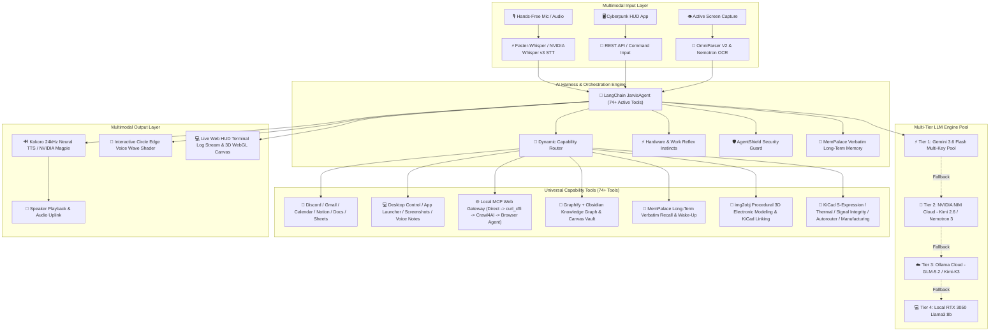

# 🤖 Jarvis AI — Universal Personal Assistant & Autonomous Work Copilot

A local, voice-activated "Jarvis-style" open-source AI assistant designed for **general productivity, daily work automation (Discord, Gmail, Calendar, Notion, Docs/Sheets), desktop app control, visual screen analysis, PDF document RAG, Graphify & Obsidian Knowledge Graphs, MemPalace Long-Term Memory, and specialized hardware/electronics engineering (3D procedural modeling, KiCad EDA, IPC-2221 thermal & autorouting)**.

<div align="center">

### 🎬 Live System Demo & Tactical HUD Walkthrough


</div>

---

> [!NOTE]
> **Universal Open-Source Personal Assistant**: Jarvis AI combines hands-free voice control, dynamic WebGL audio visualizers, desktop app automation, real-time Discord & Google workspace messaging, long-term spatial memory, interactive Obsidian knowledge graphs, procedural 3D electronic part generation, and automated KiCad PCB engineering.

---

## 🏛️ Universal System Architecture & Execution Pipeline



---

## ⚡ Hardware Constraints & Local/Cloud Resource Distribution

Optimized to run seamlessly on a standard Windows laptop with an **Intel Core i5 CPU**, **24GB RAM**, and an **NVIDIA RTX 3050 GPU (6GB VRAM)**:

| Subsystem | Target Processor | Model / Framework | Optimization |
| :--- | :--- | :--- | :--- |
| **Wake Word Engine** | CPU | `openWakeWord` ("jarvis") | ONNX Runtime (CPU) |
| **Speech-to-Text (STT)** | CPU / Cloud | `Faster-Whisper` (`base.en`) / `NVIDIA Whisper v3` | `INT8` Quantization + Cloud API Fallback |
| **Text-to-Speech (TTS)** | CPU / Cloud | `Kokoro-82M` (24kHz) / `NVIDIA Magpie TTS` | ONNX Runtime + Cloud Neural Voice |
| **WebGL Voice Visualizer**| Web Browser | Custom GLSL Fragment Shader | Dynamic Standing Audio Wave on Arc Reactor Edge |
| **Orchestration & Harness** | CPU | LangChain + ECC Agent Harness | Reflex Rules + AgentShield + Context Compression |
| **LLM Tier 1 (Cloud Pool)** | Cloud Pool | `Google Gemini 3.6 Flash` (5 API Keys) | Round-Robin Rotation + 429 Rate Limit Cooling |
| **LLM Tier 2 (Cloud Pool)** | Cloud Pool | `Moonshot Kimi 2.6` & `NVIDIA Nemotron 3` | Deep Hardware & Logical Reasoning via NVIDIA NIM |
| **LLM Tier 3 (Cloud Pool)** | Cloud Pool | `Ollama Cloud` (`glm-5.2:cloud`, `kimi-k3:cloud`) | Secondary Cloud Fallback |
| **LLM Tier 4 (Local GPU)** | GPU RTX 3050 | `Llama 3 8B` (`ChatOllama`) | Zero-Downtime Offline Fallback |
| **Long-Term Memory Engine** | CPU / Local | `MemPalace` (`all-MiniLM-L6-v2` ONNX) | Zero-Loss Verbatim Loci Hierarchy & Temporal Graph |
| **Knowledge Graph Engine** | CPU / Local | `Graphify` + AST Parsers | Obsidian Vault with Canvas, Wiki & Hub Labels |
| **3D Modeling Engine** | CPU / Browser | `img2obj` Procedural Builder + Three.js | Wavefront .OBJ/.MTL & WebGL Parametric Shaders |
| **Web Gateway Escalation** | CPU / Local | `curl_cffi` + `Crawl4AI` + Playwright | 4-Tier Anti-Bot & Autonomous Agent Fallback |
| **App & Cloud Integrations**| Cloud / HTTP | Composio MCP Apps (1000+ Services) | **Discord**, Gmail, Calendar, Notion, Sheets, Docs |

---

## 🛠️ Complete Capabilities Matrix (74+ Active Tools)

| # | Capability Domain | Subsystem / Module | Key Functions & Features |
| :--- | :--- | :--- | :--- |
| **1** | **🎙️ Hands-Free Voice Pipeline** | `voice/` (`openWakeWord`, `Whisper`, `Kokoro`) | Voice wake word ("jarvis"), Faster-Whisper STT, and Kokoro 24kHz / NVIDIA Magpie neural speech synthesis. |
| **2** | **🌊 WebGL Voice Visualizer** | `ui/index.html` & `ui/app.js` | Interactive GLSL Arc Reactor fragment shader with dynamic standing audio wave undulating along the circle edge during speech. |
| **3** | **🧠 Graphify + Obsidian Vault** | `tools/obsidian_knowledge_graph_tool.py` | Extracts AST code relationships and semantic clusters into a complete Obsidian Vault (911 linked notes, `Architecture_Graph.canvas`, `Interactive_Graph.html`, Agent Wiki, and custom subsystem color filters). |
| **4** | **🏰 MemPalace Long-Term Memory** | `tools/mempalace_tool.py` | 100% Local-first verbatim memory using the spatial Method of Loci (`Wings -> Rooms -> Halls -> Drawers`), temporal SQLite entity graph, and fast L0/L1 wake-up briefing (~800 tokens). |
| **5** | **📐 img2obj 3D Component Modeler**| `tools/img2obj_component_3d_tool.py` | Procedurally generates Wavefront `.obj`/`.mtl` and Three.js 3D models for electronic packages (0402, 0603, 0805, SOT-223, SOIC-8, TSSOP-28, QFP-48, QFN-32, TO-220, USB-C) and links them to `.kicad_pcb` footprints. |
| **6** | **🌐 Local MCP Web Gateway** | `gateway/` | 4-Tier escalation ladder: Tier 1 Direct HTTP $\to$ Tier 2 `curl_cffi` TLS/JA3 $\to$ Tier 3 Crawl4AI/Playwright JS $\to$ Tier 4 Autonomous Vision Browser Agent. |
| **7** | **💬 Discord Integration** | `tools/composio_apps_tool.py` | Direct **Discord** integration: send channel messages, fetch channel message history, and create new channels (`DISCORDBOT`). |
| **8** | **💻 Desktop & System Control** | `tools/system_control_tool.py` | Time/date & greetings, launch local apps (Notepad, Calculator, VS Code, Explorer), open URLs/websites, take screenshots, tell jokes, and log voice notes. |
| **9** | **📬 Workspace App Automation** | `tools/composio_apps_tool.py` | Full Composio integration for **Gmail** (fetch, send, search, drafts), **Google Calendar**, **Notion**, **Google Docs**, and **Google Sheets**. |
| **10**| **🧠 Multi-Tier LLM Brain Pool** | `agent/copilot.py` & `agent/key_manager.py` | 4-Tier Fallback: Tier 1 Gemini 3.6 Flash Pool -> Tier 2 NVIDIA NIM Cloud -> Tier 3 Ollama Cloud -> Tier 4 Local GPU `llama3:8b`. |
| **11**| **⚡ ECC Agent Harness Engine** | `agent/instincts.py`, `agent/security.py`, `agent/context_compressor.py` | Automatic hardware & work reflex rules, AgentShield workspace security guard, and incremental conversation history compressor. |
| **12**| **🗂️ Preferred Parts & Circuit Templates**| `tools/preferred_parts_tool.py` & `tools/circuit_templates_tool.py` | Component library memory & parametric circuit generators (LDO regulators, buck converters, voltage dividers, BME280 sensor breakout). |
| **13**| **🔁 Self-Correcting ERC/DRC Loop**| `agent/verify_loop.py` | Autonomous Agentic Verification Loop executing KiCad ERC/DRC, catching design violations, and auto-correcting schematic nets. |
| **14**| **🛤️ 2-Layer Grid Autorouter** | `tools/autorouter_tool.py` | Automated multi-layer grid autorouter with 45-degree trace routing and DFM rule verification. |
| **15**| **🏭 Turnkey Manufacturing Exporter**| `tools/manufacturing_tool.py` | Automated fabrication export: RS-274X Gerbers, Excellon NC Drills, Pick-and-Place (CPL), BOM CSV, and JLCPCB cost estimation. |
| **16**| **👁️ OmniParser Screen Vision** | `tools/omniparser_tool.py` | Active screen capture layout parsing with `RapidOCR` ONNX engine to inspect UI elements, component dialogs, and code editors. |
| **17**| **📚 Local PDF & Datasheet RAG** | `tools/datasheet_rag_tool.py` | Local document & datasheet RAG powered by **NVIDIA Nemotron 3 Embed 1B** and ChromaDB vector store. |
| **18**| **🌐 Live Web Search & Compliance** | `tools/reach_tool.py` | Live web search for technical datasheets, general information, and regulatory compliance (RoHS 3 / FCC Part 15). |
| **19**| **🎫 GitHub Issue & Repo Manager** | `tools/github_tool.py` | Log bugs, task reminders, or audit findings directly as labeled GitHub issues. |
| **20**| **📄 Engineering & General Doc Exporter**| `tools/doc_exporter_tool.py` | Formats and exports audit reports, meeting notes, or general document summaries to `docs/` and `scratch/` as Markdown/JSON. |
| **21**| **🎨 NVIDIA FLUX.1 Image Generator** | `tools/nvidia_nim_tool.py` | Text-to-Image generation for diagrams, UI concepts, and visuals via `black-forest-labs/flux.1-schnell`. |
| **22**| **🧩 Baidu Unlimited-OCR Long Parser** | `tools/unlimited_ocr_tool.py` | Long-horizon document parsing into structured Markdown using Baidu Reference Sliding Window Attention (`baidu/Unlimited-OCR`). |
| **23**| **📐 KiCad EDA & Circuit Parser** | `tools/kicad_tool.py` & `tools/kicad_editor.py` | Direct KiCad `.kicad_sch` & `.kicad_pcb` S-expression AST manipulation and net wiring. |
| **24**| **🔥 IPC-2221 Thermal Trace Solver** | `tools/thermal_tool.py` | Calculates trace widths, copper $I^2R$ power loss, and junction temperature rise for voltage regulators ($T_j = T_a + P_d \cdot R_{\theta JA}$). |
| **25**| **⚡ Signal Integrity Bounds Solver** | `tools/signal_integrity_tool.py` | Calculates I2C pullup bounds ($R_{\min} / R_{\max}$), UART series damping resistors, and CAN bus split termination ($120\Omega$). |
| **26**| **📦 Supply Chain & Risk Tracker** | `tools/supply_chain_tool.py` | Evaluates component lifecycle (Active/NRND/EOL), distributor stock availability, and JLCPCB basic/extended part risk. |
| **27**| **🔌 Stdio FastMCP Server (74+ Tools)** | `mcp_server.py` | Automatically exposes all 74+ Jarvis tools over stdio Model Context Protocol for direct integration into Claude Code, Cursor, Windsurf, and VS Code. |

---

## 🏗️ Project Architecture & Directory Layout

```
d:/aaaassistan_pcb/
├── config.py                 # Pydantic Settings & logger configuration
├── main.py                   # Async main execution loop (Wake Word -> STT -> LLM -> TTS)
├── mcp_server.py             # FastMCP Stdio MCP server exposing 74+ dynamic tools
├── web_server.py             # Cyberpunk Tactical HUD REST API & static server
├── test_capabilities.py      # System capability verification suite
├── requirements.txt          # PyTorch CUDA 12.1, LangChain, MemPalace & MCP dependencies
├── README.md                 # Project documentation & capability matrix
├── DISCORD_SETUP.md          # Setup guide for Discord Composio integration
├── demo.gif                  # Native GitHub animated video demo
├── ui/                       # Cyberpunk Glassmorphic Tactical HUD Web Interface
│   ├── index.html            # Web HUD layout with Tailwind CSS & WebGL voice wave shader
│   └── app.js                # App logic, REST API bindings, & speech audio wave hooks
├── gateway/                  # Local MCP Web Gateway (4-Tier Escalation Architecture)
│   ├── escalation_engine.py  # Transparent routing (Direct -> curl_cffi -> Crawl4AI -> Agent)
│   ├── cleaner.py            # Resilient HTML-to-Markdown cleaner
│   ├── cache_and_politeness.py # In-memory TTL cache & domain throttling
│   ├── mcp_gateway_tool.py   # Gateway MCP tools (get_web_content, browse_web_page, etc.)
│   └── transports/           # Direct, Antibot (curl_cffi), Crawl4AI, Browser Agent, Bulk Crawler
├── obsidian_vault/           # Graphify-Generated Obsidian Knowledge Graph Vault
│   ├── .obsidian/graph.json  # Subsystem color groupings and physics settings
│   ├── Architecture_Graph.canvas # Obsidian Infinite Visual Whiteboard
│   ├── Interactive_Graph.html# Standalone D3/WebGL interactive graph viewer
│   ├── Wiki/                 # Cross-referenced Agent Wiki articles
│   └── ... (911 interconnected [[wikilink]] Markdown notes)
├── voice/
│   ├── wakeword.py           # openWakeWord CPU ONNX background listener
│   ├── stt.py                # Faster-Whisper STT + NVIDIA Whisper Large v3
│   └── tts.py                # Kokoro-82M 24kHz TTS + NVIDIA Magpie TTS
├── agent/
│   ├── copilot.py            # LangChain JarvisAgent with 74+ active tools & multi-tier LLM pool
│   ├── session_context.py    # JarvisSessionContext per-session model container
│   ├── key_manager.py        # Multi-key Gemini rotation & real-time metrics manager
│   ├── composio_router.py    # Dynamic tool router & context optimizer
│   ├── verify_loop.py        # Self-correcting ERC/DRC agentic verify loop
│   ├── instincts.py          # Automatic hardware & work reflex rules (ECC-inspired)
│   ├── security.py           # AgentShield workspace path & argument security guard
│   ├── context_compressor.py # Incremental token budget & history compressor
│   ├── workflows.py          # Autonomous multi-stage audit workflows
│   └── prompts.py            # System prompt persona configuration
├── skills/                   # AAS & Claude-style SKILL.md playbooks
├── tools/
│   ├── obsidian_knowledge_graph_tool.py # Graphify AST & Obsidian Vault / Canvas generator
│   ├── mempalace_tool.py     # MemPalace verbatim long-term memory & wake-up context
│   ├── img2obj_component_3d_tool.py # Procedural 3D .OBJ/Three.js electronic part builder
│   ├── circuit_templates_tool.py # Parametric circuit generator
│   ├── autorouter_tool.py    # 2-layer grid autorouter & DFM checker
│   ├── manufacturing_tool.py # Turnkey Gerbers, NC drill, CPL, and BOM exporter
│   ├── kicad_editor.py       # S-expression schematic & PCB direct AST editor
│   ├── kicad_tool.py         # KiCad S-expression parser & power tree generator
│   ├── system_control_tool.py# Desktop system control (greeting, app launcher, screenshot, notes)
│   ├── composio_apps_tool.py # Active Discord, Gmail, Calendar, Notion, Docs, Sheets tools
│   ├── thermal_tool.py       # IPC-2221 trace width & regulator thermal solver
│   ├── signal_integrity_tool.py # I2C/UART/CAN signal integrity calculator
│   ├── supply_chain_tool.py  # Component lifecycle & stock risk tracker
│   ├── preferred_parts_tool.py # Preferred component library & workflow memory
│   ├── omniparser_tool.py    # OmniParser V2 GUI screen capture parser
│   ├── datasheet_rag_tool.py # PDF document RAG with Nemotron Embed 1B & ChromaDB
│   ├── nvidia_nim_tool.py    # NVIDIA NIM APIs (FLUX.1, Whisper, Magpie, Nemotron OCR)
│   ├── reach_tool.py         # Web search & compliance checker
│   └── doc_exporter_tool.py  # Engineering & document report exporter
└── tests/                    # 100% Passing Unit & Integration Test Suites
```

---

## ⚡ Quick Start & Running Locally

1. **Activate Python 3.12 Virtual Environment**:
   ```powershell
   .\.venv\Scripts\Activate.ps1
   ```

2. **Launch Cyberpunk Web HUD Server**:
   ```powershell
   python web_server.py
   ```
   Open `http://localhost:8000` in your web browser to interact with the WebGL Arc Reactor voice wave visualizer.

3. **Launch Hands-Free Voice Assistant**:
   ```powershell
   python main.py
   ```

4. **Generate & Open the Obsidian Knowledge Graph**:
   ```powershell
   python scratch/run_obsidian_tools.py
   ```
   Open `d:\aaaassistan_pcb\obsidian_vault` in **Obsidian** to view `Architecture_Graph.canvas` and the interactive graph.

5. **Generate 3D Electronic Component Models**:
   ```python
   from tools.img2obj_component_3d_tool import generate_3d_part_from_image_or_spec
   res = generate_3d_part_from_image_or_spec.invoke({"package_or_image": "SOT-223", "output_name": "ams1117_sot223"})
   ```

6. **Run Full Test Suite**:
   ```powershell
   python -m unittest discover tests
   ```

---

## 📜 License & Open-Source Ownership

This project is open-source under the **MIT License**. Created as a personal AI assistant for general work, productivity, automation, and hardware engineering.
