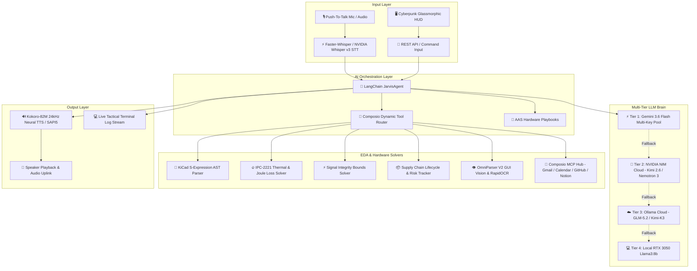
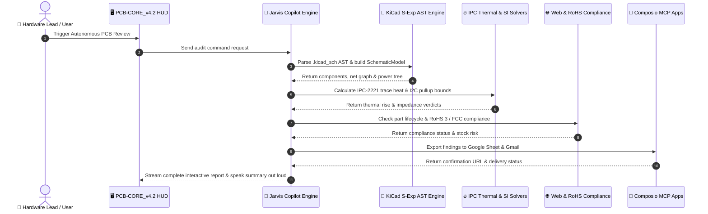

# 🤖 Jarvis PCB Copilot

A local, voice-activated "Jarvis-style" open-source AI copilot designed for PCB schematic review, electronic component selection, power distribution tree generation, regulatory compliance checks (RoHS/FCC), IPC-2221 thermal analysis, signal integrity, supply chain EOL tracking, and KiCad EDA design automation.

<div align="center">

### 🎬 Live System Demo & Tactical Engineering HUD Walkthrough


[▶ Download / Watch Full Resolution Video (test.mp4)](https://raw.githubusercontent.com/medboughrara/Jarvis-PCB-Copilot/main/test.mp4)


</div>

---

> [!WARNING]
> **Safety & Scope Disclaimer**: Jarvis PCB Copilot is an assistive AI engineering copilot designed for rapid schematic context retrieval, IPC-2221 trace calculation, and preliminary ERC checking. It is **NOT** a substitute for human peer review by a licensed electrical engineer or KiCad's built-in, certified DRC/ERC layout engines. Always manually verify motor supply rail trace widths, high-current isolation gaps, and polarity prior to PCB manufacturing.

---

## 🏛️ System Architecture & Execution Pipeline



---

## 🔄 6-Stage Autonomous Hardware Audit Dataflow



---

## ⚡ Hardware Constraints & Resource Distribution

Designed to run smoothly on a Windows laptop with an **Intel Core i5-12450HX CPU**, **24GB RAM**, and an **NVIDIA RTX 3050 Laptop GPU (6GB VRAM)** without VRAM out-of-memory errors:

| Subsystem | Target Processor | Model / Framework | Optimization |
| :--- | :--- | :--- | :--- |
| **Wake Word Engine** | CPU | `openWakeWord` ("jarvis") | ONNX Runtime (CPU) |
| **Speech-to-Text (STT)** | CPU / Cloud | `Faster-Whisper` (`base.en`) / `NVIDIA Whisper v3` | `INT8` Quantization + Cloud API Fallback |
| **Text-to-Speech (TTS)** | CPU / Cloud | `Kokoro-82M` (24kHz) / `NVIDIA Magpie TTS` | ONNX Runtime + Cloud Multilingual Neural Voice |
| **Orchestration & Memory** | CPU | LangChain + Context Buffer | Async I/O event loop |
| **LLM Tier 1 (Cloud)** | Cloud Pool | `Google Gemini 3.6 Flash` (5 API Keys) | Round-Robin Rotation + 429 Rate Limit Cooling |
| **LLM Tier 2 (Cloud)** | Cloud Pool | `Moonshot Kimi 2.6` & `NVIDIA Nemotron 3` | Deep Hardware Reasoning via NVIDIA NIM API |
| **LLM Tier 3 (Cloud)** | Cloud Pool | `Ollama Cloud` (`glm-5.2:cloud`, `kimi-k3:cloud`) | Secondary Cloud Fallback |
| **LLM Tier 4 (Local)** | GPU RTX 3050 | `Llama 3 8B` (`ChatOllama`) | Zero-Downtime Offline Fallback |
| **Vision & Document OCR** | GPU / CPU | Baidu `Unlimited-OCR` & NVIDIA `Nemotron OCR v2` | Constant Memory R-SWA + Multi-Page Parsing |
| **Protocol Integration** | CPU / Stdio | `FastMCP` Dynamic Stdio MCP Server | Native IDE Integration (Antigravity/Cursor/Claude) |

---

## 🛠️ Complete System Capabilities Matrix

Jarvis PCB Copilot integrates 19 core hardware engineering, voice, vision, and agentic capabilities:

| # | Capability Domain | Subsystem / Module | Key Functions & Features |
| :--- | :--- | :--- | :--- |
| **1** | **🎙️ Voice STT/TTS Pipeline** | `voice/` (`openWakeWord`, `Whisper`, `Kokoro`, `NVIDIA`) | Hands-free ONNX wake word ("jarvis"), Faster-Whisper / NVIDIA Whisper v3 STT, and Kokoro 24kHz / NVIDIA Magpie TTS voice synthesis. |
| **2** | **🧠 Multi-Tier LLM Brain** | `agent/copilot.py` & `agent/key_manager.py` | 4-Tier Fallback: Tier 1 Gemini 3.6 Flash Pool -> Tier 2 NVIDIA NIM Cloud (Kimi 2.6 & Nemotron 3) -> Tier 3 Ollama Cloud -> Tier 4 Local GPU `llama3:8b`. |
| **3** | **🔌 Stdio MCP Server** | `mcp_server.py` (`FastMCP`) | Dynamically registers all 19 tools over stdio Model Context Protocol for direct integration into Cursor, Antigravity, Claude Code, and VS Code. |
| **4** | **📐 KiCad S-Expression AST Parser** | `tools/kicad_tool.py` | Direct S-expression parser for `.kicad_sch` & `.kicad_pcb` files: builds `SchematicModel`, extracts components, generates power trees, builds BOM CSVs, and runs graph ERC. |
| **5** | **🔥 IPC-2221 Thermal Analysis** | `tools/thermal_tool.py` | Calculates required trace width ($I = k \cdot \Delta T^{0.44} \cdot A^{0.725}$), $I^2R$ copper power loss, and SOT-223 voltage regulator junction temperature rise ($T_j = T_a + P_d \cdot R_{\theta JA}$). |
| **6** | **⚡ Signal Integrity Calculator** | `tools/signal_integrity_tool.py` | Calculates I2C pull-up resistor min/max bounds ($R_{min} / R_{max}$), UART series damping resistors (22Ω–33Ω), and CAN bus 120Ω split termination ($60\Omega + 60\Omega + 4.7\text{nF}$). |
| **7** | **📦 Supply Chain & Lifecycle Tracker** | `tools/supply_chain_tool.py` | Evaluates component lifecycle status (Active vs NRND vs EOL), distributor stock availability (LCSC/Mouser/DigiKey), JLCPCB basic/extended classification, and risk levels. |
| **8** | **🌐 Live Web & Compliance Search** | `tools/reach_tool.py` | Live DuckDuckGo web search for part datasheets, pinouts, and strict RoHS 3 (2015/863/EU) / FCC Part 15 regulatory verification. |
| **9** | **👁️ OmniParser Screen OCR Inspector** | `tools/omniparser_tool.py` | Screen capture layout parser using `RapidOCR` ONNX engine to visually detect ICs, pin labels, power rails, and KiCad GUI dialogs. |
| **10**| **📚 Local & Cloud Datasheet PDF RAG**| `tools/datasheet_rag_tool.py` | Incremental PDF datasheet ingestion into ChromaDB powered by **NVIDIA Nemotron 3 Embed 1B** or HuggingFace `all-MiniLM-L6-v2` embeddings. |
| **11**| **🎫 GitHub Issue & Audit Logger** | `tools/github_tool.py` | Logs PCB schematic ERC violations, thermal alerts, or component risks directly as labeled GitHub issues via GitHub API or local JSON log (`scratch/github_issues_log.json`). |
| **12**| **📄 Engineering Document Exporter** | `tools/doc_exporter_tool.py` | Formats and exports audit reports, thermal calculations, and BOM summaries directly to `docs/` and `scratch/` as clean markdown or JSON files. |
| **13**| **📖 AAS & Claude Skill Playbook Engine**| `agent/skill_loader.py` & `skills/` | Dynamic SKILL.md playbook loader with YAML frontmatter for domain playbooks: Thermal Analysis, EMC/EMI Hardening, Sim2Real Motor Calibration, Issue Tracking, BOM Cost Optimization. |
| **14**| **🔄 On-Demand Dynamic Tool Router** | `agent/composio_router.py` | Dynamically scopes active tools per prompt query intent (`ComposioRouter.filter_tools_for_query`), keeping LLM context fast and lightweight. |
| **15**| **🤖 Autonomous 6-Stage Hardware Audit**| `agent/workflows.py` | Executes multi-phase audit workflow deriving parameters directly from parsed `SchematicModel` and writes reproducible reports (`scratch/pcb_audit_report.md`). |
| **16**| **🎨 NVIDIA FLUX.1 Image Generator** | `tools/nvidia_nim_tool.py` | Generates high-resolution concept block diagrams, laboratory interiors, or hardware schematics via `black-forest-labs/flux.1-schnell`. |
| **17**| **🧩 Baidu Unlimited-OCR Long Parser** | `tools/unlimited_ocr_tool.py` | One-shot long-horizon PDF datasheet & schematic parsing into structured Markdown using Baidu's Reference Sliding Window Attention (`baidu/Unlimited-OCR`). |
| **18**| **👁️ NVIDIA Nemotron OCR v2** | `tools/nvidia_nim_tool.py` | Visual document & schematic OCR for extracting pinouts, table values, and component references via `nvidia/nemotron-ocr-v2`. |
| **19**| **🔗 Composio Cloud App Integration** | `tools/composio_tool.py` | 1000+ cloud app actions (Gmail, GitHub, Slack, Notion, Google Calendar, Google Drive, etc.) via Composio's MCP HTTP API — no pip package required. |

---

## 🏗️ Project Architecture & Directory Layout

```
d:/aaaassistan_pcb/
├── config.py                 # Validated Pydantic Settings schema & logger configuration
├── main.py                   # Async main execution loop linking Wake Word -> STT -> LLM -> TTS
├── mcp_server.py             # Dynamic FastMCP Stdio MCP server for external IDEs
├── web_server.py             # Multi-threaded Cyberpunk HUD HTTP REST server
├── test_capabilities.py      # Standalone end-to-end 19-capability verification suite
├── requirements.txt          # Dependencies with PyTorch CUDA 12.1 index & MCP packages
├── README.md                 # Project documentation
├── image.png                 # PCB-CORE_v4.2 Tactical HUD interface screenshot
├── ui/                       # Cyberpunk Glassmorphic Tactical HUD Web Application
│   ├── index.html            # Tactical HUD HTML layout with Tailwind CSS & WebGL 3D Shader
│   └── app.js                # Interactive application logic & REST API bindings
├── voice/
│   ├── __init__.py
│   ├── wakeword.py           # Background openWakeWord listener (CPU ONNX)
│   ├── stt.py                # Faster-Whisper transcriber + NVIDIA Whisper Large v3 cloud option
│   └── tts.py                # Kokoro-82M 24kHz engine + NVIDIA Magpie Multilingual TTS cloud option
├── agent/
│   ├── __init__.py
│   ├── copilot.py            # LangChain agent with conversation history & 4-tier LLM fallback
│   ├── session_context.py    # JarvisSessionContext per-session model cache & engine container
│   ├── key_manager.py        # Multi-key Gemini rotation manager & real-time metrics tracking
│   ├── composio_router.py    # On-demand dynamic tool router & tool stacker
│   ├── skill_loader.py       # Standardized AAS SKILL.md playbook loader
│   ├── workflows.py          # Multi-stage autonomous audit workflows & report generator
│   └── prompts.py            # System prompts configured for AutoPick / Multiverse AI
├── skills/                   # AAS & Claude-style SKILL.md hardware engineering playbooks
│   ├── pcb-thermal-analysis/SKILL.md
│   ├── emc-emi-hardening/SKILL.md
│   ├── sim2real-motor-calibration/SKILL.md
│   ├── github-pcb-issue-tracker/SKILL.md
│   └── bom-cost-optimization/SKILL.md
├── tools/
│   ├── __init__.py
│   ├── kicad_tool.py         # KiCad S-expression parser, SchematicModel, power tree, & ERC
│   ├── formatters.py         # Voice audio and CLI text presentation formatter layer
│   ├── reach_tool.py         # Web search & servomotor datasheet/RoHS compliance checker
│   ├── thermal_tool.py       # IPC-2221 trace width, copper power loss, & regulator thermal calculation
│   ├── signal_integrity_tool.py # I2C pull-up bounds, UART damping, & CAN bus termination
│   ├── supply_chain_tool.py  # Component lifecycle (Active/NRND/EOL) & distributor stock risk
│   ├── github_tool.py        # GitHub Issue logger for PCB ERC violations & thermal alerts
│   ├── doc_exporter_tool.py  # Engineering documentation report exporter (Markdown/JSON)
│   ├── omniparser_tool.py    # OmniParser V2 screen capture & RapidOCR layout parser
│   ├── datasheet_rag_tool.py # PDF RAG with NVIDIA Nemotron 3 Embed 1B / HuggingFace & ChromaDB
│   ├── nvidia_nim_tool.py    # NVIDIA NIM Cloud APIs: FLUX.1-Schnell, Whisper v3, Magpie TTS, Kimi 2.6, Nemotron 3
│   ├── composio_tool.py      # Composio MCP JSON-RPC protocol integration
│   └── unlimited_ocr_tool.py # Baidu Unlimited-OCR long-horizon document parser (R-SWA)
├── docs/                     # Exported engineering audit logs and documentation
├── models/                   # Downloaded ONNX model weights (Kokoro-82M 24kHz voice pack)
├── datasheets/               # Directory for local PDF datasheets queried via RAG
├── scratch/                  # Directory for audit reports, CSVs, screen captures, and session logs
├── tests/                    # Comprehensive unit and integration test suite (38 test modules)
```

---

## 📥 Installation & Setup Guide

### 1. Prerequisites
- **Python 3.12** installed on Windows.
- **NVIDIA GPU Drivers** and **CUDA 12.1** toolkit.
- **Ollama** installed on Windows.

### 2. Create Virtual Environment with `uv`
```powershell
# Navigate to workspace
cd d:\aaaassistan_pcb

# Create Python 3.12 virtual environment
uv venv --python 3.12 --clear .venv

# Activate virtual environment
.venv\Scripts\activate
```

### 3. Install Dependencies
```powershell
# Install project packages
uv pip install --index-strategy unsafe-best-match -r requirements.txt

# Install PyTorch CUDA 12.1 wheels
uv pip install torch==2.4.1+cu121 torchaudio==2.4.1+cu121 torchvision==0.19.1+cu121 --index-url https://download.pytorch.org/whl/cu121
```

---

## 🚀 Running Jarvis PCB Copilot

### Option A: Tactical Engineering HUD Web UI (Browser Mode)
```powershell
python main.py --ui
# or python web_server.py
```
> Open your browser at **http://localhost:8000** to access the Cyberpunk Glassmorphic Tactical Engineering HUD interface.

### Option B: Voice Assistant Mode (Hands-Free Hotword Mode)
```powershell
python main.py
```

### Option C: Native Stdio MCP Server Mode (for Cursor / Antigravity / Claude Code)
```powershell
python mcp_server.py
```

---

## 🔗 Composio Cloud App Integration

Jarvis can send emails, create GitHub issues, post Slack messages, schedule calendar events, and interact with 1000+ cloud apps using [Composio](https://connect.composio.dev) — all via voice command or agent tool call.

### Programmatic Usage

```python
from tools.composio_tool import composio_execute_action

# Fetch last 5 Gmail inbox emails
res = composio_execute_action.invoke({
    "intent": "Fetch 5 most recent Gmail emails",
    "tool_slug": "GMAIL_FETCH_EMAILS",
    "tool_arguments": '{"max_results": 5, "label_ids": ["INBOX"], "user_id": "me"}'
})
print(res["summary"])

# Send an email
res = composio_execute_action.invoke({
    "intent": "Send PCB audit report",
    "tool_slug": "GMAIL_SEND_EMAIL",
    "tool_arguments": '{"to": "team@company.com", "subject": "PCB Audit Report", "body": "See attached audit."}'
})
```

---

## 🗣️ Sample Voice Commands

| Category | Voice Command Example | System Action |
| :--- | :--- | :--- |
| **Autonomous Audit** | *"Hey Jarvis, run a full PCB audit workflow."* | Executes 6-stage hardware review and writes reports to `scratch/pcb_audit_report.md`. |
| **IPC Thermal Loss** | *"Hey Jarvis, calculate thermal power loss for 3 Amps."* | Evaluates IPC-2221 trace width, mOhm resistance, and SOT-223 LDO junction temperature. |
| **Signal Integrity** | *"Hey Jarvis, calculate I2C pullup resistors for 400kHz."* | Computes $R_{min}$ and $R_{max}$ resistor bounds based on bus capacitance. |
| **Supply Chain EOL** | *"Hey Jarvis, check supply chain status for STM32F405."* | Checks lifecycle status (Active), distributor stock, and second-source pinouts. |
| **GUI Visual Inspection** | *"Hey Jarvis, capture my screen and describe the circuit."* | Captures display, runs RapidOCR layout detection, and speaks detected ICs out loud at 24kHz. |
| **Power Distribution** | *"Hey Jarvis, generate the power tree for the AutoPick PCB."* | Parses schematic power nets and speaks the 12V -> 5V -> 3.3V rail distribution. |
| **Electrical Rules Check** | *"Hey Jarvis, run an ERC check on my schematic."* | Checks for floating nets, missing ground planes, and decoupling capacitor counts. |
| **API Key Status** | *"Hey Jarvis, show API key tracking status."* | Outputs ASCII table of all 5 Gemini keys, request counts, error counts, and status. |

---

## 🧪 Running Automated Unit & Capabilities Test Suites

### 1. Run Complete Unit Test Suite (38 Modules)
```powershell
.venv\Scripts\python.exe -m unittest discover -s tests
```

### 2. Run Standalone Capabilities Verification Suite (19 Capabilities)
```powershell
.venv\Scripts\python.exe test_capabilities.py
```

---

## 📄 License & Credits
Developed as an open-source personal AI hardware engineering assistant. Powered by LangChain, Google Gemini, Ollama, FastMCP, openWakeWord, Faster-Whisper, Kokoro-82M, Microsoft OmniParser V2, Composio MCP, and KiCad S-Expression tools.
