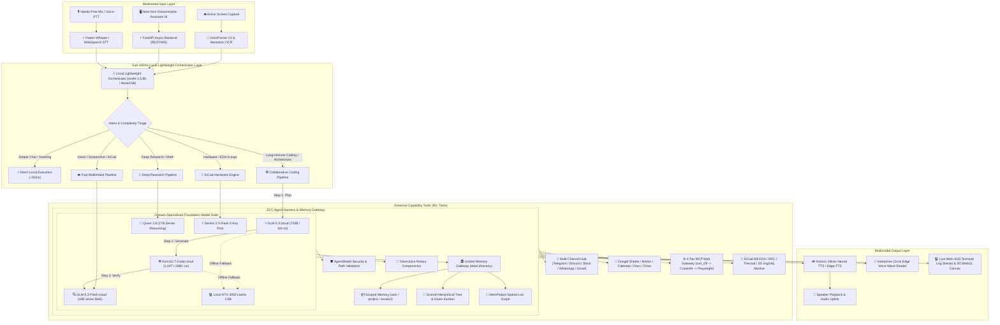

# 🤖 Jarvis AI — Universal General-Purpose Assistant & Autonomous Copilot

A local, voice-activated "Jarvis-style" open-source AI super-assistant designed for **general personal productivity, daily work automations, multi-model agentic orchestration (GLM-5.3, Kimi K2.7 Code, GLM-5.3 Flash, Qwen 3.8, Ornith-1.5), hierarchical memory trees, Goals & Tasks Kanban boards, TokenJuice token compression, visual trigger workflows (Tinyflows), universal 17-channel messaging (Telegram, Discord, Slack, WhatsApp, Gmail), desktop app control, visual screen analysis, PDF document RAG, Graphify & Obsidian Knowledge Graphs, MemPalace Long-Term Memory, and specialized hardware/electronics engineering (3D procedural modeling, KiCad EDA, IPC-2221 thermal & autorouting)**.

<div align="center">


</div>

---

> [!NOTE]
> **Universal Open-Source Personal Assistant & Multi-Model Agentic System**: Jarvis AI combines hands-free voice control, interactive animated mascot reactions, **sub-100ms local intent orchestration**, domain-specialized foundation models, collaborative multi-model pipelines, **ECC (Everything Claude Code) autonomous instincts & plan-before-build reflexes**, on-demand lazy model lifecycle management, unified memory gateways, goals kanban boards, trigger-driven workflows, multi-channel messaging, long-term spatial memory, interactive Obsidian knowledge graphs, procedural 3D electronic part generation, and automated KiCad PCB engineering across **95+ registered tools**.

---

## 🏛️ Universal System Architecture & Execution Pipeline



---

## 🖥️ Next-Gen Conversational & General-Purpose UI Showcase

<div align="center">

### 💬 1. Assistant Chat with Rich GitHub Markdown & Live Tool Execution
*Streaming conversational interface with full Markdown formatting (headings, bold accents, bullet points, syntax-highlighted code blocks), live tool telemetry execution, and single-voice high-fidelity neural audio streaming.*


---

### 🎙️ 2. Conversational Avatar Mode (Real-Time Voice, 3D Mascot & Reflected Aura)
*Full-duplex voice conversation with an expressive animated 3D holographic mascot, cursor-tracking pupils, dynamic mouth viseme lip-sync, real-time waveform audio equalizers, customizable atmospheric reflected aura lighting, and hands-free auto-listening.*


---

### 🧠 3. Hierarchical Scored Memory Tree & Goals Kanban Board
*4-Column Goals Kanban manager (`To Do`, `In Progress`, `Blocked`, `Done`) and hierarchical memory nodes with importance scoring (1–10) mirrored into Obsidian Vault.*


---

### ⚙️ 4. Automated Workflows & Routines Studio (Tinyflows Engine)
*Trigger-driven automation graph with pre-built routines (Daily Executive Briefings, Autonomous Web Research, Sponsor Outreach pipelines, PCB DRC Audits) and one-click execution.*


---

### 📡 5. Universal Multi-Channel Communications Gateway
*Unified hub monitoring connected accounts (Gmail, Discord, Telegram, Slack, WhatsApp, Notion, Google Sheets) with quick outbound multi-channel message dispatcher.*


---

### 📱 6. Universal 12-App Recipes & Autonomous Cron Daemon (OpenHuman Subsystems)
*One-click multi-platform automation recipes (Gmail, Outlook, LinkedIn, Slack, Telegram, Discord, Twitter/X, Instagram, WhatsApp, Google Meet, Zoom, BrowserScan), autonomous background scheduled heartbeat daemon, and interactive Python/Math Sandboxed Code Runner.*


---

### 📐 7. KiCad PCB Hardware & 3D Modeling Suite
*Schematic AST S-expression inspector, DRC/ERC rules checker, Joule thermal loss simulator, signal integrity estimator, and procedural 3D electronic part generator.*


</div>

---

## 🧠 Obsidian Knowledge Graph & Visual Canvas

Jarvis uses **Graphify-Labs** AST extraction and semantic clustering to transform all codebase symbols, schematic nets, and architectural tools into an interactive **Obsidian Knowledge Graph Vault**:

<div align="center">

### 🌐 Global Force-Directed Knowledge Graph (850 Nodes & 1,654 Edges)


### 📋 Infinite Visual Whiteboard (`Architecture_Graph.canvas`)


</div>

* **Interactive Force Physics**: Color-coded clusters for KiCad EDA, Agent Orchestration, Web Gateway, Composio Workspace, and 3D Modeling.
* **911 Bi-directional Notes**: Every function, tool, and class has its own Markdown note with `[[wikilinks]]` and caller graphs.
* **Agent Wiki**: 61 cross-linked community articles providing high-level subsystem overviews.

---

## ⚡ Multi-Model Agentic Environment & Local Lightweight Orchestrator

Jarvis implements an intelligent multi-model agentic environment with **sub-100ms local intent orchestration**, domain-specialized routing, and collaborative multi-model pipelines:

| Foundation Model | Provider & Context | Parameters & Modalities | Architecture Specialization | Role in Jarvis Agentic System |
| :--- | :--- | :--- | :--- | :--- |
| **`ornith-1.5:9b`** | Local Ollama (256K) | 9B (6.6GB) · Text + Vision | Local Foundation Model | **Local Lightweight Orchestrator & Fast Reflex Evaluator (<100ms)** |
| **`glm-5.3:cloud`** | Ollama Cloud (1M) | 753B · Tools + Thinking | Open-Weights Coding Flagship | **Long-Horizon Agentic Coding & Deep Architecture Planner** |
| **`kimi-k2.7-code:cloud`** | Ollama Cloud (256K) | 1.04T · Vision + Code | -30% Thinking Token MoE | **Real-World Complex Code Implementer & Bug Resolver** |
| **`glm-5.3-flash:cloud`** | Ollama Cloud (1M) | 321B (18B Active MoE) · Multimodal | Natively Multimodal MoE | **Real-Time Multimodal Agent & Instant Tool Caller** |
| **`qwen3.8`** | Ollama Cloud / Local (128K) | 27B / 8B · Vision + Thinking | Dense Reasoning | **Deep Research, Literature Synthesis & Mathematical Reasoning** |
| **`gemini-2.5-flash`** | Google Cloud (1M) | Proprietary Multimodal | 5-Key Auto-Rotating Pool | **General High-Throughput Cloud Engine & EDA Tools** |
| **`llama3:8b`** | Local GPU RTX 3050 (8K) | 8B Local GGUF/INT4 | Pure Local Inference | **Zero-Downtime Offline Fallback** |

---

## ⚡ Hardware Constraints & Local/Cloud Resource Distribution

Optimized to run seamlessly on a standard Windows laptop with an **Intel Core i5 CPU**, **24GB RAM**, and an **NVIDIA RTX 3050 GPU (6GB VRAM)**:

| Subsystem | Target Processor | Model / Framework | Optimization |
| :--- | :--- | :--- | :--- |
| **Local Orchestrator** | CPU / Local GPU | `ornith-1.5:9b` / `llama3:8b` | Sub-100ms Local Intent Evaluation & Triage |
| **Wake Word Engine** | CPU | `openWakeWord` ("jarvis") | ONNX Runtime (CPU) |
| **Speech-to-Text (STT)** | CPU / Cloud | `Faster-Whisper` (`base.en`) / `NVIDIA Whisper v3` | `INT8` Quantization + Cloud API Fallback |
| **Text-to-Speech (TTS)** | CPU / Cloud | `Kokoro-82M` (24kHz) / `Edge-TTS Neural` | ONNX Runtime + Cloud Neural Voices |
| **WebGL Voice Visualizer**| Web Browser | Custom GLSL Fragment Shader | Dynamic Standing Audio Wave on Arc Reactor Edge |
| **Orchestration & Harness** | CPU | LangChain + ECC Agent Harness | Reflex Rules + AgentShield + Context Compression |
| **Agentic Coding Tier** | Cloud Pool | `glm-5.3:cloud` (753B) & `kimi-k2.7-code:cloud` (1.04T) | Collaborative Multi-Model Planning & Generation |
| **Fast Multimodal Tier** | Cloud Pool | `glm-5.3-flash:cloud` (18B active) & `gemini-2.5-flash` | Real-Time Screen & KiCad Visual Inspection |
| **Research & Reasoning Tier**| Cloud Pool | `qwen3.8` (27B) | Deep Synthesis, Paper Analysis & Mathematical Computation |
| **Local Offline Fallback** | GPU RTX 3050 | `Llama 3 8B` (`ChatOllama`) | Zero-Downtime Offline Fallback |
| **Long-Term Memory Engine** | CPU / Local | `MemPalace` (`all-MiniLM-L6-v2` ONNX) | Zero-Loss Verbatim Loci Hierarchy & Temporal Graph |
| **Knowledge Graph Engine** | CPU / Local | `Graphify` + AST Parsers | Obsidian Vault with Canvas, Wiki & Hub Labels |
| **3D Modeling Engine** | CPU / Browser | `img2obj` Procedural Builder + Three.js | Wavefront .OBJ/.MTL & WebGL Parametric Shaders |
| **Web Gateway Escalation** | CPU / Local | `curl_cffi` + `Crawl4AI` + Playwright | 4-Tier Anti-Bot & Autonomous Agent Fallback |
| **App & Cloud Integrations**| Cloud / HTTP | Composio MCP Apps (1000+ Services) | **Discord**, Gmail, Calendar, Notion, Sheets, Docs |

---

## 🛠️ Complete Capabilities Matrix (89+ Active Tools)

| # | Capability Domain | Subsystem / Module | Key Functions & Features |
| :--- | :--- | :--- | :--- |
| **1** | **🎙️ Conversational Avatar Voice Mode**| `ui/index.html` & `voice/` | Interactive animated holographic mascot with reactive eyes, dynamic viseme mouth lip-sync, live audio visualizer, subtitles, and hands-free continuous loop. |
| **2** | **📝 Rich Markdown & Speech Replay**| `ui/app.js` & `ui/index.html` | Full GitHub-flavored Markdown rendering (headings, tables, syntax-highlighted code blocks) with interactive `🔊 Replay` audio synthesis button on every bubble. |
| **3** | **🌳 Hierarchical Scored Memory Tree**| `tools/memory_tree_tool.py` | Scored memory tree in SQLite (`/projects`, `/people`, `/research`, `/preferences`) with 1–10 importance weighting and instant Obsidian Vault note mirroring. |
| **4** | **📋 Goals & Tasks Kanban Manager**| `tools/memory_tree_tool.py` | 4-column kanban board (`To Do`, `In Progress`, `Blocked`, `Done`) with progress bars, priority weights (`urgent`, `high`, `medium`), and deadlines. |
| **5** | **🧃 TokenJuice Compression Engine**| `tools/tokenjuice_tool.py` | Semantic JSON, AST signature, and log compression reducing LLM context token usage by 40% to 80%. |
| **6** | **⚙️ Trigger-Driven Tinyflows Engine**| `tools/workflows_engine_tool.py` | Durable trigger-driven workflow engine (cron, webhook, channel message, manual) with execution logs and approval gates. |
| **7** | **📡 Universal Multi-Channel Gateway**| `tools/multichannel_hub_tool.py` | Unified outbound dispatcher and status monitor for Telegram, Discord, Slack, WhatsApp, and native Gmail/SMTP email. |
| **8** | **⚡ Split-Brain Medulla Reflex Engine**| `agent/medulla_reflex.py` | Sub-5ms intent triage separating instant reflex rules, memory queries, and deep multi-step reasoning with human approval gates. |
| **9** | **🧠 Graphify + Obsidian Vault** | `tools/obsidian_knowledge_graph_tool.py` | Extracts AST code relationships and semantic clusters into a complete Obsidian Vault (911 linked notes, `Architecture_Graph.canvas`, `Interactive_Graph.html`, Agent Wiki, and custom subsystem color filters). |
| **10**| **🏰 MemPalace Long-Term Memory** | `tools/mempalace_tool.py` | 100% Local-first verbatim memory using the spatial Method of Loci (`Wings -> Rooms -> Halls -> Drawers`), temporal SQLite entity graph, and fast L0/L1 wake-up briefing (~800 tokens). |
| **11**| **📐 img2obj 3D Component Modeler**| `tools/img2obj_component_3d_tool.py` | Procedurally generates Wavefront `.obj`/`.mtl` and Three.js 3D models for electronic packages (0402, 0603, 0805, SOT-223, SOIC-8, TSSOP-28, QFP-48, QFN-32, TO-220, USB-C) and links them to `.kicad_pcb` footprints. |
| **12**| **🌐 Local MCP Web Gateway** | `gateway/` | 4-Tier escalation ladder: Tier 1 Direct HTTP $\to$ Tier 2 `curl_cffi` TLS/JA3 $\to$ Tier 3 Crawl4AI/Playwright JS $\to$ Tier 4 Autonomous Vision Browser Agent. |
| **13**| **💬 Discord Integration** | `tools/composio_apps_tool.py` | Direct **Discord** integration: send channel messages, fetch channel message history, and create new channels (`DISCORDBOT`). |
| **14**| **💻 Desktop & System Control** | `tools/system_control_tool.py` | Time/date & greetings, launch local apps (Notepad, Calculator, VS Code, Explorer), open URLs/websites, take screenshots, tell jokes, and log voice notes. |
| **15**| **📬 Workspace App Automation** | `tools/composio_apps_tool.py` | Full Composio integration for **Gmail** (fetch, send, search, drafts), **Google Calendar**, **Notion**, **Google Docs**, and **Google Sheets**. |
| **16**| **🧠 Multi-Tier LLM Brain Pool** | `agent/copilot.py` & `agent/key_manager.py` | 4-Tier Fallback: Tier 1 Gemini 2.5/3.6 Flash Pool -> Tier 2 NVIDIA NIM Cloud -> Tier 3 Ollama Cloud -> Tier 4 Local GPU `llama3:8b`. |
| **17**| **⚡ ECC Agent Harness Engine** | `agent/instincts.py`, `agent/security.py`, `agent/context_compressor.py` | Automatic hardware & work reflex rules, AgentShield workspace security guard, and incremental conversation history compressor. |
| **18**| **🗂️ Preferred Parts & Circuit Templates**| `tools/preferred_parts_tool.py` & `tools/circuit_templates_tool.py` | Component library memory & parametric circuit generators (LDO regulators, buck converters, voltage dividers, BME280 sensor breakout). |
| **19**| **🔁 Self-Correcting ERC/DRC Loop**| `agent/verify_loop.py` | Autonomous Agentic Verification Loop executing KiCad ERC/DRC, catching design violations, and auto-correcting schematic nets. |
| **20**| **🛤️ 2-Layer Grid Autorouter** | `tools/autorouter_tool.py` | Automated multi-layer grid autorouter with 45-degree trace routing and DFM rule verification. |
| **21**| **🏭 Turnkey Manufacturing Exporter**| `tools/manufacturing_tool.py` | Automated fabrication export: RS-274X Gerbers, Excellon NC Drills, Pick-and-Place (CPL), BOM CSV, and JLCPCB cost estimation. |
| **22**| **👁️ OmniParser Screen Vision** | `tools/omniparser_tool.py` | Active screen capture layout parsing with `RapidOCR` ONNX engine to inspect UI elements, component dialogs, and code editors. |
| **23**| **📚 Local PDF & Datasheet RAG** | `tools/datasheet_rag_tool.py` | Local document & datasheet RAG powered by **NVIDIA Nemotron 3 Embed 1B** and ChromaDB vector store. |
| **24**| **🌐 Live Web Search & Compliance** | `tools/reach_tool.py` | Live web search for technical datasheets, general information, and regulatory compliance (RoHS 3 / FCC Part 15). |
| **25**| **🎫 GitHub Issue & Repo Manager** | `tools/github_tool.py` | Log bugs, task reminders, or audit findings directly as labeled GitHub issues. |
| **26**| **📄 Engineering & General Doc Exporter**| `tools/doc_exporter_tool.py` | Formats and exports audit reports, meeting notes, or general document summaries to `docs/` and `scratch/` as Markdown/JSON. |
| **27**| **🎨 NVIDIA FLUX.1 Image Generator** | `tools/nvidia_nim_tool.py` | Text-to-Image generation for diagrams, UI concepts, and visuals via `black-forest-labs/flux.1-schnell`. |
| **28**| **🧩 Baidu Unlimited-OCR Long Parser** | `tools/unlimited_ocr_tool.py` | Long-horizon document parsing into structured Markdown using Baidu Reference Sliding Window Attention (`baidu/Unlimited-OCR`). |
| **29**| **📐 KiCad EDA & Circuit Parser** | `tools/kicad_tool.py` & `tools/kicad_editor.py` | Direct KiCad `.kicad_sch` & `.kicad_pcb` S-expression AST manipulation and net wiring. |
| **30**| **🔥 IPC-2221 Thermal Trace Solver** | `tools/thermal_tool.py` | Calculates trace widths, copper $I^2R$ power loss, and junction temperature rise for voltage regulators ($T_j = T_a + P_d \cdot R_{\theta JA}$). |
| **31**| **⚡ Signal Integrity Bounds Solver** | `tools/signal_integrity_tool.py` | Calculates I2C pullup bounds ($R_{\min} / R_{\max}$), UART series damping resistors, and CAN bus split termination ($120\Omega$). |
| **32**| **📦 Supply Chain & Risk Tracker** | `tools/supply_chain_tool.py` | Evaluates component lifecycle (Active/NRND/EOL), distributor stock availability, and JLCPCB basic/extended part risk. |
| **33**| **🛠️ Autonomous Code Pipeline** | `agent/code_pipeline.py` | Autonomous software code generation, static AST syntax check, sandboxed test execution, multi-iteration self-correction, and atomic rollback to pre-edit disk snapshot on failure. |
| **34**| **🛡️ AgentShield v2 Security Guard** | `agent/security.py` | Canonical realpath workspace jail, Win32 Job Object memory capping (256MB), `sitecustomize.py` network isolation, Shannon entropy secret scanning, prompt-injection sanitization, and tokenized approval nonces. |
| **35**| **📊 Universal DAG TaskRunner** | `agent/task_runner.py` | Asynchronous DAG scheduler, pure-Python Kahn cycle validation, durable SQLite task persistence (`data/task_runner.db`), side-effect aware crash recovery, and split cloud (5) / local GPU (1) concurrency limits. |
| **36**| **🌐 Explicit Search with Citations**| `tools/reach_tool.py` | Explicit `search_web_explicit(force=True)` with inline source citations (`[Source: <url>]`) and 4-tier gateway escalation. |
| **37**| **🔌 Stdio FastMCP Server (95+ Tools)** | `mcp_server.py` | Automatically exposes all 95+ Jarvis tools over stdio Model Context Protocol for direct integration into Claude Code, Cursor, Windsurf, and VS Code. |

---

## 🛡️ Security Model & Sandboxing Boundary Disclosures

Jarvis AI implements defense-in-depth security mechanisms through **AgentShield v2**:

1. **Canonical Workspace Jail**:
   - Uses `os.path.realpath()` to resolve symlinks and reject all path traversal attempts (`..`) that resolve outside the active workspace directory.
2. **Process Sandboxing & Memory Limits**:
   - Windows Job Objects enforce hard virtual memory caps (`CODE_SANDBOX_MAX_MEMORY_MB`, default 256MB) and watchdog timeouts.
   - **Network Isolation Boundary Disclosure:** Outbound network restriction is enforced at the Python interpreter level via `sitecustomize.py` in `PYTHONPATH` (disabling `socket.socket`, `socket.create_connection`, `urllib`, and `http.client`). On Windows, this provides best-effort defense-in-depth against accidental networking in generated code, but does not construct a kernel-level hypervisor boundary against arbitrary compiled C-extension syscalls. For multi-tenant or untrusted code execution, containerized execution (`docker run --network=none`) is recommended.
3. **Approval Gates & Token Authorization**:
   - Single-use cryptographic nonce tokens (`secrets.token_urlsafe(24)`) stored in `data/task_runner.db`.
   - Approval API endpoints (`POST /api/tasks/{task_id}/approve`) require the custom header `X-Jarvis-Approval-Token`, constant-time digest verification (`secrets.compare_digest`), and origin verification against `config.settings.TRUSTED_ORIGINS`.
4. **Side-Effect Aware Crash Recovery**:
   - If the server restarts during DAG execution, `TaskRunner.recover_inflight_tasks()` marks in-flight tasks as `INTERRUPTED_FAILED`, restores pre-edit disk snapshots from `data/snapshots/`, and logs which side-effects were already completed to avoid duplicate external actions.

---

## 🏗️ Project Architecture & Directory Layout

```
d:/aaaassistan_pcb/
├── config.py                 # Pydantic Settings (typed settings singleton)
├── main.py                   # Async main voice loop (Wake Word -> STT -> Orchestrator -> LLM -> TTS)
├── mcp_server.py             # FastMCP Stdio MCP server exposing 95+ dynamic tools
├── web_server.py             # High-performance async FastAPI REST backend & WebGL HUD static server
├── requirements.txt          # PyTorch, FastAPI, Uvicorn, LangChain, MemPalace & MCP dependencies
├── README.md                 # Project documentation & architecture matrix
├── .env.example              # Complete environment variables template
├── data/                     # Standardized SQLite database directory (scoped_memory, memory_tree)
├── ui/                       # Next-Gen Glassmorphic Conversational HUD Web Interface
│   ├── index.html            # Web HUD with Markdown rendering & Conversational Avatar Mode
│   ├── app.js                # App logic, Web Speech synthesis, & Avatar state controller
│   └── tiny_mascot.riv       # Rive native vector mascot asset
├── gateway/                  # Local MCP Web Gateway (4-Tier Escalation Architecture)
│   ├── escalation_engine.py  # Transparent routing (Direct -> curl_cffi -> Crawl4AI -> Agent)
│   ├── cleaner.py            # Resilient HTML-to-Markdown cleaner
│   ├── cache_and_politeness.py # In-memory TTL cache & domain throttling
│   ├── mcp_gateway_tool.py   # Gateway MCP tools (get_web_content, browse_web_page, etc.)
│   └── transports/           # Direct, Antibot (curl_cffi), Crawl4AI, Browser Agent, Bulk Crawler
├── obsidian_vault/           # Graphify-Generated Obsidian Knowledge Graph Vault
│   ├── .obsidian/graph.json  # Subsystem color groupings and physics settings
│   ├── Architecture_Graph.canvas # Obsidian Infinite Visual Whiteboard
│   ├── Interactive_Graph.html# Standalone D3/WebGL interactive graph viewer
│   ├── Memory_Tree/          # Mirrored Scored Memory Tree notes
│   ├── Wiki/                 # Cross-referenced Agent Wiki articles
│   └── ... (911 interconnected [[wikilink]] Markdown notes)
├── voice/
│   ├── wakeword.py           # openWakeWord CPU ONNX background listener
│   ├── stt.py                # Faster-Whisper STT + NVIDIA Whisper Large v3
│   └── tts.py                # Kokoro-82M 24kHz TTS + Edge-TTS Neural voices
├── agent/
│   ├── model_registry.py     # Central Model Registry & singleton client cache for 7 foundation models
│   ├── local_orchestrator.py # Sub-100ms Local Lightweight Intent Evaluator & Pipeline Planner
│   ├── memory_gateway.py     # Unified Memory Gateway Facade (Scoped, Hierarchical Tree, MemPalace)
│   ├── service_lifecycle.py  # On-demand lazy model loader with 5-minute idle memory reclamation
│   ├── copilot.py            # LangChain JarvisAgent with 95+ active tools & orchestrator routing
│   ├── ecc_instincts.py      # Plan-Before-Build, static AST validation & auto-recovery engine
│   ├── cron_daemon.py        # Background autonomous heartbeat daemon & periodic health checks
│   ├── session_context.py    # JarvisSessionContext per-session model container
│   ├── key_manager.py        # Multi-key Gemini rotation & real-time metrics manager
│   ├── composio_router.py    # Dynamic tool router & context optimizer
│   ├── verify_loop.py        # Self-correcting ERC/DRC agentic verify loop
│   ├── security.py           # AgentShield workspace path & argument security guard
│   ├── context_compressor.py # Incremental token budget & history compressor
│   └── prompts.py            # System prompt persona configuration
├── tools/
│   ├── ecc_tools.py          # ECC Plan action, AST verify & unified scoped memory tools
│   ├── memory_tree_tool.py   # Hierarchical memory tree, Goals Kanban, People dossiers & Obsidian mirror
│   ├── tokenjuice_tool.py    # TokenJuice semantic JSON/AST/Log compression engine
│   ├── workflows_engine_tool.py # Tinyflows trigger-driven multi-step automation graph
│   ├── multichannel_hub_tool.py # 17-channel dispatcher (Telegram/Discord/Slack/WhatsApp/Gmail)
│   ├── obsidian_knowledge_graph_tool.py # Graphify AST & Obsidian Vault / Canvas generator
│   ├── mempalace_tool.py     # MemPalace verbatim long-term memory & wake-up context
│   ├── img2obj_component_3d_tool.py # Procedural 3D .OBJ/Three.js electronic part builder
│   ├── circuit_templates_tool.py # Parametric circuit generator
│   ├── autorouter_tool.py    # 2-layer grid autorouter & DFM checker
│   ├── manufacturing_tool.py # Turnkey Gerbers, NC drill, CPL, and BOM exporter
│   ├── kicad_editor.py       # S-expression schematic & PCB direct AST editor
│   ├── kicad_tool.py         # KiCad S-expression parser & power tree generator
│   ├── system_control_tool.py# Desktop system control (greeting, app launcher, screenshot, notes)
│   ├── composio_apps_tool.py # Active Discord, Gmail, Calendar, Notion, Docs, Sheets tools
│   ├── thermal_tool.py       # IPC-2221 trace width & regulator thermal solver
│   ├── signal_integrity_tool.py # I2C/UART/CAN signal integrity calculator
│   ├── supply_chain_tool.py  # Component lifecycle & stock risk tracker
│   ├── preferred_parts_tool.py # Preferred component library & workflow memory
│   ├── omniparser_tool.py    # OmniParser V2 GUI screen capture parser
│   ├── datasheet_rag_tool.py # PDF document RAG with Nemotron Embed 1B & ChromaDB
│   ├── nvidia_nim_tool.py    # NVIDIA NIM APIs (FLUX.1, Whisper, Magpie, Nemotron OCR)
│   ├── reach_tool.py         # Web search & compliance checker
│   └── doc_exporter_tool.py  # Engineering & document report exporter
└── tests/                    # 100% Passing Unit & Integration Test Suites
```

---

## ⚡ Quick Start & Running Locally

1. **Activate Python 3.12 Virtual Environment**:
   ```powershell
   .\.venv\Scripts\Activate.ps1
   ```

2. **Launch Cyberpunk Web HUD Server**:
   ```powershell
   python web_server.py
   ```
   Open `http://localhost:8000` in your web browser to interact with the WebGL Arc Reactor voice wave visualizer.

3. **Launch Hands-Free Voice Assistant**:
   ```powershell
   python main.py
   ```

4. **Test Multi-Model Orchestrator & Fast Intent Triage**:
   ```powershell
   python scratch/test_multi_model_orchestrator.py
   ```

5. **Generate & Open the Obsidian Knowledge Graph**:
   ```powershell
   python scratch/run_obsidian_tools.py
   ```
   Open `d:\aaaassistan_pcb\obsidian_vault` in **Obsidian** to view `Architecture_Graph.canvas` and the interactive graph.

6. **Generate 3D Electronic Component Models**:
   ```python
   from tools.img2obj_component_3d_tool import generate_3d_part_from_image_or_spec
   res = generate_3d_part_from_image_or_spec.invoke({"package_or_image": "SOT-223", "output_name": "ams1117_sot223"})
   ```

7. **Run Full Test Suite**:
   ```powershell
   python -m unittest discover tests
   ```

---

## 🗺️ Architectural Roadmap

The following planned extensions are under active design and scheduled for subsequent minor releases:

* [ ] **Direct Native SDK Bindings**: Native Slack Bolt / python-telegram-bot / Discord.py streaming listeners (currently routed through Composio MCP / Multi-Channel Webhooks).
* [ ] **Local Voice Activity Detection (VAD)**: Dynamic silence cutoff via `silero-vad` to eliminate fixed recording windows.
* [ ] **Headless Chromium Cluster**: Multi-worker Playwright cluster for enterprise-scale bulk crawling.
* [ ] **KiCad 9 Native IPC Socket**: Direct Unix domain socket / named pipe connection to active KiCad PCB editor instances.

---

## 📜 License & Open-Source Ownership

This project is open-source under the **MIT License**. Created as a personal AI assistant for general work, productivity, automation, and hardware engineering.
