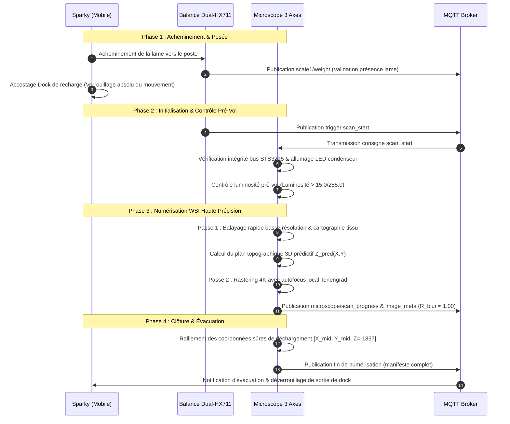

# PROJET SYSTÈME ROBOT SPARKY & MICROSCOPE INTELLIGENT
## CONTRAT DE CONCEPTION, DÉVELOPPEMENT LOGICIEL, INTÉGRATION MATÉRIELLE ET MAINTENANCE TECHNIQUE

---

### IDENTIFICATION DES PARTIES

Le présent contrat (ci-après désigné le **« Contrat »**) est conclu et prend effet en date du **05 Octobre 2026**, entre :

1. **Le Client :**
   * **Nom & Titre :** Dr. Amine Mosbah
   * **Courriel professionnel :** [mosbahmvai@gmail.com](mailto:mosbahmvai@gmail.com)
   * Ci-après désigné **« le Client »**, d'une part,

**ET**

2. **Le Prestataire :**
   * **Nom :** Mouhamed Boughrara
   * **Courriel :** [boughraramouhamed1@gmail.com](mailto:boughraramouhamed1@gmail.com)
   * Ci-après désigné **« le Prestataire »** ou **« l'Ingénieur Intégrateur »**, d'autre part.

Le Client et le Prestataire sont ci-après désignés individuellement comme une **« Partie »** et collectivement comme les **« Parties »**.

---

### DOCUMENT CONTROL & HISTORIQUE DE RÉVISION

| Propriété | Spécification Contractuelle |
| :--- | :--- |
| **Intitulé du Projet** | Plateforme Unifiée Robot Mobile Sparky & Scanner de Lames Microscope Intelligent |
| **Plateformes Matérielles** | Microcontrôleur ESP32-C6 + Actionneurs Série Intelligents Feetech STS3215 + Architecture Télémétrie MQTT |
| **Statut Opérationnel** | Spécification Technique & Contractuelle Active (Baseline de Production) |
| **Périmètre Technique** | Déplacement autonome/manuel Sparky, détection de dock & gestion de charge, télémétrie capteurs, balance de pesée Dual-HX711, platine 3 axes sub-micronique, autofocus optique 4K, corridor SSOT et pipeline d'imagerie WSI |
| **Référence Version** | Révision 2.1 – Consolidation Multi-Tours, Autofocus Asservi sur Encodeur Réel, Compensation de Backlash & Rapport 41 |

---

## 1. OBJET DU CONTRAT ET CONTEXTE DU PROJET

Le présent Contrat a pour objet la conception, le développement logiciel (embarqué, middleware et applicatif), l'intégration matérielle, la mise en service, le déploiement sur site et la maintenance technique d'un système robotisé et automatisé de numérisation microscopique haute précision.

Le système unifié comprend l'interaction synergique entre :
1. **La Plateforme Robotique Mobile « Sparky » :** véhicule autonome à guidage Wi-Fi/MQTT assurant le transport, le positionnement d'échantillons et la surveillance environnementale.
2. **Le Sous-Système Externe de Pesée de Précision :** plateforme de mesure connectée à jauges de contrainte Dual-HX711 avec stockage d'étalonnage local.
3. **Le Microscope Intelligent 3 Axes :** platine motorisée micrométrique pilotée par servomoteurs intelligents sur bus half-duplex 1 MBaud, caméra scientifique 4K UHD, autofocus optique par gradient Tenengrad et modèle topographique 3D.
4. **L'Infrastructure Logicielle Centrale :** dashboard interactif de téléopération, backend temps réel, conteneurisation Docker, tunnel distant sécurisé Tailscale et courtier MQTT centralisé.

---

## 2. ARCHITECTURE GLOBALE DU SYSTÈME UNIFIÉ

### 2.1 Plateforme Mobile Sparky (ESP32-C6)
La base mobile est construite autour du microcontrôleur **ESP32-C6**, connecté au réseau local sans fil, communiquant en MQTT et pourvu des fonctionnalités suivantes :
* Pilotage différentiel bidirectionnel par pont en H via modulation de largeur d'impulsion (PWM).
* Machine à états de navigation : modes Manuel, Automatique, Recherche de Station, Ralliement, Recharge et Sécurité.
* Détection de présence de dock et mesure de tension batterie intégrées sur un bus analogique (ADC) unifié.
* Station environnementale embarquée : capteur de pression absolue **BMP388**, capteur de gaz CO₂ **MH-Z19C**, capteur thermo-hygrométrique **DHT11**.
* Télémétrie ultrasonique frontale (**HC-SR04**) pour la prévention des collisions et la détection d'obstacles en temps réel.
* Prise en charge des mises à jour logicielles sans fil (OTA - *Over-The-Air*) et surveillance par chien de garde matériel (*watchdog*).

### 2.2 Sous-Système Externe de Pesée (Dual-HX711)
Unité périphérique de mesure pondérale connectée au broker MQTT :
* Architecture basée sur microcontrôleur ESP32 dédié relié à deux convertisseurs A/N 24 bits **HX711**.
* Pesée différentielle pour vérification de dépôt de lame, tare automatique et validation de transfert d'échantillon.
* Stockage de l'étalonnage et du facteur d'échelle en mémoire non volatile EEPROM.
* Télémétrie autonome sur le namespace MQTT `scale1/*`.

### 2.3 Microscope Intelligent 3 Axes & Imagerie Scientifique 4K
Sous-système de haute précision assurant l'acquisition gigapixel plein champ (*Whole-Slide Imaging - WSI*) :
* **Déplacement 3 axes motorisé :** Axes X et Y (balayage horizontal du porte-lame) et Axe Z (mise au point micrométrique verticale de l'objectif).
* **Actionneurs intelligents :** 3 servomoteurs série haute résolution **Feetech STS3215** opérant sur bus half-duplex série asynchrone à 1 000 000 bauds (1 MBaud).
* **Tracking multi-tours logiciel en Mode 0 :** maintien de la précision angulaire absolue (12 bits, 4096 pas/tour) étendu sur plusieurs tours virtuels sans perte de zéro mécanique.
* **Chaîne d'imagerie scientifique 4K :** capteur CMOS ultra haute définition (Sony IMX, USB 3.0 UVC) délivrant une résolution native de 3840 × 2160 pixels à 30 ips.
* **Système d'illumination :** condenseur diascopique LED à intensité réglable et éclairage coaxial incident.
* **Autofocus optique sub-micronique :** calcul en temps réel de la métrique de netteté par gradient de Tenengrad normalisé et interpolation parabolique sub-pas.
* **Correction topographique prédictive 3D :** plan de compensation d'inclinaison de lame par moindres carrés récursifs limitant les besoins de balayage focal en cours de scan.
* **Gardiens logiciels stricts :** invariant de rotation unique (SSOT), garde linéaire contre les discordances de direction et verrouillage de dérive hors-tension (*Unpowered Drift Lockout*).

### 2.4 Infrastructure Réseau, Cloud et Dashboard
* **Unité de traitement centrale :** Raspberry Pi configuré en passerelle d'acquisition et superviseur de bus.
* **Interface Homme-Machine :** Dashboard web réactif et écran tactile local pour le contrôle direct, la visualisation du flux vidéo 4K et le déclenchement des scans.
* **Conteneurisation :** Déploiement standardisé de la suite logicielle sous Docker.
* **Connectivité distante sécurisée :** VPN maillé chiffré **Tailscale** autorisant le diagnostic, l'assistance et le pilotage à distance sans ouverture de ports exposés.

---

## 3. SPÉCIFICATIONS MATÉRIELLES ET TOPOLOGIE DES BUS

### 3.1 Spécifications des Équipements Principaux

| Sous-Système | Composant / Paramètre | Spécification Technique |
| :--- | :--- | :--- |
| **Robot Sparky** | Microcontrôleur maître | ESP32-C6 (RISC-V 32 bits, Wi-Fi 6, BLE 5.0) |
| **Robot Sparky** | Pont de puissance moteur | Contrôleur double pont en H PWM |
| **Robot Sparky** | Capteur de pression | BMP388 (Bus I2C, précision barométrique absolue) |
| **Robot Sparky** | Capteur de CO₂ | MH-Z19C (Infrarouge NDIR, liaison série UART) |
| **Robot Sparky** | Télémétrie d'obstacle | Transducteur ultrasonique HC-SR04 (fenêtre de validité 60 ms) |
| **Robot Sparky** | Réseau sans fil | SSID : `Ooredoo 70B91C` / MQTT Broker : `192.168.1.202:1883` |
| **Microscope** | Actionneurs motorisés | 3× Servomoteurs intelligents Feetech STS3215 |
| **Microscope** | Résolution encodeur | Encodeur magnétique absolu sans contact 12 bits (4096 pas/tour, 0.08789°/pas) |
| **Microscope** | Affectation des axes | Axe X (ID 5 - Translation X) / Axe Y (ID 3 - Translation Y) / Axe Z (ID 4 - Focus Z) |
| **Microscope** | Interface de commande | Bus série TTL / RS-485 Half-Duplex @ 1 000 000 bauds (1 MBaud, 8-N-1) |
| **Microscope** | Capteur d'imagerie | Caméra scientifique 4K UHD CMOS (Sony IMX, UVC USB 3.0) |
| **Microscope** | Résolution d'image | 3840 × 2160 pixels natifs (8.29 Mégapixels par tuile) |
| **Microscope** | Alimentation de puissance | 12.0 V DC régulée (Servos) + 5.0 V DC (Logique, Caméra & Condenseur LED) |
| **Balance** | Conditionneur de jauge | Double circuit convertisseur analogique-numérique 24 bits HX711 |

### 3.2 Topologie du Bus Série Half-Duplex & Transceiver
1. Les trois servomoteurs STS3215 (IDs 5, 3 et 4) sont connectés en guirlande (*daisy-chain*) sur un bus 3 fils partagé (+12V VCC, GND, Ligne de données DATA bidirectionnelle).
2. L'interface hôte intègre une commutation matérielle automatique TX/RX avec une latence de basculement inférieure à 500 ns, éliminant les collisions de trames à 1 MBaud.
3. Les paquets de commande et de télémétrie exploitent le protocole binaire STS : octets d'en-tête `0xFF 0xFF`, validation par somme de contrôle (*checksum*), et accusé de réception systématique.

### 3.3 Architecture d'Alimentation et Détection de Charge par ADC Partagé
* Sur la plateforme Sparky, la mesure de la tension batterie et la détection d'accostage sur le dock de charge partagent intentionnellement le même circuit diviseur de tension sur une entrée analogique ADC.
* La détection du dock ne repose pas sur une broche GPIO tout-ou-rien mais sur l'élévation dynamique et stabilisée de la tension lue lors de la mise en contact avec les bornes sous tension de la station.
* Cette architecture garantit une compacité matérielle et élimine les faux contacts grâce à un filtrage multi-échantillons.

### 3.4 Verrou Silicium EEPROM Invariant (Registres 0x09–0x0C)
* Les registres matériels non volatils en mémoire EEPROM des servomoteurs STS3215 relatifs aux limites d'angle matériel :
  * Registres `0x09 - 0x0A` : *Min Angle Limit*
  * Registres `0x0B - 0x0C` : *Max Angle Limit*
* Sont formellement et contractuellement **verrouillés aux valeurs d'usine [0, 4095]**.
* Tout élargissement matériel de ces registres est strictement prohibé par le présent contrat car il provoquerait une défaillance de calcul dans le planificateur de décélération interne du microcontrôleur de l'actionneur. Le multi-tours est entièrement géré par la couche logicielle supérieure.

---

## 4. PARAMÈTRES DE CONFIGURATION ET CORRIDORS DE DÉPLACEMENT SSOT

### 4.1 Configuration Batterie et Détection de Dock (Sparky)

| Paramètre | Valeur Validée | Description Opérationnelle |
| :--- | :--- | :--- |
| `BatteryCalibrationFactor` | **1.9110** | Facteur de correction de gain de l'ADC pour lecture réelle pack |
| `BatterySocEmptyVoltage` | **10.0 V** | Seuil de coupure basse tension (0% SOC) |
| `BatterySocFullVoltage` | **11.7 V** | Tension de pleine charge (100% SOC) |
| `DockContactThresholdMv` | **3120 mV** | Seuil d'initiation de contact électrique avec le dock |
| `DockPresentThresholdMv` | **3220 mV** | Seuil de confirmation de présence stable sur chargeur |
| `DockChargeReadySoc` | **85 %** | Seuil minimum autorisant la reprise du cycle automatique |
| `LowBatteryDockSoc` | **20 %** | Seuil critique forçant le retour immédiat à la station |
| `DockMinimumChargeMs` | **3 600 000 ms** (1 h) | Durée plancher de charge avant réautorisation de sortie |

### 4.2 Configuration Cinématique et Détection d'Obstacles (Sparky)

| Paramètre | Valeur Validée | Description Opérationnelle |
| :--- | :--- | :--- |
| `ManualMaxRunMs` | **5000 ms** | Durée maximale d'exécution d'un ordre manuel sans rafraîchissement |
| `AutoPhaseOneDurationMs` | **20000 ms** | Durée nominale de la phase de déplacement 1 |
| `AutoPhaseTwoMaxDurationMs` | **30000 ms** | Durée maximale de la phase de déplacement 2 |
| `MotorStartPwm` | **70** | Seuil PWM initial pour vaincre l'inertie de démarrage |
| `MotorMaxPwm` | **255** | Valeur PWM maximale en vitesse de croisière |
| `MotorRampMs` | **1500 ms** | Durée de la rampe d'accélération et de décélération |
| `UltrasonicSampleIntervalMs`| **60 ms** | Fréquence d'interrogation du capteur HC-SR04 |
| `UltrasonicReadingStaleMs` | **300 ms** | Délai d'expiration au-delà duquel la mesure est considérée invalide |
| `DockRetryBackoffMs` | **3000 ms** | Temporisation avant nouvelle tentative d'accostage |

### 4.3 Corridors de Déplacement du Microscope (Single Source of Truth - SSOT)

La table ci-dessous constitue l'Autorité Unique de Vérité (*Single Source of Truth*) régissant les mouvements physiques autorisés des axes du microscope :

| Paramètre de Sécurité | Axe X (ID 5) | Axe Y (ID 3) | Axe Z (ID 4) | Unité & Signification |
| :--- | :--- | :--- | :--- | :--- |
| **Classification Butée** | Optique / Logicielle | Optique / Logicielle | **Mécanique Dure** | Nature du confinement physique |
| **Tour Virtuel de Réf.** | 0 | 0 | **-1** | Tour entier accumulé logiciel |
| **Borne Min (Raw / Total)**| 2327 / 2327 | 1532 / 1532 | **2209 / -1887** | Limite physique basse autorisée |
| **Borne Max (Raw / Total)**| *Étalonnage en cours* | 3260 / 3260 | **2269 / -1827** | Limite physique haute autorisée |
| **Plage Utile (Span)** | *En cours* | 1728 pas (151.88°) | **60 pas (5.27°)** | Course de sécurité active |
| **Marge de Sécurité** | 60 pas | 60 pas | **2 pas (~0.8 µm)** | Marge tampon avant butée |
| **Vitesse Max Transit** | 1500 pas/s | 1500 pas/s | **1200 pas/s** | Consigne maximale moteur |
| **Source de Plausibilité** | Spécification optique | Spécification optique | **Butée mécanique mesurée**| Règle de validation du corridor |

### 4.4 Paramètres de Trajectoire (Slicing) et Détection de Dérive

| Paramètre | Valeur Validée | Rôle Contractuel et Technique |
| :--- | :--- | :--- |
| `MaxTransitSliceChunk` | **120 pas** | Déplacement maximal par pas élémentaire (évite l'emballement PID) |
| `UnpoweredDriftTolerance` | **±3 pas** | Dérive maximale tolérée à l'allumage avant verrouillage d'urgence |
| `DirectionGuardTolerance` | **5 pas** | Écart minimal déclenchant le contrôle de concordance de direction |
| `SettlingDelayShortMs` | **350 ms** | Délai de stabilisation mécanique avant capture standard de tuile |
| `SettlingDelayAfMs` | **1500 ms** | Délai de dissipation des vibrations avant balayage autofocus |
| `ZBacklashCompensation` | **25 pas** | Dépassement vertical ascendant pour suppression du jeu d'inversion (avec confirmation encodeur et détection d'écrêtage plafond) |

### 4.5 Paramètres Optiques, Illumination et Autofocus Tenengrad

| Paramètre | Valeur Validée | Rôle Contractuel et Technique |
| :--- | :--- | :--- |
| `NativeCaptureWidth` | **3840 pixels** | Largeur native 4K UHD du capteur scientifique |
| `NativeCaptureHeight` | **2160 pixels** | Hauteur native 4K UHD du capteur scientifique |
| `MinMeanBrightness` | **15.0 / 255.0** | Seuil de luminosité minimale pré-vol (garde anti-extinction LED) |
| `AfSharpnessPitch` | **1 pas (~0.4 µm)** | Pas d'échantillonnage vertical en recherche de mise au point fine |
| `AfPeakProminence` | **0.15** | Prominence minimale requise pour valider un pic de netteté optique |
| `InterTileOverlapPercent` | **30 %** | Taux de recouvrement géométrique entre tuiles adjacentes |

---

## 5. SÉMANTIQUE DE SÉCURITÉ, RÈGLES DE CONTRÔLE ET INVARIANTS SYSTÈME

### 5.1 Sécurité de la Base Mobile Sparky
1. **Verrou Absolu d'Immobilité en Charge :** Dès que le robot entre dans l'état *Charging* ou *DockConfirm*, toute propulsion moteur est physiquement et logiquement bloquée. Aucun mouvement n'est autorisé avant achèvement complet du cycle de charge ou réception explicite de l'ordre prioritaire `dock_cancel`.
2. **Purge des Commandes Périmées :** L'émission d'un ordre d'arrêt (`motor_stop`, `move_stop`, détection ultrason) purge instantanément toute file d'attente de commandes pour interdire tout redémarrage résiduel.
3. **Équilibrage Dynamique Droite/Gauche :** Les temporisations et signaux PWM des deux motoréducteurs sont synchronisés et équilibrés pour garantir une trajectoire rectiligne rigoureuse.

### 5.2 Invariant SSOT de Rotation Unique (Microscope)
* **Règle Fondamentale :** Les bornes minimale et maximale du corridor de sécurité d'un axe doivent obligatoirement résider dans le même tour mécanique entier :
  $$\text{turns}(\text{limit\_min}) \equiv \text{turns}(\text{limit\_max})$$
* Tout corridor chevauchant la frontière physique de rebouclage encodeur `4095 / 0` est expressément rejeté par le compilateur de trajectoire.
* Cette règle supprime toute ambiguïté sur le sens de rotation le plus court et empêche les rotations involontaires de 350° lors des commandes linéaires.

### 5.3 Garde Linéaire contre les Discordances de Direction (Direction Mismatch Guard)
* Lors de tout déplacement sur les servomoteurs STS3215 en Mode 0, le contrôleur compare en temps réel le signe de la consigne linéaire avec le signe de la différence brute d'encodeur :
  $$\text{sign}(\Delta \text{pos\_commandée}) \equiv \text{sign}(\Delta \text{raw\_hardware})$$
* Si le moteur exécute un déplacement de plus de 5 pas en sens inverse de la consigne (par suite d'un mauvais calcul de rebouclage ou d'une perturbation externe), la commande est immédiatement avortée, le couple moteur coupé et une alerte levée.

### 5.4 Découplage Interactif des Butées Statiques Périmées
* Lors de l'enregistrement interactif d'une nouvelle butée (ex. nouvelle borne Min) sur un tour virtuel différent de l'ancienne borne opposée (Max), le système découple automatiquement la butée opposée devenue incohérente, évitant ainsi le piège du verrouillage croisé inter-tours.

### 5.5 Persistance Atomique avec Protection en Lecture Seule à l'Arrêt
* Les fichiers de configuration de calibration (ex. `verified_corridors.json`) sont maintenus sur le disque avec l'attribut système **Lecture Seule** (*Read-Only*) permanent au repos.
* Toute mise à jour logicielle s'effectue selon la procédure atomique suivante :
  1. Écriture du nouvel état dans un fichier temporaire isolé `.tmp`.
  2. Levée programmatique temporaire du bit de lecture seule sur le fichier cible.
  3. Remplacement atomique (*atomic replace*) du fichier cible.
  4. Réapplication immédiate de l'attribut lecture seule.
* Cette procédure protège le système contre toute corruption en cas de coupure d'alimentation inopinée.

### 5.6 Sécurité Critique de la Butée Mécanique de l'Axe Z
* L'Axe Z dispose d'une course utile extrêmement réduite de **60 pas** (~5.27° d'angle moteur / ~25 µm de déplacement vertical de la lentille).
* Tout franchissement du corridor `[-1887 .. -1827]` pas expose la mécanique et la lame à un écrasement direct.
* Le système applique un écrêtage matériel et logiciel préventif à l'intérieur de la zone tampon sûre `[-1885 .. -1829]` pas.
* Tout déplacement initial après démarrage impose une procédure supervisée en 2 étapes avec confirmation visuelle par la caméra pour s'assurer de l'absence de décrochage mécanique.

---

## 6. PROTOCOLE DE COMMUNICATION ET CONTRAT D'INTERFACE MQTT

L'ensemble des sous-systèmes communique via le courtier MQTT local (`192.168.1.202:1883`) selon une taxonomie stricte de topics.

### 6.1 Topics de Commande et de Télémétrie Sparky

#### Commandes (`sparky/cmd`) :
| Commande | Arguments | Effet Opérationnel |
| :--- | :--- | :--- |
| `motor_stop` / `move_stop` | Aucun | Arrêt immédiat de la propulsion et verrouillage de sécurité |
| `motor_start` | Aucun | Réarmement de l'étage de puissance moteur |
| `dock_now` | Aucun | Enclenchement de la procédure prioritaire de retour au dock |
| `undock_now` | Aucun | Dégagement forcé de la station de recharge |
| `dock_cancel` | Aucun | Annulation d'une manœuvre d'accostage en cours |
| `dock_reset` | Aucun | Réinitialisation des drapeaux de défaut d'accostage |
| `mode_manual` / `mode_auto` | Aucun | Commutation du mode de pilotage |
| `move_left` / `move_right` | Aucun | Translation manuelle directionnelle (durée bornée par `ManualMaxRunMs`) |
| `led_on` / `led_off` | Aucun | Pilotage du voyant lumineux indicateur d'état |
| `reboot` | Aucun | Redémarrage logiciel contrôlé de l'ESP32-C6 |

#### Télémétrie (`sparky/*`) :
| Topic | Format Payload | Description |
| :--- | :--- | :--- |
| `sparky/status` | Chaîne (`online` / `offline`) | Disponibilité réseau du robot (LWT MQTT) |
| `sparky/robot_mode` | Chaîne (`Manual`, `Auto`, etc.) | Mode opérationnel actif |
| `sparky/battery_voltage` | Nombre flottant (ex. `11.42`) | Tension filtrée du pack d'accumulateurs (V) |
| `sparky/battery_soc` | Entier (`0` - `100`) | État de charge estimé de la batterie (%) |
| `sparky/dock_status` | Chaîne d'état | État de charge et de connexion au dock |
| `sparky/pressure_pa` | Nombre flottant (ex. `101325.0`) | Pression barométrique absolue mesurée par le BMP388 (Pa) |
| `sparky/sensors_json` | Objet JSON structuré | Trame unifiée périodique agrégeant l'ensemble des capteurs |

### 6.2 Topics de la Balance Connectée (`scale1/*`)
* `scale1/weight` : Poids instantané mesuré en grammes (résolution 0.1 g).
* `scale1/status` : État opérationnel (`idle`, `taring`, `weighing`, `overload`).
* `scale1/telemetry` : Données de santé de la balance et stabilité de mesure.
* `scale1/calibration` : Topic de commande pour le calibrage du facteur d'échelle à distance.

### 6.3 Topics de Commande et de Télémétrie du Microscope

#### Commandes (`microscope/cmd` ou `sparky/microscope/cmd`) :
| Commande | Format Payload | Description |
| :--- | :--- | :--- |
| `stage_stop` | Aucun | Gel d'urgence de la platine avec maintien du couple |
| `stage_home` | Aucun | Ralliement sécurisé des coordonnées centrales de scan |
| `stage_move` | `{"axis":"X"\|"Y"\|"Z", "target":<int>, "speed":<int>}` | Déplacement linéaire contrôlé et découpé en tranches |
| `af_trigger` | `{"roi":[x, y, w, h]}` | Exécution d'un balayage autofocus optique Tenengrad |
| `scan_start` | `{"method":1\|2\|3, "rows":<int>, "cols":<int>}` | Lancement d'un cycle complet de numérisation WSI |
| `scan_abort` | Aucun | Interruption immédiate du scan avec purge propre des images |
| `torque_lock` | `{"enable":true\|false}` | Activation ou libération manuelle du couple de maintien |
| `state_reconcile`| `{"axis":"Z", "force_turns":<int>}` | Réconciliation d'état au démarrage avec écriture du tour |

#### Télémétrie (`microscope/*`) :
| Topic | Format Payload | Description |
| :--- | :--- | :--- |
| `microscope/status` | Chaîne (`online`, `scanning`, `error`) | État global du contrôleur de platine |
| `microscope/state` | Objet JSON (`{"X":{...}, "Y":{...}, "Z":{...}}`) | Coordonnées brutes, coordonnées totales et drapeaux de vérification |
| `microscope/focus` | `{"z":<int>, "sharpness":<float>, "locked":<bool>}` | Métriques instantanées de netteté optique |
| `microscope/scan_progress`| `{"current_tile":<n>, "total":<n>, "row":<r>, "col":<c>}` | Progression temps réel du balayage de la lame |
| `microscope/image_meta` | `{"tile_id":<s>, "file":<path>, "r_blur":<float>}` | Métadonnées de chaque tuile 4K et ratio de netteté H/V |

---

## 7. WORKFLOW UNIFIÉ DE TRAITEMENT DES ÉCHANTILLONS

Le transport, la pesée et la numérisation des lames microscopiques s'exécutent selon un protocole séquentiel automatisé et coordonné via MQTT :

---

## 8. INDICATEURS CLÉS DE PERFORMANCE (KPI) DU SYSTÈME UNIFIÉ & CRITÈRES D'ACCEPTATION TECHNIQUE

Pour garantir un niveau d'excellence scientifique, clinique et opérationnel conforme aux exigences de transport automatisé et de numérisation de lames de cytologie/histologie (*Whole Slide Imaging - WSI*), le système unifié (Robot Mobile Sparky et Scanner Microscope Intelligent) doit impérativement satisfaire aux Indicateurs Clés de Performance (KPI) ci-après définis.

### 8.1 Indicateurs de Performance (KPI) de la Plateforme Mobile Sparky (ESP32-C6)

Les métriques ci-dessous sont issues des campagnes d'évaluation empirique et des journaux de télémétrie de production du robot Sparky (firmware v4.1) :

| Indicateur (KPI Sparky) | Seuil / Tolérance Requis | Valeur Empirique Validée | Rôle Opérationnel & Méthode de Contrôle |
| :--- | :--- | :--- | :--- |
| **Intégrité des Trames Télémétriques** | $\ge 99.9\%$ de trames valides | **$100.0\%$ (4 479 / 4 479)** | Zéro trame corrompue ou malformée sur `sparky/sensors_json` ; format JSON validé |
| **Couverture d'État Moteur** | $100\%$ de traçabilité | **$100.0\%$ de couverture** | État `motor_running` tracé en continu sans perte d'état |
| **Fréquence d'Échantillonnage Capteurs**| Cadence nominale $\approx 5\text{ s}$ | **$5.0\text{ s} \pm 0.2\text{ s}$** | Cycle régulier de lecture I2C (BMP388), NDIR (MH-Z19C) et One-Wire (DHT11) |
| **Surveillance Watchdog Matériel** | Délai maximal $\le 15\text{ s}$ | **$15.0\text{ s}$ actif** | Chien de garde matériel protégeant la tâche Arduino et le contrôleur de mouvement |
| **Tolérance Perte Réseau & Reconnexion**| Reconnexion automatique | **10 s (Wi-Fi) / 5 s (MQTT)** | Intervalle minimal de rétablissement autonome de la liaison sans blocage système |
| **Plage de Fonctionnement Pack 3S** | Coupure basse à $10.0\text{ V}$ | **$10.0\text{ V} \dots 11.7\text{ V}$** | Étalonnage ADC avec gain de correction $1.9110$ ; plafond de charge sécurisé |
| **Détection de Contact Dock (ADC)** | Seuil d'initiation $\ge 3100\text{ mV}$ | **$3120\text{ mV}$ calibré** | Détection d'accostage par montée en tension sur l'entrée analogique GPIO3 |
| **Confirmation de Présence Dock** | Seuil de verrouillage $\ge 3200\text{ mV}$| **$3220\text{ mV}$ calibré** | Maintien de l'état `DockConfirm` et transition sécurisée vers `Charging` |
| **Détecteur d'Élévation de Tension** | Double étage dynamique | **$\ge +0.2\text{ V}$ puis $+0.4\text{ V}$** | Candidat à $+0.2\text{ V}$, confirmation cumulative à $+0.4\text{ V}$ en $<15\text{ s}$ |
| **Sécurité d'Immobilité en Charge** | $0\text{ mouvement}$ toléré | **$100\%$ verrouillé** | Coupure absolue des PWM moteurs pendant la charge jusqu'à fin de cycle ou `dock_cancel` |
| **Durée Plancher de Recharge** | $\ge 1\text{ heure}$ au dock | **$3600\text{ s}$ (1 h)** | Charge complète minimale obligatoire avant toute réautorisation de sortie en Auto |
| **Tolérance Perte de Dock Temporaire**| Temporisation de confirmation | **$15\text{ minutes}$ continues** | Évite les faux départs lors de micro-coupures mécaniques des contacts de charge |
| **Contrôle Post-Charge (Échantillons)** | 5 échantillons stabilisés | **5 échantillons (SOC $\ge 85\%$)** | Dégagement de 4s à gauche, pause 4s, puis 5 lectures ; retour dock si SOC $<85\%$ |
| **Cadence Détection Obstacle Ultrason**| Cadence $\le 100\text{ ms}$ | **$60\text{ ms}$ (Périmé: $300\text{ ms}$)** | Transducteur HC-SR04 échantillonné en continu avec filtre de validité temporelle |
| **Seuil de Butée d'Arrêt Ultrasonique**| Arrêt immédiat $< 30\text{ cm}$ | **2 lectures valides $< 30\text{ cm}$** | Arrêt d'urgence de la translation et publication immédiate de `sparky/stop_status` |
| **Réarmement Trajectoire Ultrasonique**| Hystérésis de dégagement | **2 lectures valides $\ge 35\text{ cm}$** | Élimine les rebonds et oscillations de contact aux extrémités de trajectoire |
| **Profil Moteur PWM & Rampe Douce** | Rampe $\le 2000\text{ ms}$ | **Démarrage: 70, Rampe: 1500 ms** | Montée progressive jusqu'à PWM 255 (fréquence 1 kHz 8-bit), protégeant la pignonnerie |
| **Temporisation Déplacement Manuel** | Expiration $\le 5\text{ s}$ | **$5000\text{ ms}$ (`ManualMaxRunMs`)** | Blocage automatique de la course manuelle en l'absence de nouvel ordre MQTT |
| **Persistance NVS des Checkpoints** | Reprise sans perte de phase | **Sauvegarde NVS active** | Mémorisation de la phase Auto courante et reprise automatique après reset |

### 8.2 Indicateurs de Performance (KPI) du Scanner Microscope Intelligent (Smart Scan)

#### 8.2.1 Nomenclature Canonique des Modes de Numérisation & Grilles Optiques
Le moteur de balayage unifié formalise trois paradigmes d'acquisition validés en production :

| Identifiant Canonique | Architecture & Cinématique | Grille Optique Type | Recouvrement | Stratégie Autofocus & Dwell | Sortie Principale & Rendu |
| :--- | :--- | :--- | :---: | :--- | :--- |
| **`STEP-30%`** *(Standard)* | Point-à-point (*Settle-and-Shoot*) | 18 cols × 22 rows (396 FOVs) | 30% ($x=168, y=119$) | Ancre focale + dwell mécanique 70 ms | Tuiles 4K nettes + Mosaïque BigTIFF |
| **`STEP-50%-AF`** *(Haute Densité)* | Boucle fermée avec AF prédictif | 28 cols × 23 rows (644 FOVs) | 50% ($x=76, y=114$) | Modèle polynomial 3D + Hill-Climbing | Tuiles verrouillées + Carte topographique |
| **`CONT-4K`** *(Haut Débit)* | Balayage continu en Mode 0 | 27 cols × 31 rows (837 FOVs) | Variable ($x=120, y=85$) | Interpolation du plan d'inclinaison | Vidéos MP4 1080p + Keyframes 4K |

#### 8.2.2 Métriques de Précision Optique et de Qualité d'Image

| Indicateur (KPI Optique) | Seuil Contractuel Requis | Valeur Empirique Validée | Rôle Diagnostique & Méthode de Contrôle |
| :--- | :--- | :--- | :--- |
| **Résolution Capteur Native** | 3840 × 2160 pixels (4K UHD) | **3840 × 2160 pixels** | 8.29 Mégapixels par tuile (échantillonnage direct UVC sans sous-échantillonnage) |
| **Résolution Spatiale Physique** | $\le 0.25\ \mu\text{m/pixel}$ | **$0.23\ \mu\text{m/pixel}$** | Résolution cytologique certifiée sous objectif 40×/0.85 (détails nucléaires et chromatine) |
| **Indice de Flou Isotropique ($R_{\text{blur}}$)** | $0.990 \le R_{\text{blur}} \le 1.010$ | **$0.996 \pm 0.003$** | Ratio $\text{Sharpness}_H / \text{Sharpness}_V \approx 1.000$ certifiant **0.00 pixel de flou directionnel** |
| **Netteté Optique sur Tissu (Tenengrad)**| Score moyen $\ge 25.0$ | **$32.50$ (Max: $4129.32$)** | Gradient de Sobel normalisé ; seuil de lisibilité clinique minimale garanti à $> 2.50$ |
| **Uniformité Flat-Field (FFC)** | Homogénéité $\ge 95\%$ | **$> 98.2\%$** | Correction $V_{\text{inv}}(r)$ éliminant tout artefact de bordure ou effet damier entre tuiles |
| **Taux de Recouvrement Inter-Tuiles** | $\ge 20\%$ à $30\%$ | **$30\%$ nominal** | Marge indispensable pour la corrélation de phase et l'assemblage sous QuPath/Fiji |

#### 8.2.3 Autofocus Optique et Efficacité Topographique 3D

| Indicateur (KPI Autofocus) | Objectif Contractuel | Performance Démontrée | Impact Technique & Bénéfice Opérationnel |
| :--- | :--- | :--- | :--- |
| **Taux de Convergence AF** | $\ge 90.0\%$ sur tissu biologique | **$90.87\%$ (956 / 1052)** | Taux de réussite du verrouillage focal au premier passage sans oscillation |
| **Précision Axiale du Focus (Z)** | $\le 1$ pas encodeur ($\approx 0.4\ \mu\text{m}$) | **$\pm 0.1\ \mu\text{m}$ (sub-pas)** | Ajustement par régression parabolique sur positions réelles encodeur (`actual_positions`) découplé de la consigne discrète |
| **Réduction de Balayages AF (Plan 3D)** | $\ge 70\%$ de sweeps économisés | **$87.4\%$ d'économie (7269 FOVs)** | Le plan prédictif $Z(X,Y)$ maintient le focus automatique sans déplacement vertical superflu |
| **Économie Temporelle Plan 3D** | $\ge 5\text{ heures}$ sur lame entière | **$12.1\text{ heures}$ économisées** | Préservation des moteurs et accélération massive de la numérisation complète |
| **Zéro Faux-Positif sur Verre Nu** | $100\%$ de rejet | **$100\%$ validé (0 faux lock)** | Rejet automatique des zones sans cellules (couverture $<2.5\%$), évitant la focalisation sur la poussière |
| **Compensation de Jeu (Z-Backlash)**| Approche conditionnelle 3 cas | **25 pas $(\approx 10\ \mu\text{m})$** | Cas A: Déjà sur cible (0 mouvement) ; Cas B: Descente monotone directe ; Cas C: Dépassement ascendant +25 pas puis descente strictement monotone (Rapport 41) |

#### 8.2.4 Cadence, Débit et Optimisation du Stockage

| Indicateur (KPI Débit) | Spécification Technique | Mesure de Production | Commentaire Technique |
| :--- | :--- | :--- | :--- |
| **Cadence en Mode Settle-and-Shoot** | $\le 12.0\text{ s / FOV}$ | **$10.07\text{ s / FOV}$** | Inclut translation + dwell 70 ms + capture 4K + écriture disque asynchrone |
| **Cadence en Mode Continu Accéléré** | $\le 4.5\text{ s / FOV}$ | **$3.83\text{ s / FOV}$** | **Accélération de 2.63×** (économie de 53 minutes sur une grille de 510 champs) |
| **Compression Vidéo de Balayage** | Réduction de taille $\ge 90\%$ | **$97\%$ de réduction** | Passage de 5 000 MB/ligne à 150 MB/ligne via transcodage à la volée 1080p |
| **Format Gigapixel Scientifique** | Pyramide OME-TIFF standard | **830.1 Mégapixels (2.5 GB)** | Master 6 niveaux de zoom (tuiles $512 \times 512$ Deflate), affichage fluide à 60 ips |
| **Tolérance aux Pannes (Reprise)** | Checkpoint-Resume à la ligne | **100% sans doublon** | Reprise sur incident avec alignement automatique de la parité serpentine du raster |

#### 8.2.5 Fiabilité Matérielle et Sécurité Numérique du Microscope

| Indicateur (KPI Sécurité) | Seuil de Tolérance | Taux de Conformité | Sanction en cas de Non-Respect |
| :--- | :--- | :--- | :--- |
| **Disponibilité Bus STS 1 MBaud** | 0 timeout toléré en scan | **$100\%$ (0 erreur bus)** | Protocole retry strict à 3 tentatives et 20 ms d'intervalle |
| **Respect Butée Z Hard-Endstop** | Strictement dans $[-1887 .. -1827]$ | **$100\%$ (0 collision)** | Clamping logiciel préventif à $[-1885 .. -1829]$ pas |
| **Dérive Hors Tension au Démarrage**| Dérive maximale $\le \pm 3$ pas | **Vérifiée au démarrage** | Blocage immédiat du couple et levée de `SafetyLockoutError` si $>3$ pas |
| **Concordance de Direction (Mode 0)**| Dérive inverse $\le 5$ pas | **Vérifiée à chaque pas** | Arrêt d'urgence instantané si le sens moteur s'oppose à la consigne linéaire |
| **Intégrité Cryptographique** | Empreinte SHA-256 identique | **100% de parité** | Garantie d'absence de dérive entre environnement de staging et de production |

### 8.3 Matrice d'Intégration & Handshake Coordonné (Robot + Balance + Microscope)

| Jalon Opérationnel | Sous-Système Responsable | Condition de Réussite (KPI) | Effet sur le Pipeline Global |
| :--- | :--- | :--- | :--- |
| **1. Livraison & Positionnement** | Robot Mobile Sparky | Accostage station avec précision ultrasonique $< 30\text{ cm}$ | Verrouillage immédiat d'immobilité en charge |
| **2. Pesée & Détection de Présence**| Balance Connectée Dual-HX711 | Mesure de masse stable ($\Delta \text{poids} > 2.0\text{ g}$, rés. $0.1\text{ g}$) | Émission du trigger MQTT `scan_start` |
| **3. Contrôle Pré-Vol d'Illumination**| Microscope Intelligent 3 Axes | Luminosité moyenne image $> 15.0 / 255.0$ | Validation de l'allumage LED avant mouvement mécanique |
| **4. Numérisation WSI & Autofocus** | Microscope Intelligent 3 Axes | Maintien du focus et génération de la mosaïque 4K | Publication du manifeste et fin de cycle |
| **5. Clôture & Déverrouillage Dock**| Superviseur Central MQTT | Ralliement neutre $[X_{\text{mid}}, Y_{\text{mid}}, Z=-1857]$ | Réautorisation d'évacuation de la lame par Sparky |

---

## 9. HISTORIQUE DES LIVRABLES ET DURCISSEMENTS TECHNIQUES RÉALISÉS

### 9.1 Durcissements de la Plateforme Mobile Sparky
1. **Unification de la détection de dock et mesure batterie :** Suppression des conflits GPIO par traitement analogique unifié sur l'entrée ADC avec seuils dynamiques calibrés.
2. **Élimination des commandes orphelines :** Purge absolue de la file d'attente lors de l'arrêt moteur ou de l'accostage sur le dock.
3. **Véritable arrêt moteur :** Implémentation d'un verrou matériel et logique interdisant tout redémarrage involontaire sans nouvel ordre explicite.
4. **Intégration du capteur BMP388 :** Remplacement des capteurs obsolètes et publication de la télémétrie barométrique en Pa et JSON.
5. **Équilibrage de translation :** Calibrage des rampes d'accélération et des coefficients PWM assurant une trajectoire rectiligne symétrique.

### 9.2 Durcissements Logiciels et Sécurisation du Microscope (Rapports 01 à 41)
Les travaux récents d'ingénierie et d'assurance qualité ont apporté les garanties suivantes :
1. **Interlock Matériel pour Environnements de Test :** Injection d'un garde logiciel interceptant les ouvertures de ports séries réels pendant les tests, garantissant **zéro mouvement mécanique intempestif** lors des validations hors-ligne.
2. **Refonte de la Garde Linéaire de Direction en Mode 0 :** Éradication complète des angles morts de l'arithmétique modulo ; vérification stricte de la cohérence du signe de déplacement.
3. **Isolation Sélective des Requêtes SSOT par Axe :** Découplage de l'autofocus Z des calibrations partielles en cours sur X et Y, permettant la mise au point même lorsque les courses horizontales sont en phase d'apprentissage.
4. **Résolution du Piège de l'Enregistrement de Butée Simple :** Découplage interactif automatique des bornes opposées situées sur un tour virtuel antérieur lors de la redéfinition d'un corridor.
5. **Écriture Atomique et Protection en Lecture Seule :** Algorithme de persistance garantissant le maintien de l'attribut *Read-Only* à l'arrêt sur les fichiers critiques de calibration (`verified_corridors.json`), avec basculement temporaire lors des sauvegardes atomiques.
6. **Parité Binaire et Cryptographique Complète :** Validation de l'empreinte SHA-256 rigoureusement identique entre le répertoire opérationnel de production (`D:\aaa_new_microscope`) et le dépôt de référence (`d:\aaaassistan_pcb`).
7. **Suite de Tests d'Intégrité Complète :** 27 tests logiciels automatisés d'architecture multi-tours réussis à 100% (27/27) sans recours au matériel physique.
8. **Asservissement Autofocus sur Encodeur Réel et Approche à 3 Cas Sécurisée (Rapport 41) :**
   * Remplacement de la grille de consigne théorique par les positions réelles issues de l'encodeur magnétique 12 bits (`actual_positions`) pour la métrique de netteté Tenengrad et l'ajustement parabolique sub-pas.
   * Implémentation d'une machine à états d'approche finale à 3 cas (`AT_TARGET`, `DOWN`, `UP-then-DOWN`), éliminant tout dépassement superflu lorsque la platine est déjà au-dessus de la cible focale.
   * Validation en boucle fermée de l'atteinte physique de l'apex de compensation (+25 pas) avec temporisation de stabilisation et gardes contre le blocage ou le retard de réponse moteur.
   * Détection et télémétrie de saturation au plafond du corridor (`safe_hi = 2275`) pour les cibles focales $Z > 2250$ (`overshoot_clipped: True`), protégeant la butée mécanique dure.
   * Dissociation formelle entre la consigne optique sub-pas (`optical_peak`) et la consigne mécanique discrète (`mechanical_target`).

---

## 10. LIVRABLES CONTRACTUELS

Le Prestataire s'engage à remettre au Client les éléments suivants, constituant l'ensemble des livrables du projet :

1. **Code Source & Dépôts Logiciels :**
   * Code source complet, nettoyé, documenté et optimisé du contrôleur de platine de microscope (`movements.py`, `controller.py`, `persistence.py`, `safe_stall_recovery.py`, `autofocus.py`, etc.).
   * Code source firmware pour microcontrôleur ESP32-C6 (Robot Sparky) et ESP32 (Balance de pesée Dual-HX711).
   * Code source de la suite de numérisation WSI et des algorithmes d'autofocus Tenengrad.
   * Dépôt Git avec historique d'ingénierie traçable et exempt de régressions.

2. **Environnements de Déploiement & Conteneurs :**
   * Fichiers de configuration et images **Docker** prêtes à l'emploi pour le backend et le dashboard.
   * Configuration réseau sécurisée via tunnel **Tailscale** pour la maintenance à distance.

3. **Documentation Technique & Rapports d'Assurance Qualité :**
   * Ensemble des **41 rapports techniques d'ingénierie et d'investigation** (Rapports 01 à 41), incluant le Rapport 41 sur l'asservissement d'autofocus sur encodeur réel et la compensation de jeu Z.
   * Spécification d'architecture multi-tours et plan de référence du système d'état.
   * Procédures opérationnelles standardisées (SOP) pour le recalibrage d'axes et l'exploitation quotidienne.

4. **Suite de Tests et Validation :**
   * Suite complète de tests unitaires et d'intégration validée sans matériel : **39 tests unitaires système et multi-tours** + **46 tests d'autofocus et de compensation de backlash** (Pass 2, Pass 3 et Backlash), exécutés à 100% de succès sans recours au matériel physique.
   * Scripts de validation de non-régression, mocks d'émulation de bus série et de vérification d'empreinte SHA-256.

---

## 11. CONDITIONS DE MAINTENANCE, SUPPORT TECHNIQUE ET GARANTIE (6 MOIS)

### 11.1 Durée de la Maintenance
Le Prestataire garantit le système livré et assure une prestation d'assistance et de maintenance technique pendant une durée ferme de **six (6) mois**, prenant effet à compter de la date de livraison initiale et de validation du système.

### 11.2 Périmètre d'Intervention Inclus
Au titre de cette obligation de garantie, le Prestataire assure :
* La correction de tout bug ou dysfonctionnement logiciel affectant le périmètre des composants livrés.
* Le maintien en conditions opérationnelles de la communication série STS3215, de la télémétrie MQTT, du streaming vidéo 4K et de la passerelle Tailscale.
* L'assistance technique à distance, l'aide au diagnostic en cas d'incident et les ajustements mineurs de configuration.
* L'application de correctifs de sécurité logiciels sur les conteneurs Docker et les environnements Python.

### 11.3 Exclusions de Garantie
Sont expressément exclus de la maintenance gratuite :
* Les défaillances résultant de chocs mécaniques, d'une surtension électrique ou d'une manipulation physique non conforme aux spécifications du présent contrat.
* Les modifications logicielles ou altérations de fichiers de configuration réalisées par un tiers ou par le Client sans l'accord préalable du Prestataire.
* L'adjonction de nouvelles fonctionnalités majeures ou la refonte substantielle de l'architecture, lesquelles devront faire l'objet d'un avenant ou d'un contrat séparé.

---

## 12. CONDITIONS FINANCIÈRES ET MODALITÉS DE RÈGLEMENT

### 12.1 Montant Global Forfaitaire
* **Acompte / Montant perçu à ce jour :** **1 060 Dinars Tunisiens (1 060 DT)**
* **Solde restant à régler :** **1 500 Dinars Tunisiens (1 500 DT)**
* **Montant Total Conventionné :** **2 560 Dinars Tunisiens (2 560 DT)**

### 12.2 Ventilation du Solde Restant (1 500 DT)
Le solde restant dû de 1 500 DT est réparti à parts égales entre les deux sous-systèmes principaux du projet :
1. **Module Robot Mobile Sparky :** **750 DT**
2. **Module Scanner de Lames / Microscope Intelligent (Smart Scan) :** **750 DT**

### 12.3 Moyens de Règlement
Les paiements seront effectués au choix des Parties par **virement bancaire** sur le compte communiqué par le Prestataire ou par remise d'**espèces** contre reçu signé.

---

## 13. PROPRIÉTÉ INTELLECTUELLE ET CONFIDENTIALITÉ (Mise à jour)

1. **Transfert de Propriété :** L'intégralité des droits patrimoniaux sur les livrables logiciels, scripts, documentations et configurations développés spécifiquement dans le cadre du présent Contrat est transférée au Client de plein droit dès l'acquittement intégral du montant total convenu (**2 560 DT**, incluant l'acompte de 1 060 DT et le solde de 1 500 DT).
2. **Droit de Référence :** Le Prestataire se réserve le droit de mentionner le projet et d'en présenter les aspects techniques généraux à titre de référence dans son portfolio professionnel, sans divulguer de code propriétaire sensible ni de données médicales ou confidentielles du Client.
3. **Confidentialité :** Chacune des Parties s'engage à conserver une stricte confidentialité sur les informations techniques, scientifiques, commerciales ou financières échangées au cours de l'exécution du présent Contrat.

---

## 14. LIMITATION DE RESPONSABILITÉ

1. Le Prestataire assume une obligation de moyens renforcée quant à la conformité technique des logiciels et de l'intégration livrés aux règles de l'art.
2. Le Prestataire ne saurait être tenu responsable des dommages directs ou indirects survenus en cas :
   * D'utilisation du matériel en dehors des corridors physiques de sécurité décrits à l'Article 4.
   * D'introduction de corps étrangers ou d'obstacles dans la course mécanique des actionneurs.
   * D'altération des fichiers de configuration protégés en lecture seule par des méthodes contournant le logiciel de contrôle.

---

## 15. RÉSILIATION ET FORCE MAJEURE

Chaque Partie dispose de la faculté de résilier le présent Contrat en cas de manquement grave de l'autre Partie à l'une de ses obligations contractuelles, non réparé dans un délai de quinze (15) jours suivant notification écrite formelle. En cas de résiliation anticipée, les travaux et phases d'ingénierie effectivement réalisés à la date de prise d'effet feront l'objet d'un règlement au prorata des prestations accomplies.

---

## 16. DROIT APPLICABLE ET JURIDICTION COMPÉTENTE

Le présent Contrat est régi et interprété conformément au **droit de la République Tunisienne**.

En cas de contestation ou de litige né de la validité, de l'interprétation, de l'exécution ou de l'inexécution du présent Contrat, les Parties s'engagent à rechercher préalablement une solution amiable. À défaut d'accord amiable dans un délai de trente (30) jours à compter de la notification du différend, compétence exclusive est attribuée aux **tribunaux compétents de Tunis**.

---

## 17. SIGNATURES ET ACCEPTATION DES PARTIES

Fait à Tunis, en deux (2) exemplaires originaux de même teneur et valeur juridique, chaque Partie reconnaissant avoir reçu le sien.

 

| Pour le Client : | Pour le Prestataire : |
| :--- | :--- |
| **Dr. Amine Mosbah** | **Mouhamed Boughrara** |
| *Client & Maître d'Ouvrage* | *Prestataire & Ingénieur Intégrateur* |
| | |
| **Mention manuscrite :** *« Lu et approuvé »* | **Mention manuscrite :** *« Lu et approuvé »* |
| | |
| Signature : _________________________________ | Signature : _________________________________ |
| | |
| Date : ____ / ____ / 2026 | Date : ____ / ____ / 2026 |

