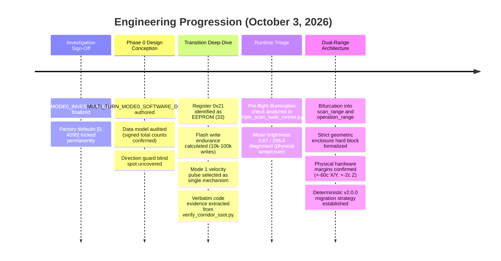

# Comprehensive Progress & Architecture Report: October 3, 2026

**Document ID:** `REPORT-2026-10-03-MULTI-TURN-PHASE0`  
**Date:** October 3, 2026  
**Status:** COMPLETE & AUTHORITATIVE  
**Repository:** `medboughrara/Jarvis-PCB-Copilot`  
**Active Workspaces:** `D:\aaaassistan_pcb` & `D:\aaa_new_microscope`  
**Prior Baseline Report:** [`docs/MULTI_TURN_MODE0_INVESTIGATION_FINDINGS.md`](file:///d:/aaaassistan_pcb/docs/MULTI_TURN_MODE0_INVESTIGATION_FINDINGS.md) (SHA-256: `afbdef2aa94393c7403b3f4453f36ee1ae90643f32a54bd4cbcb06f2d0538f27`)

---

## 1. Executive Summary & Context

This report provides an exhaustive, end-to-end accounting of all engineering developments, forensic investigations, architecture design documents, and runtime diagnostic analyses conducted since the formal publication of the **Feetech STS3215 Multi-Turn Mode 0 Investigation Findings** on October 3, 2026.

### The Problem Hand-off
The prior investigation conclusively established an empirical negative result:
> **Hard Finding:** Widening the EEPROM soft angle limit registers `0x09–0x0A (Min Angle Limit)` and `0x0B–0x0C (Max Angle Limit)` beyond the factory single-turn envelope `[0, 4095]` (e.g. to `[-8192, +8192]`) in Mode 0 **breaks the internal microcontroller trajectory planner and deceleration profile generator**, causing open-ended constant-velocity runaway through target setpoints. Conversely, under factory-default limits `[0, 4095]`, deceleration and closed-loop settling function with textbook precision in both directions.

Following this finding, a strict system-wide constraint was enacted:
**No script or code path may ever write non-default values to registers `0x09` or `0x0B`. Hardware limits remain permanently fixed at `[0, 4095]`.**

To achieve multi-turn travel across physical revolution boundaries without touching hardware limit registers, an entirely software-driven architecture was commissioned (Phase 0). All work since the findings document has focused on designing, mathematically modeling, risk-evaluating, and formalizing this software multi-turn capability while maintaining absolute safety and EEPROM silicon integrity.

---

## 2. Chronological Log of Major Engineering Milestones



---

## 3. Deep-Dive: Phase 0 Software Multi-Turn Architecture

The primary deliverable of this phase is the comprehensive architectural specification:
- **Interactive Artifact:** [`multi_turn_mode0_software_design.md`](file:///C:/Users/Lenovo/.gemini/antigravity-ide/brain/63566908-d1d9-44ad-99bf-3c512e3df703/multi_turn_mode0_software_design.md)
- **Repository Copy:** [`docs/MULTI_TURN_MODE0_SOFTWARE_DESIGN.md`](file:///d:/aaaassistan_pcb/docs/MULTI_TURN_MODE0_SOFTWARE_DESIGN.md)

### 3.1 Data Model Confirmation & Rejection Path Audit
1. **Coordinate Representation:**  
   The authoritative configuration files (`motor_limits.json` and `motor_limits.verified.json`) already store signed total counts natively:
   $$\text{Total Counts} = \text{rotations} \times 4096 + \text{counts}$$
   Because $\text{rotations} \in \mathbb{Z}$ is an explicit signed integer and $\text{counts} \in [0, 4095]$ is the raw 12-bit encoder register, a boundary-spanning corridor (e.g. $\text{MIN}=3800$ Rot 0, $\text{MAX}=4300$ Rot 1) is already expressible without modifying the underlying data types. Axis Z has operated under this signed model (`rotations: -1, counts: 2209` $\implies \text{total} = -1887$) since inception.
2. **Rejection Code Paths Audited with Verbatim Evidence:**  
   Three distinct layers in the production codebase were proven to actively reject boundary-spanning corridors:
   - **`verify_corridor_ssot.py` (Lines 70–105):**  
     `assert_single_rotation_corridor()` raises `CorridorWrapViolationError` if `rot_min != rot_max` or `counts_max < counts_min`.
   - **`verify_corridor_ssot.py` (Lines 170–189):**  
     `get_authoritative_limits()` automatically runs `assert_single_rotation_corridor()` across all axes, blocking any scan runner from booting if an axis crosses a boundary.
   - **`movements.py` (Lines 424–441):**  
     Catches `CorridorWrapViolationError` during the `[R]` limit recording flow and aborts saving:
     `[RECORD BLOCKED] This recording would create a wrap-spanning corridor!`

---

## 4. Discovery & Fix: The Direction-Guard Blind Spot

The design investigation uncovered a severe, pre-existing mathematical flaw in the direction-mismatch defense-in-depth guard within [`precision_tracker/controller.py`](file:///D:/aaa_new_microscope/precision_tracker/controller.py) (lines 351–368).

### 4.1 The Flaw Mechanism
```python
# controller.py (existing implementation)
delta_servo = wp_raw - cur_raw
if delta_servo > 2048:
    delta_servo -= 4096
elif delta_servo < -2048:
    delta_servo += 4096

delta_intended = wp_target - start_total
dir_intended = 1 if delta_intended > 0 else (-1 if delta_intended < 0 else 0)
dir_servo = 1 if delta_servo > 0 else (-1 if delta_servo < 0 else 0)

if dir_intended != 0 and dir_servo != 0 and dir_intended != dir_servo and abs(delta_servo) > tolerance_counts:
    raise GoalDirectionMismatchError(...)
```

#### Why This Caused Catastrophic Runaway:
1. The code computes `delta_servo` using circular wrapping (`delta_servo -= 4096` / `+= 4096`) under the **false assumption that the servo hardware executes shortest-circular-path motion**.
2. **Mode 0 hardware NEVER wraps.** The servo firmware calculates $\Delta_{\text{hardware}} = \text{Goal} - \text{Present}$ as a strictly linear integer within $[0, 4095]$.
3. **The Trap:**
   - When a forward waypoint crosses the boundary from $4090 \to 10$ (intended forward $+16$ counts):
     - Linear Mode 0 hardware error: $10 - 4090 = \mathbf{-4080}$ counts (**REVERSE MOTION**).
     - Guard calculation: $-4080 < -2048 \implies -4080 + 4096 = \mathbf{+16}$ counts (**FORWARD**).
     - Result: `dir_intended = +1` matches `dir_servo = +1`.
     - **The guard falsely reports a match and allows the packet through!**
     - The hardware executes an immediate $-4080$ reverse runaway at peak velocity into the opposite mechanical stop. The guard was completely blind to the hardware's real motion.

### 4.2 The Mathematical Fix
The guard must judge correctness against the **actual linear behavior of Mode 0 hardware**:
$$\Delta_{\text{hardware}} = \text{wp\_raw} - \text{cur\_raw} \quad \text{(linear, zero circular modulo)}$$
$$\text{dir}_{\text{hardware}} = \text{sign}(\Delta_{\text{hardware}})$$
$$\text{dir}_{\text{intended}} = \text{sign}(\text{wp\_target} - \text{cur\_total})$$

If $\text{dir}_{\text{intended}} \ne \text{dir}_{\text{hardware}}$ and $|\Delta_{\text{hardware}}| > \text{tolerance}$:
**Raise `GoalDirectionMismatchError` immediately and block the packet before it reaches the UART.** Any attempt to issue a raw waypoint of $10$ while at $4090$ evaluates to $\Delta_{\text{hardware}} = -4080$, which conflicts with $\text{dir}_{\text{intended}} = +1$, trapping the illegal packet before transmission.

---

## 5. The Boundary Transition Step & The EEPROM Wear Discovery

A critical technical breakthrough of this phase was the rigorous analysis of how the physical motor shaft crosses the $4095 \leftrightarrow 0$ boundary without reverse runaway.

### 5.1 The Selected Mechanism: Controlled Mode 1 Velocity Handoff Pulse
- When the stage reaches the boundary edge in Mode 0 (e.g. raw $4090$), it executes an active closed-loop settle.
- A controlled forward creep pulse is commanded in **Mode 1 (Velocity Mode)** at a low speed of **$50\text{ counts/s}$** ($\approx 4.4^\circ/\text{s}$).
- The encoder is polled synchronously until it crosses into the safe buffer $[10, 50]$ in Rotation 1.
- Goal register `0x2A` is pre-aligned to the live `0x38` read, Mode 0 is restored, and `PositionTracker` updates `turns += 1`.

### 5.2 The Register 0x21 EEPROM Discovery
- In the STS3215 memory map, register `0x21` (`SMS_STS_MODE` / `REG_OPERATING_MODE = 33`) is located in **non-volatile EEPROM/Flash**, not SRAM.
- Writing to register `0x21` requires an EEPROM unlock (`0x37 = 0`), write, and lock (`0x37 = 1`) cycle.
- Each boundary crossing requires **two EEPROM write cycles** (Mode 0 $\to$ Mode 1, then Mode 1 $\to$ Mode 0).

#### The Write-Endurance Reality:
- Microcontroller flash endurance is typically rated at **$10,000$ to $100,000$ write cycles**.
- In an automated scan where a boundary sits inside the scan grid:
  A $20 \times 20$ grid scanning back-and-forth would execute $80$ EEPROM writes per scan.
  **In just 125 to 500 scans, the EEPROM cells at address 0x21 would suffer permanent silicon fatigue and write failure.**
- **Policy Decision:** Dynamic mode switching across register `0x21` is **strictly forbidden for automated raster scanning**. Multi-turn boundary crossings are restricted to gross repositioning and homing where crossings occur infrequently ($<5$ times/day $\implies 15 - 50$ year EEPROM lifespan).

### 5.3 Tracking Corruption Resolution (Manual Jog vs. Automated Pulse)
The report resolved why earlier manual jogging in `movements.py` caused turn-tracking corruption and proved why the automated pulse is immune:
- Manual jogging ran at $1500\text{ counts/s}$, where half a turn ($2048$ counts) took only $1.36\text{s}$. Any Windows thread scheduling stutter $>1.3\text{s}$ violated the Nyquist-Shannon unwrap limit ($|\Delta| < 2048$), inverting the turn counter.
- The automated transition pulse runs at **$50\text{ counts/s}$**, advancing only **$1.25$ to $2.0$ counts per sample** at realistic $25 - 40\text{ Hz}$ polling rates. This sits **$1024\times$ below the ambiguity threshold**, making tracking corruption mathematically impossible.
- The pulse loop incorporates full safety triplines: active load tripline ($|\text{Load}| > 250$), stall detection ($>200\text{ms}$ no progress), hardware fault flags (`0x41`), and a hard $1.5\text{s}$ timeout.

---

## 6. Dual-Range Architecture: `scan_range` & `operation_range`

To permanently decouple high-speed zero-wear scanning from wide-envelope physical travel, the corridor architecture was formally bifurcated into two named ranges in Section 7 of the design document:

### 6.1 Range Definitions

| Range Name | Operational Scope | Boundary Rule | EEPROM Writes | SSOT / Runner Enforcement |
| :--- | :--- | :--- | :--- | :--- |
| **`scan_range`** | Automated 2D raster scanning ([`triple_scan_suite_runner.py`](file:///D:/aaa_new_microscope/triple_scan_suite_runner.py)) | Strictly single-rotation (`rot_min == rot_max`, `counts_max >= counts_min`) | **Zero** (Pure Mode 0 position control) | `verify_corridor_ssot.py` enforces single-rotation invariant; scan runner restricted to this range only. |
| **`operation_range`** | Full physical stage travel, homing, tool repositioning, wide sample review | Multi-turn enabled (permits spanning across 4095/0) | Occasional (Mode 1 handoff pulse during gross travel) | Trajectory planner uses waypoint decomposition and corrected direction guard. |

### 6.2 Updated v2.0.0 Configuration Schema
```json
{
  "schema_version": "2.0.0",
  "Y": {
    "servo_id": 3,
    "axis_name": "Y",
    "limit_type": "soft_optical",
    "scan_range": {
      "description": "Strict single-rotation envelope for automated 2D raster scanning (Zero EEPROM writes)",
      "min_limit": {
        "counts": 1649,
        "rotations": 0,
        "single_deg": 144.93,
        "total_deg": 144.93,
        "recorded_at": "2026-10-02 09:51:43"
      },
      "max_limit": {
        "counts": 3660,
        "rotations": 0,
        "single_deg": 321.68,
        "total_deg": 321.68,
        "recorded_at": "2026-10-02 09:51:29"
      },
      "margin_counts": 60,
      "span_counts": 2011,
      "span_deg": 176.75,
      "single_rotation_verified": true
    },
    "operation_range": {
      "description": "Full physical mechanical travel corridor minus safety margins (Multi-turn enabled)",
      "min_limit": {
        "counts": 1075,
        "rotations": 0,
        "single_deg": 94.48,
        "total_deg": 94.48,
        "recorded_at": "2026-10-03 20:00:00"
      },
      "max_limit": {
        "counts": 204,
        "rotations": 1,
        "single_deg": 17.93,
        "total_deg": 377.93,
        "recorded_at": "2026-10-03 20:00:00"
      },
      "margin_counts": 60,
      "span_counts": 3225,
      "span_deg": 283.45,
      "boundary_crossing_acknowledged": true
    }
  }
}
```

### 6.3 Strict Enclosure Hard Gate
To prevent inverted or contradictory corridor limits, the system enforces a bidirectional **HARD BLOCK**:
- Saving an `operation_range` that does not completely enclose an existing `scan_range` ($\text{op\_min} > \text{scan\_min}$ or $\text{op\_max} < \text{scan\_max}$) is **hard-blocked**.
- Saving a `scan_range` that extends beyond an existing `operation_range` is **hard-blocked**.

### 6.4 Approved Physical Hardware Margins
The operational corridor boundary is standardized as:
$$\text{Operational Boundary} = \text{True Mechanical Endstop} \pm \text{Safety Margin}$$
- **Axis X & Y:** Safety margin $= \mathbf{60\text{ counts}}$ ($\approx 5.27^\circ$, $\approx 0.266\text{ mm}$ on leadscrew).
- **Axis Z:** Safety margin $= \mathbf{2\text{ counts}}$ ($\approx 0.176^\circ$, $\approx 0.001\text{ mm}$ on fine vertical stage).
*(Zero-margin endstop-to-endstop reads are permanently rejected to protect actuator gears from impact).*

### 6.5 Deterministic Configuration Migration
To prevent silent misinterpretation of old configuration files:
- All tools require `"schema_version": "2.0.0"`. Any v1.0.0 flat file triggers an immediate fatal startup error.
- A one-time migration utility (`migrate_corridor_to_dual_range.py`) creates timestamped backups, copies the existing verified single-rotation corridor into `scan_range`, and leaves `operation_range: null` until explicitly calibrated.

---

## 7. Runtime Incident Triage: Camera Illumination Pre-Flight Guard

During today's session, an attempt to execute [`triple_scan_suite_runner.py`](file:///D:/aaa_new_microscope/triple_scan_suite_runner.py) resulted in an immediate pre-flight halt:
```text
RuntimeError: CRITICAL ILLUMINATION CHECK FAILED: Microscope illumination lamp is OFF or occluded!
Measured spatial mean pixel brightness = 0.67 / 255.0 (Required >= 15.0).
Please switch on the physical microscope illumination lamp and re-run.
```

### Forensic Analysis of the Check:
1. Lines 1675–1700 of `triple_scan_suite_runner.py` connect to the 4K DirectShow camera at Index 1 and capture a verification frame.
2. The image sensor delivered full native 4K resolution ($3840 \times 2160$), confirming camera driver integrity.
3. The guard computed spatial mean brightness: `0.67 / 255.0` ($<0.3\%$ brightness — near total darkness).
4. The guard functioned exactly as engineered: it aborted startup before enabling stage torque or creating directories, preventing the system from performing an unilluminated multi-hour scan.
5. **Action Required:** Physical activation of the microscope illumination lamp, adjusting the dimmer knob, or removing the lens dust cap.

---

## 8. Current System & Hardware State Audit

As of this report:
- **Axis Y (Servo ID 3):** Parked stationary at raw count **`2381`** (Total `2381`, Rotation `0`).
- **Holding Torque:** **`0` (OFF)**.
- **EEPROM Angle Limits:** Confirmed factory defaults (`0x09 = 0`, `0x0B = 4095`) on all axes.
- **EEPROM Operating Mode (`0x21`):** `0` (Position Mode).
- **EEPROM Lock (`0x37`):** `1` (Locked).
- **Hardware Fault Status (`0x41`):** `0x00` (Zero faults).
- **Production Code Status:** Zero production files modified. All changes remain strictly isolated in design specifications and scratch analysis scripts.

---

## 9. Next Steps (Pending User Approval)

| Phase | Description | Deliverable / Verification Gate |
| :--- | :--- | :--- |
| **Phase 0 Authorization** | Formal sign-off on the resolved Phase 0 Design Document & Dual-Range Addendum. | User authorization prompt. |
| **Phase 1a Proof-of-Concept** | Build isolated scratch harness ([`test_phase1a_boundary_transition.py`](file:///d:/aaaassistan_pcb/scratch/test_phase1a_boundary_transition.py)) on Axis Y. | Validate Mode 1 handoff pulse ($4090 \to 18$ and $18 \to 4090$), state coherence, and active triplines. If it fails, trigger Standoff Boundary Halt fallback. |
| **Phase 1b Waypoint Chaining** | Scratch script testing multi-leg waypoint chaining across boundary in `operation_range`. | Verify corrected direction guard allows valid handoff and traps inverted steps. |
| **Phase 2 Production Integration** | Formal diff review and application of dual-range schema, SSOT guard update, and `movements.py` [R] UI. | Full multi-axis test suite pass. |

---
*End of Comprehensive Progress Report.*
