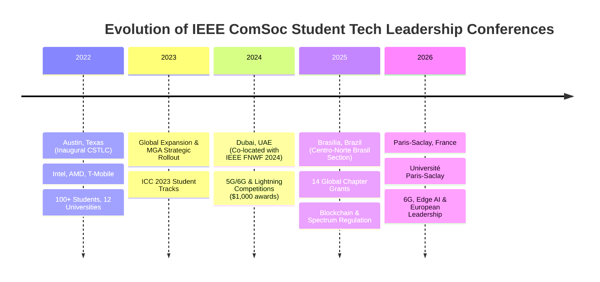

# 📡 IEEE ComSoc Student Tech Leadership Conference (STLC) — Comprehensive Dossier

**Target Initiative**: [IEEE ComSoc Student Tech Leadership Conference](https://www.comsoc.org/engagement-community/students/ieee-comsoc-student-tech-leadership-conference)  
**Parent Organization**: IEEE Communications Society (ComSoc) — Member and Global Activities (MGA)  
**Target Audience**: Undergraduate & Graduate IEEE ComSoc Student Members, Chapter Leaders, Young Professionals, and Researchers.  
**Compiled By**: Jarvis AI Multimodal Engineering Assistant  

---

## 1. Executive Overview & Mission

The **IEEE ComSoc Student Tech Leadership Conference (STLC)** (formerly often referred to as *CSTLC*) is a flagship global student empowerment initiative introduced by the **IEEE Communications Society (ComSoc)** under the leadership of the Member and Global Activities (MGA) council (led by leaders such as VP Ana Garcia Armada and past ComSoc Presidents like Sherman Shen).

### Core Objectives:
1. **Emerging Tech Exploration**: Deep dives into next-generation communications including **6G architecture, AI-driven wireless networks, Open RAN, IoT edge intelligence, and cybersecurity**.
2. **Professional & Soft Skills Development**: Interactive hands-on workshops covering **"Developing the Ninja Resume," "Nailing the Technical Interview," personal branding, and career transition**.
3. **Leadership Training**: Equipping IEEE Student Branch Chapter officers with skills in **volunteer leadership, project management, international grant writing, and global event coordination**.
4. **Industry & Academic Bridges**: Direct, small-group networking between undergraduate/graduate students, IEEE Fellows, university professors, and corporate executives from companies like **Intel, AMD, Ericsson, Nokia, and T-Mobile**.

---

## 2. Chronicle of Editions, Locations & Keynotes

---

### 🏛️ Edition 1: Inaugural CSTLC — Austin, Texas (2022)
* **Date**: Saturday, April 9, 2022
* **Location**: Austin, Texas, USA
* **General Chair & Co-Chairs**: Larry Horner (Intel), Devaki Chandramouli (Nokia Fellow)
* **Industry Sponsors**: AMD, Intel, T-Mobile
* **Scale**: ~100 student attendees representing 12 universities across 4 countries.

#### Keynote Speakers:
* **Lynn Comp** — Corporate Vice President, AMD (*Opening Keynote: Navigating Future Tech Horizons*)
* **Prof. Xuemin (Sherman) Shen** — President, IEEE Communications Society; University of Waterloo (*Closing Keynote: Telecommunication Evolution and ComSoc's Role*)

#### Featured Speakers & Panelists:
* **Mike Murphy** — Chief Technology Officer (CTO), Ericsson North America
* **Prakash Kartha** — Segment Director, Intel
* **Mona Shukla** — Vice President, Ericsson
* **Prof. Ana Garcia Armada** — VP of Member and Global Activities, IEEE ComSoc; Universidad Carlos III de Madrid
* **Fawzi Behmann** — President, TelNete Management; Chair of IEEE Central Texas Section
* **Prof. Nirwan Ansari** — Distinguished Professor, New Jersey Institute of Technology (NJIT); IEEE Fellow
* **Prof. Brian Evans** — Professor, UT Austin; IEEE Fellow
* **Prof. Sandeep Chinchali** — Assistant Professor, UT Austin
* **Raghavan Alevoor** — Senior Manager, Deloitte Consulting

#### Workshops & Small-Group Breakouts:
1. **"Developing the Ninja Resume"** — Led by Laura Reuter & Melissa Fontenette-Mitchell (AMD).
2. **"Nailing the Interview"** — Led by Piotr Weglick (AMD) & Chris Hughes (Intel).
3. **"Your Career 5 Years In"** — Guided by early-career industry engineers.
4. **"Giving Back to the Profession & Global Volunteering"** — Mentored by IEEE ComSoc leadership.
5. **Speed Meet-and-Greet & Fireside Q&A**: Round-robin mentor tables during lunch connecting students with hiring managers.

---

### 🌐 Edition 2: STLC Global — Dubai, UAE (2024)
* **Date**: October 15–17, 2024
* **Location**: Dubai, United Arab Emirates (Co-located with **IEEE Future Networks World Forum — FNWF 2024** and *Connecting the Unconnected Summit — CTUS*)
* **Focus**: 5G-Advanced, 6G Wireless, Open Networks, and Space-Air-Ground Integrated Networks.

#### Highlights & Competitions:
* **ComSoc 5-Minute Lightning Competition**:
  * Global student research pitch competition evaluated on clarity, innovation, and impact.
  * **1st Place Winner**: *"Solar Panel based LC/VLC Receivers for Sustainable Intelligent Transportation Systems"* (by Rahul, Vivek Ashok Bohara, Abhijit Mitra, Deepak Solanki, Anand Srivastava).
  * Awarded $1,000 cash grant and travel recognition.
* **Industry Panels**: Leaders from global telecom operators, standardization bodies (3GPP, ITU), and university research labs.

---

### 🇧🇷 Edition 3: STLC Centro-Norte Brasil — Brasília, Brazil (2025)
* **Date**: October 13–14, 2025
* **Location**: Auditório Esperança Garcia, Faculdade de Direito (FD), Universidade de Brasília (UnB), Campus Darcy Ribeiro, Brasília, Brazil.
* **Organizers**: IEEE ComSoc Student Branch Chapter UnB & IEEE Centro-Norte Brasil Section.
* **Global Context**: Selected as one of **14 host organizations worldwide** under the official ComSoc STLC Global Grant Program.

#### Core Program & Technical Workshops:
* **Technical Sessions**:
  1. *Spectrum Regulation, 5G Standalone & Public Policy in Latin America* (Special guests from ANATEL — National Telecommunications Agency).
  2. *Decentralized Networks, Web3 & Blockchain Applications in Telecommunications*.
  3. *AI/ML in Radio Resource Management*.
* **Leadership & Professional Development**:
  * Strategic management of IEEE Student Branch Chapters.
  * Soft skills, technical pitch delivery, and industry career pathways in South America.

---

### 🇫🇷 Edition 4: STLC France — Paris-Saclay (2026)
* **Date**: November 20, 2026 (07:00 AM – 05:00 PM UTC)
* **Location**: Université Paris-Saclay, 3 Rue Joliot-Curie, 91190 Gif-sur-Yvette, France.
* **Format**: In-person full-day summit with open student admission.

#### Key Focus Pillars:
1. **6G & Sub-THz Wireless**: European 6G flagship initiatives (Hexa-X-II), reconfigurable intelligent surfaces (RIS), and semantic communications.
2. **AI & Edge Computing in Telco**: Distributed intelligence, TinyML, and energy-efficient green communications.
3. **European Tech Career Pathways**: Direct recruitment talks with French and European deep-tech laboratories (CNRS, Inria, Nokia Bell Labs Paris-Saclay, Thales).
4. **Leadership Hackathon**: Team-based problem solving on organizing impactful university tech conferences.

---

## 3. How to Apply & Host an STLC Chapter Grant

IEEE ComSoc periodically releases **Calls for Proposals** for Student Branch Chapters to host funded STLC editions:
* **Eligibility**: Active IEEE ComSoc Student Branch Chapters in good standing.
* **Grant Support**: Financial sponsorship from ComSoc MGA for venue logistics, keynote travel support, and student award prizes.
* **Proposal Requirements**: Proposed agenda, target student attendance, industry partner commitments, workshop outlines, and budget breakdown.
* **Official Portal**: [IEEE ComSoc Student Programs Portal](https://www.comsoc.org/engagement-community/students/ieee-comsoc-student-tech-leadership-conference).
