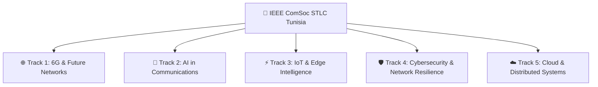
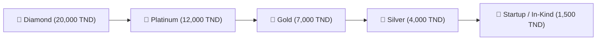
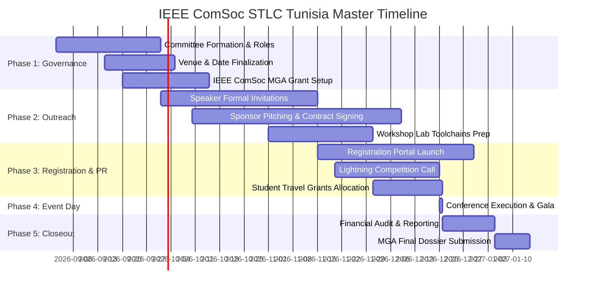

# 🇹🇳 IEEE ComSoc Student Tech Leadership Conference (STLC) — Tunisia Edition
## 🚀 Comprehensive Master Plan, Speaker Directory, Workshop Curriculum & Sponsorship Strategy

**Initiative**: IEEE Communications Society (ComSoc) Student Tech Leadership Conference (STLC) — Tunisia Edition  
**Host Organization**: IEEE ComSoc Tunisia Chapter & University Student Branch Chapters (Sup'Com / ENIT / INSAT)  
**Parent Body**: IEEE ComSoc Member and Global Activities (MGA) Council  
**Location**: Tunis, Tunisia  
**Target Attendance**: 200–250 Undergraduate, Master’s, and PhD Student Members, Young Professionals, and Researchers from across Tunisia & the Maghreb region.  
**Compiled By**: Jarvis AI Multimodal Engineering Assistant  

---

## 📑 Table of Contents
1. [Executive Summary & Strategic Vision](#1-executive-summary--strategic-vision)
2. [The 5 Technical Tracks](#2-the-5-technical-tracks)
3. [Global & National Speaker Master Directory](#3-global--national-speaker-master-directory)
4. [Hands-On Technical Workshop Curricula](#4-hands-on-technical-workshop-curricula)
5. [Corporate Sponsorship Strategy & Prospect Matrix](#5-corporate-sponsorship-strategy--prospect-matrix)
6. [Formal Sponsorship Outreach Email Template](#6-formal-sponsorship-outreach-email-template)
7. [5-Phase Notion Project Work Breakdown Structure (WBS)](#7-5-phase-notion-project-work-breakdown-structure-wbs)
8. [Generated Datasets & CSV Exports](#8-generated-datasets--csv-exports)

---

## 1. Executive Summary & Strategic Vision

The **IEEE ComSoc Student Tech Leadership Conference (STLC) — Tunisia Edition** brings the premier global student conference of the IEEE Communications Society to North Africa. Following successful international editions in **Austin (USA, 2022)**, **Dubai (UAE, 2024)**, **Brasília (Brazil, 2025)**, and **Paris-Saclay (France, 2026)**, this conference empowers student engineers, builds leadership capabilities, bridges the academia-industry gap, and positions Tunisia as a regional hub for telecommunications and AI innovation.

### Core Value Pillars:
* **World-Class Technical Depth**: Keynotes and panels from global IEEE Fellows and top Tunisian researchers.
* **Hands-on Skill Acquisition**: 5 parallel technical workshops on industry-standard open-source tools (Open5GS, Sionna, Edge Impulse, Suricata, Kubernetes).
* **5-Minute Student Lightning Pitch Competition**: High-stakes student research competition with a **$1,000 top cash prize**.
* **Direct Employer Recruitment**: Speed mentoring lunches and exhibition booths with top telecom operators and tech multinational corporations.
* **Regional Inclusion**: Dedicated travel grants enabling student participation from interior university engineering hubs (Sfax, Sousse, Monastir, Gabes, Gafsa).

---

## 2. The 5 Technical Tracks



1. **6G & Future Networks**: Terahertz communications, Reconfigurable Intelligent Surfaces (RIS), Open RAN, non-terrestrial networks (NTN/satellite), and 3GPP Rel-19/20 evolution.
2. **AI in Communications**: Deep Reinforcement Learning for RAN scheduling, generative AI for channel estimation, semantic communications, and neural receiver modeling.
3. **IoT & Edge Intelligence**: TinyML, ultra-low power embedded systems (ESP32/STM32/Zephyr), space IoT/CubeSats, and smart agriculture/city sensors.
4. **Cybersecurity & Network Resilience**: Zero-Trust telecom core security, eBPF high-speed packet filtering, 5G network slicing isolation, and intrusion detection for autonomous systems.
5. **Cloud & Distributed Systems**: Cloud-native 5G/6G core virtualization, multi-cluster Kubernetes edge orchestration, service mesh (Istio), and low-latency microservices.

---

## 3. Global & National Speaker Master Directory

| # | Track | Speaker Name | Title & Affiliation | Country | Proposed Keynote / Presentation Title | Contact Email | LinkedIn Profile |
| :- | :--- | :--- | :--- | :--- | :--- | :--- | :--- |
| **1** | **6G & Future Networks** | **Prof. Mérouane Debbah** | Professor at Khalifa University; Former Director of Huawei Mathematical Lab / TII; IEEE Fellow | UAE / France | *Towards 6G: Telecommunications in the Era of AI and Large Language Models* | `merouane.debbah@ku.ac.ae` | [Profile](https://linkedin.com/in/merouanedebbah) |
| **2** | **6G & Future Networks** | **Dr. Devaki Chandramouli** | Nokia Fellow; Head of North American Standardization, Nokia | USA | *6G Architecture Evolution and 3GPP Standardization Roadmap* | `devaki.chandramouli@nokia.com` | [Profile](https://linkedin.com/in/devaki-chandramouli) |
| **3** | **6G & Future Networks** | **Prof. Ammar Bouallegue** | Professor & Founder of SysCom Lab, ENIT (National Engineering School of Tunis) | Tunisia | *Future Terahertz & Reconfigurable Intelligent Surfaces (RIS) in North Africa* | `ammar.bouallegue@enit.utm.tn` | [Profile](https://linkedin.com/in/ammar-bouallegue) |
| **4** | **AI in Communications** | **Prof. Melike Erol-Kantarci** | Canada Research Chair in AI-Enabled Wireless Networks, Univ. of Ottawa; IEEE Fellow | Canada | *Generative AI and Deep Reinforcement Learning for Self-Optimizing 6G RAN* | `melike.erolkantarci@uottawa.ca` | [Profile](https://linkedin.com/in/melikeerolkantarci) |
| **5** | **AI in Communications** | **Karim Beguir** | CEO & Co-Founder, InstaDeep (BioNTech Subsidiary) | Tunisia / UK | *Scaling Decision-Making AI from Enterprise to Communication Infrastructure* | `k.beguir@instadeep.com` | [Profile](https://linkedin.com/in/karimbeguir) |
| **6** | **AI in Communications** | **Prof. Sofiène Affes** | Director of INRS-EMT Wireless Lab, Montreal; IEEE Fellow | Canada / TN | *Machine Learning for Massive MIMO Beamforming and Signal Estimation* | `sofiene.affes@inrs.ca` | [Profile](https://linkedin.com/in/sofiene-affes) |
| **7** | **IoT & Edge Intelligence** | **Prof. Falko Dressler** | Chair for Telecommunication Networks, TU Berlin; IEEE Fellow | Germany | *Cooperative Vehicular Edge Computing and Cyber-Physical Networking* | `dressler@ccs-labs.org` | [Profile](https://linkedin.com/in/falkodressler) |
| **8** | **IoT & Edge Intelligence** | **Mohamed Frikha** | CEO, Telnet Holding (Space & Embedded IoT Subsystems) | Tunisia | *Nano-Satellite Constellations & IoT Connectivity for the Global South* | `m.frikha@groupe-telnet.net` | [Profile](https://linkedin.com/in/mohamedfrikha) |
| **9** | **IoT & Edge Intelligence** | **Prof. Rabah Attia** | Professor at Sup'Com (Higher School of Communications of Tunis) | Tunisia | *TinyML and Ultra-Low Power Edge Sensors for Precision Agriculture & Smart Cities* | `rabah.attia@supcom.tn` | [Profile](https://linkedin.com/in/rabah-attia) |
| **10**| **Cybersecurity & Resilience**| **Prof. Elisa Bertino** | Samuel D. Conte Professor of Computer Science, Purdue University; ACM/IEEE Fellow | USA | *Zero-Trust Architecture and Threat Defense for 5G/6G Core Networks* | `bertino@purdue.edu` | [Profile](https://linkedin.com/in/elisa-bertino) |
| **11**| **Cybersecurity & Resilience**| **Dr. Jalel Ben Othman** | Professor at Univ. of Paris-Saclay / CentraleSupélec; IEEE ComSoc Distinguished Lecturer | France / TN | *Security Protocols and Intrusion Detection in Connected Autonomous Vehicles* | `jalel.ben-othman@centralesupelec.fr` | [Profile](https://linkedin.com/in/jalel-ben-othman) |
| **12**| **Cybersecurity & Resilience**| **Eng. Maher Amami** | Head of Cyber Threat Intelligence & CSIRT Lead, ANSI Tunisia | Tunisia | *National Cyber Resilience: Mitigating Critical Infrastructure Telecom Attacks* | `maher.amami@ansi.tn` | [Profile](https://linkedin.com/in/maheramami) |
| **13**| **Cloud & Distributed Systems**| **Prof. Raouf Boutaba** | Director of David R. Cheriton School of CS, Univ. of Waterloo; IEEE Fellow | Canada / TN | *Network Softwarization, Cloud-Native Virtualization, and Intent-Driven Slicing* | `rboutaba@uwaterloo.ca` | [Profile](https://linkedin.com/in/raouf-boutaba) |
| **14**| **Cloud & Distributed Systems**| **Moez Gouiaa** | Lead Cloud Solutions Architect, Orange Cloud & Data North Africa | Tunisia / FR| *Multi-Cloud Orchestration, Kubernetes Telco Edge, and Microservice Slicing* | `moez.gouiaa@orange.com` | [Profile](https://linkedin.com/in/moezgouiaa) |
| **15**| **Cloud & Distributed Systems**| **Dr. Slim Rekik** | Senior Director of Cloud Architecture, Vermeg Financial Software | Tunisia | *High-Throughput Distributed Microservices and Resilient Cloud Mesh Architectures* | `srekik@vermeg.com` | [Profile](https://linkedin.com/in/slimrekik) |

---

## 4. Hands-On Technical Workshop Curricula

### 🛠️ Workshop 1: Private 5G Core Networks & End-to-End RAN Emulation
* **Track**: 6G & Future Networks
* **Duration**: 3.0 Hours
* **Prerequisites**: Basic Linux navigation, TCP/IP fundamentals, Python basics.
* **Toolchain**: Open5GS, UERANSIM, Wireshark, Docker Compose.
* **Hands-on Student Exercise**:
  1. Deploy a complete 5G Standalone (SA) software core (AMF, SMF, UPF, NRF, UDR, UDM) via Docker containers.
  2. Instantiate emulated 5G gNodeB base stations and User Equipment (UE) using UERANSIM.
  3. Establish an active PDU session, execute data traffic routing, and capture live 3GPP NGAP/NAS signaling traffic in Wireshark.

### 🛠️ Workshop 2: Deep Reinforcement Learning for Wireless Resource Allocation
* **Track**: AI in Communications
* **Duration**: 2.5 Hours
* **Prerequisites**: Python, PyTorch / TensorFlow, Linear algebra.
* **Toolchain**: PyTorch, Sionna (NVIDIA 6G Link-Level Simulator), Google Colab.
* **Hands-on Student Exercise**:
  1. Model an orthogonal frequency-division multiplexing (OFDM) channel with multipath fading in Sionna.
  2. Implement and train a Deep Q-Network (DQN) and Proximal Policy Optimization (PPO) agent to allocate subcarrier power and beamforming weights.
  3. Benchmark AI dynamic allocation against conventional round-robin and water-filling algorithms.

### 🛠️ Workshop 3: Real-Time TinyML Deployment on Low-Power Microcontrollers
* **Track**: IoT & Edge Intelligence
* **Duration**: 3.0 Hours
* **Prerequisites**: C/C++, Embedded microcontroller basics.
* **Toolchain**: Edge Impulse Studio, TensorFlow Lite for Microcontrollers (TFLM), ESP32 / STM32 Nucleo boards, Zephyr RTOS.
* **Hands-on Student Exercise**:
  1. Ingest real-time IMU accelerometer and microphone sensory waveforms.
  2. Extract spectral DSP features and train an ultra-compact INT8 quantized convolutional neural network.
  3. Compile and flash the quantized model into an ESP32 firmware running inference with $<30\text{KB}$ RAM consumption.

### 🛠️ Workshop 4: Threat Hunting & 5G Slicing Security with Suricata and eBPF
* **Track**: Cybersecurity & Network Resilience
* **Duration**: 2.5 Hours
* **Prerequisites**: Linux shell, networking protocols, Wireshark.
* **Toolchain**: Suricata IDS/IPS, eBPF (BCC / Cilium), Kali Linux.
* **Hands-on Student Exercise**:
  1. Simulate adversary brute-force, signaling flood, and rogue slice impersonation attacks against virtualized network functions.
  2. Analyze pcap logs and write customized Suricata detection rules.
  3. Write and load in-kernel eBPF packet inspection programs to drop malicious packets at the network card driver layer with near-zero CPU overhead.

### 🛠️ Workshop 5: Cloud-Native Microservices & Kubernetes Service Mesh at the Telco Edge
* **Track**: Cloud & Distributed Systems
* **Duration**: 3.0 Hours
* **Prerequisites**: Docker basics, Git, YAML configuration.
* **Toolchain**: Kubernetes (K3s/Minikube), Istio Service Mesh, Helm, Prometheus & Grafana.
* **Hands-on Student Exercise**:
  1. Containerize distributed Python/Go telecom microservice micro-APIs.
  2. Deploy an Istio ingress gateway with dynamic traffic splitting (Canary 90/10 deployment).
  3. Configure distributed tracing and observe real-time latency anomalies in Prometheus and Grafana dashboards.

---

## 5. Corporate Sponsorship Strategy & Prospect Matrix

### 💎 Tiered Sponsorship Packages & Benefits



| Sponsorship Tier | Contribution (TND) | Key Deliverables & Benefits |
| :--- | :--- | :--- |
| **Diamond / Title** | 20,000 TND | Exclusive *"Powered by [Company]"* title branding, 30-min Plenary Keynote slot, 3x3m premium booth, direct resume database access (250+ students), 10 VIP passes, logo on all event lanyards and awards. |
| **Platinum** | 12,000 TND | Exclusive Naming Rights for the **5-Minute Student Lightning Competition** ($1,000 grand prize sponsor), 20-min plenary talk, 2x2m booth, resume database, 6 VIP passes, logo on main stage backdrop. |
| **Gold** | 7,000 TND | Workshop Host sponsor (lead 1 technical workshop), 2x2m exhibition stand, resume database, 4 VIP passes, logo on official conference website and roll-up banners. |
| **Silver** | 4,000 TND | Exhibition stand, company flyer insertion in attendee welcome packs, logo on website and social media campaigns, 2 VIP passes. |
| **Startup / Academic** | 1,500 TND | Demo kiosk booth in startup alley, logo on website, 2 attendee passes. |

---

### 🏢 Priority Sponsorship Target Accounts

| Company | Tier Target | Category | Target Contact Role | Contact Email | Phone Office | Key Value Proposition Pitch |
| :--- | :--- | :--- | :--- | :--- | :--- | :--- |
| **Tunisie Telecom** | Diamond / Title | National Telecom Operator | Head of Corporate Partnerships & Talent Acquisition | `partenariats@tunisietelecom.tn` | +216 71 860 000 | National employer branding, talent acquisition of top 200 telecom/AI engineers, exclusive keynote on 5G rollout. |
| **Ooredoo Tunisia** | Platinum | Telecom & 5G Leader | Director of Innovation & Brand Sponsorship | `sponsoring@ooredoo.tn` | +216 22 123 123 | Showcase Ooredoo 5G Lab & Cloud data centers; exclusive sponsor of 5-Minute Student Lightning Competition. |
| **Orange Tunisie & ODC** | Platinum | Telecom & Tech Incubator | Head of Orange Digital Center (ODC) | `orangedigitalcenter@orange.tn`| +216 31 100 000 | Host tech workshops, direct pipeline for ODC developer academy, hackathon prize partner. |
| **Telnet Holding** | Gold | Space Tech & Embedded IoT | Chief Technology Officer / Space Division | `contact@groupe-telnet.net` | +216 71 860 233 | Promote CubeSat / Space IoT initiative (Challenge One) and recruit embedded hardware/firmware engineers. |
| **InstaDeep (BioNTech)**| Gold | Advanced AI & Biotech | Head of Community, Academia & Talent EMEA | `community@instadeep.com` | +216 71 860 900 | Lead AI in Communications track, showcase Deep Reinforcement Learning for telecom networks. |
| **Ericsson North Africa**| Gold | Global Telecom Vendor | Head of Customer Unit North Africa & HR | `tunisia.recruitment@ericsson.com`| +216 71 182 000| Global ComSoc corporate partner, showcase Open RAN & 6G research initiatives. |
| **Nokia North Africa** | Gold | Global Infrastructure | Regional Director & University Relations | `university.relations@nokia.com` | +216 71 130 500 | Global STLC patron; sponsor student travel grants and Bell Labs innovation talks. |
| **Huawei Tunisia** | Gold | Global ICT & Cloud | Public Relations & ICT Academy Director | `ict_tunisia@huawei.com` | +216 71 100 800 | Integrate Huawei ICT Academy competitions, certified lab hardware showcase. |
| **ACTIA Engineering** | Silver | Automotive Telematics | HR Director & University Partnership Manager | `recrutement@actia-engineering.tn`| +216 71 165 000 | Automotive connected V2X systems and telematics talent pipeline. |
| **Sofrecom Tunisia** | Silver | Telecom Consulting & Cloud | Head of Talent Acquisition & Digital Transformation| `recrutement@sofrecom.com` | +216 71 161 600 | Cloud native and 5G network software engineering recruitment. |
| **Vermeg** | Silver | FinTech & Cloud Architecture | Campus Management & CSR | `careers@vermeg.com` | +216 71 190 000 | Cloud microservices, DevOps, and cybersecurity student talent pipeline. |
| **SAGEMCOM Tunisia** | Silver | Broadband & Smart Energy | University Relations & R&D Center Lead | `drh.tunisie@sagemcom.com` | +216 71 860 111 | Hardware PCB, RF engineering, and smart meter IoT device design hiring. |

---

## 6. Formal Sponsorship Outreach Email Template

```text
Subject: Partnership Opportunity: IEEE ComSoc Student Tech Leadership Conference (STLC) — Tunisia Edition

Dear [Mr./Ms. Contact Name / Talent Acquisition Team],

On behalf of the IEEE Communications Society (ComSoc) and the Organizing Committee, we have the honor to invite [Company Name] to become an official Corporate Partner of the inaugural IEEE ComSoc Student Tech Leadership Conference (STLC) — Tunisia Edition, taking place in Tunis.

Selected by the IEEE ComSoc Member and Global Activities (MGA) Council as one of only 14 official host organizations worldwide, the STLC is the premier international gathering for the next generation of telecommunications, AI, and cloud leaders.

Event Highlights:
• 250+ Top Student Engineers & Researchers from leading institutions (Sup'Com, ENIT, INSAT, ENIS, ENISO, ESPRIT).
• 5 Cutting-Edge Tracks: 6G & Future Networks, AI in Communications, IoT & Edge Intelligence, Cybersecurity & Resilience, and Cloud & Distributed Systems.
• Global & National Keynotes from IEEE Fellows, Nokia Bell Labs, Ericsson, and leading research laboratories.
• 5 Hands-on Technical Workshops and the flagship 5-Minute Student Lightning Competition.

Why Partner with IEEE ComSoc STLC Tunisia?
1. Direct Access to Top Talent: Receive complete CV books of graduating engineers and engage with top candidates during dedicated Speed Mentoring sessions.
2. Premium Brand Exposure: Prominent visibility across IEEE global channels, national press, physical stage backdrops, and technical exhibition booths.
3. Industry Thought Leadership: Deliver a keynote address or host an interactive technical workshop showcasing your company's latest technology stack.

We have attached the detailed Partnership Brochure outlining our Diamond, Platinum, Gold, and Silver sponsorship packages. We would be delighted to schedule a brief 15-minute call this week to discuss how we can tailor this partnership to align with your corporate recruitment and innovation goals.

Thank you for your leadership in advancing technology in Tunisia and North Africa.

Warm regards,

[Your Name]
General Chair, IEEE ComSoc Student Tech Leadership Conference (STLC) — Tunisia Edition
IEEE Communications Society Tunisia Chapter
Email: [Your Email] | Phone: [Your Phone]
Website: https://www.comsoc.org/engagement-community/students/ieee-comsoc-student-tech-leadership-conference
```

---

## 7. 5-Phase Notion Project Work Breakdown Structure (WBS)



### Detailed Task Breakdown:

#### 🔹 Phase 1: Organizing Committee & Governance (Month -6 to -4)
- **Task 1.1**: Appoint Executive Committee: General Chair, Technical Program Chair (TPC), Finance & Sponsorship Chair, Logistics & Venue Lead, PR & Media Lead.
- **Task 1.2**: Secure University Host Venue (e.g. Sup'Com / ENIT Amphitheater) with 250-seat plenary hall and 5 computer lab breakout rooms.
- **Task 1.3**: Establish bank account and financial oversight with IEEE Tunisia Section Treasurer for ComSoc MGA grant disbursement.

#### 🔹 Phase 2: Sponsorship Outreach & Speaker Confirmation (Month -4 to -2)
- **Task 2.1**: Send formal outreach dossiers to 12 target corporate partners (Tunisie Telecom, Ooredoo, Orange, Telnet, InstaDeep, Ericsson, Nokia, Huawei, ACTIA, Sofrecom, Vermeg, SAGEMCOM).
- **Task 2.2**: Secure written confirmations for 15 Global & National Keynote speakers across the 5 tracks.
- **Task 2.3**: Finalize instructor guide and software/cloud prerequisites for all 5 hands-on workshops.

#### 🔹 Phase 3: Registration, Student Grants & PR Campaign (Month -2 to -1)
- **Task 3.1**: Deploy registration portal with IEEE Member discount and early-bird ticketing.
- **Task 3.2**: Announce the **5-Minute Student Lightning Competition** and recruit an international evaluation jury.
- **Task 3.3**: Launch application process for **30 Regional Student Travel Grants** (covering inter-city train/bus & accommodation for students from Sfax, Sousse, Monastir, Gabes, Gafsa).

#### 🔹 Phase 4: Event Day Execution (Day 0)
- **08:00 – 09:00**: Welcome Breakfast, Badge Pickup, and Sponsor Exhibition Opening.
- **09:00 – 09:30**: Opening Ceremony & Address by IEEE ComSoc MGA Leadership.
- **09:30 – 11:00**: Plenary Keynote Sessions: 6G Future Networks & Scalable AI in Telecom.
- **11:00 – 11:30**: Networking Coffee Break & VIP Sponsor Tour.
- **11:30 – 13:00**: Plenary Keynote Sessions: IoT Edge Intelligence, Cybersecurity, and Cloud Systems.
- **13:00 – 14:30**: Speed Mentoring Networking Lunch & Sponsor Career Fair.
- **14:30 – 17:30**: **5 Parallel Hands-on Technical Workshops** (Rooms A through E).
- **14:30 – 16:30**: **5-Minute Student Lightning Pitch Competition Finals**.
- **17:30 – 18:30**: Awards Ceremony ($1,000 Grand Prize Winner Announcement), Closing Address & Gala Reception.

#### 🔹 Phase 5: Post-Conference Reporting & Grant Closeout (Week +1 to +3)
- **Task 5.1**: Conduct complete financial balance sheet audit with IEEE Tunisia Section.
- **Task 5.2**: Submit final attendee demographic and technical report to IEEE ComSoc MGA.
- **Task 5.3**: Publish photo gallery, high-definition session recordings, and attendee survey analytics.

---

## 8. Generated Datasets & CSV Exports

All datasets have been compiled and exported to the `docs/` directory for direct import into Google Sheets, Excel, or Airtable:

1. 👥 **Speakers Master Directory**: [`docs/STLC_Tunisia_Speakers_Master_List.csv`](file:///d:/aaaassistan_pcb/docs/STLC_Tunisia_Speakers_Master_List.csv) (15 global/national keynotes with bios, emails & LinkedIn).
2. 💼 **Sponsorship Prospects Matrix**: [`docs/STLC_Tunisia_Sponsors_Prospects.csv`](file:///d:/aaaassistan_pcb/docs/STLC_Tunisia_Sponsors_Prospects.csv) (12 corporate accounts, contacts, phones & value propositions).
3. 🛠️ **Workshops Curriculum**: [`docs/STLC_Tunisia_Workshops_Curriculum.csv`](file:///d:/aaaassistan_pcb/docs/STLC_Tunisia_Workshops_Curriculum.csv) (5 detailed 3-hour technical syllabi).
4. 📓 **Notion Live Sync**: Synchronized to Notion workspace page: *"IEEE ComSoc STLC Tunisia 2026 — Master Plan & Work Roadmap"*.
