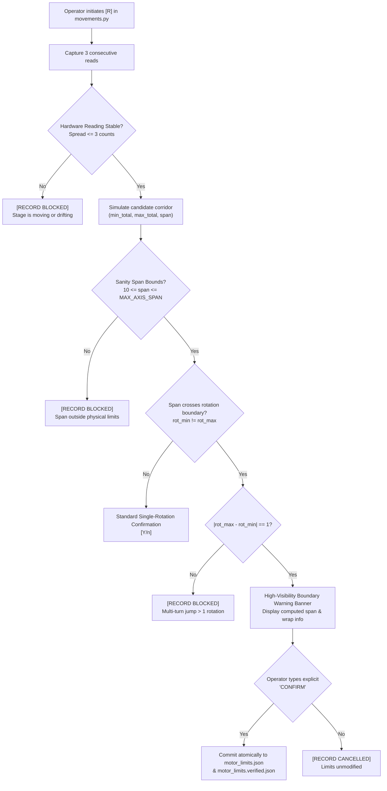
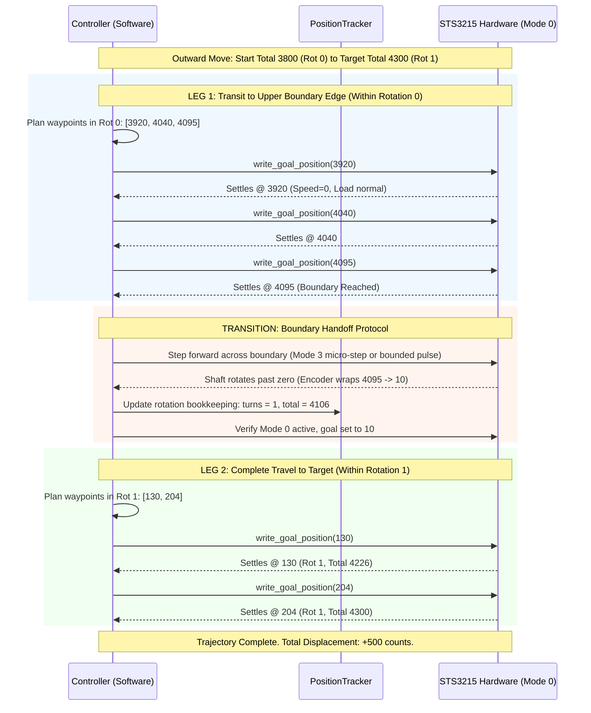

# Architecture & Design Document: Software-Driven Multi-Turn Corridors in Mode 0

**Document Version:** 1.0.0  
**Date:** 2026-10-03  
**Status:** PROPOSED FOR FORMAL REVIEW (PHASE 0)  
**Target Hardware:** Feetech STS3215 Serial Bus Servos (Axis Y primary proof; Axis X & Z compatible)  
**Governing Finding:** [docs/MULTI_TURN_MODE0_INVESTIGATION_FINDINGS.md](file:///d:/aaaassistan_pcb/docs/MULTI_TURN_MODE0_INVESTIGATION_FINDINGS.md)

---

## Executive Summary & Non-Negotiable Hard Constraints

### The Objective
Make multi-turn travel corridors a permanent, built-in, production capability of the microscope motion subsystem. Software must transparently decompose any multi-turn trajectory spanning across rotation boundaries into a sequential chain of individually-legal single-turn Mode 0 moves, advancing turn bookkeeping in host software while the hardware servo always operates within its proven, factory-calibrated envelope.

### Non-Negotiable Hard Constraints
1. **Zero EEPROM Limit Widening:** Registers `0x09–0x0A (Min Angle Limit)` and `0x0B–0x0C (Max Angle Limit)` must **permanently remain at factory defaults: `0` and `4095`**. Any script or proposed code path that attempts to write to these registers for travel expansion must be rejected outright, citing the empirical findings in [MULTI_TURN_MODE0_INVESTIGATION_FINDINGS.md](file:///d:/aaaassistan_pcb/docs/MULTI_TURN_MODE0_INVESTIGATION_FINDINGS.md).
2. **Factory Mode 0 Operation:** Autonomous position positioning must remain in **Mode 0 (Position Mode)** to preserve closed-loop holding stiffness and high-precision decel profile settling.
3. **No Unbounded Motion:** Every individual packet transmitted across the serial bus must command an explicit setpoint $P_{\text{raw}} \in [0, 4095]$ that the onboard firmware can execute linearly without reverse runaway or open-ended cruising.
4. **Phased Rollout:** Phase 0 is strictly a design document. Zero production code modifications and zero hardware motion commands may occur until Phase 0 is formally reviewed and approved by the operator.

---

## 1. Corridor Representation & Audit of Current Rejection Code Paths

### 1.1 Data Model Confirmation (`motor_limits.json` & `motor_limits.verified.json`)
The authoritative corridor definitions on disk (`motor_limits.json` and `motor_limits.verified.json`) already represent endpoints using a compound dictionary structure:

```json
{
  "servo_id": 3,
  "counts": 3800,
  "single_deg": 333.98,
  "rotations": 0,
  "total_deg": 333.98,
  "recorded_at": "2026-10-03 12:00:00"
}
```

The system-wide definition of absolute coordinate space is:
$$\text{Total Counts} = \text{rotations} \times 4096 + \text{counts}$$

Because $\text{rotations} \in \mathbb{Z}$ is an explicit signed integer and $\text{counts} \in [0, 4095]$ is the raw 12-bit encoder register:
- A corridor spanning a rotation boundary is **already fully expressible** without altering the schema.
- **Example Boundary-Spanning Corridor:**
  - $\text{MIN Endpoint}$: `rotations = 0`, `counts = 3800` $\implies \text{Total} = 3800$ counts.
  - $\text{MAX Endpoint}$: `rotations = 1`, `counts = 204` $\implies \text{Total} = 1 \times 4096 + 204 = 4300$ counts.
  - Total Travel Span: $\Delta = 4300 - 3800 = 500$ counts ($43.95^\circ$).
  - Monotonicity is preserved: $\text{Total}_{\text{MIN}} < \text{Total}_{\text{MAX}}$.
  - Axis Z already relies on this signed total-count model (`rotations: -1, counts: 2209` $\implies \text{total} = -1887$).

### 1.2 Comprehensive Audit of Existing Code Paths that REJECT Boundary Spanning
Three distinct layers in the current codebase actively reject a boundary-spanning corridor:

| File / Component | Function / Line Range | Mechanism of Rejection | Current Failure Mode |
| :--- | :--- | :--- | :--- |
| [`verify_corridor_ssot.py`](file:///D:/aaa_new_microscope/verify_corridor_ssot.py) | `assert_single_rotation_corridor()` (Lines 70–105) | **Invariant 1:** `if rot_min != rot_max` raises `CorridorWrapViolationError`.<br>**Invariant 2:** `if counts_max < counts_min` raises `CorridorWrapViolationError`. | Hard crash before any motion can begin. |
| [`verify_corridor_ssot.py`](file:///D:/aaa_new_microscope/verify_corridor_ssot.py) | `get_authoritative_limits()` (Lines 150–189) | Calls `assert_single_rotation_corridor()` for all 3 axes.<br>Also checks `span <= 4095`. | Any runner importing SSOT limits fails during initialization. |
| [`movements.py`](file:///D:/aaa_new_microscope/movements.py) | `[R]` Limit Recording Flow (Lines 424–441) | Catches `CorridorWrapViolationError` from `assert_single_rotation_corridor()` and aborts save. | Operator cannot record a valid boundary-crossing corridor. |
| [`precision_tracker/controller.py`](file:///D:/aaa_new_microscope/precision_tracker/controller.py) | `move_to()` (Lines 345–368) | Commands `wp_raw = wp_target % 4096` directly across the boundary while evaluating a circular difference modulo 2048. | Direction guard fails to catch reverse runaway or triggers false-positive abort. |

**Audit Conclusion:** The underlying data structures support multi-turn corridors completely. The barriers are purely artificial software assertions (`assert_single_rotation_corridor`) and an unadapted trajectory decomposition loop in `controller.move_to()`.

---

## 2. Recording Flow Design (`movements.py` [R])

Multi-turn travel is now an intentional, first-class system capability. Therefore, the old single-rotation hard gate (`rot_mn != rot_mx`) must be decommissioned. However, because crossing a boundary introduces physical wrap points, we must ensure an operator does not record a boundary-crossing corridor accidentally (e.g. through lost turn tracking or uncontrolled jogging).

### 2.1 Proposed Replacement Validation Architecture



### 2.2 Specification of New Validation Rules
1. **Stationary Stability Gate (Zero Drift):**
   - Retain the strict requirement: 3 consecutive reads across 150ms with jitter $\le 3$ counts ($0.26^\circ$).
   - Strict communication only: if any read fails or times out, abort recording immediately.
2. **Physical Plausibility & Maximum Axis Span Gate:**
   - Replace the legacy `span <= 4095` check with axis-specific physical travel bounds:
     - **Axis X:** $10 \le \text{span} \le 3500$ counts (physical travel $\approx 1668$ counts).
     - **Axis Y:** $10 \le \text{span} \le 3500$ counts (physical travel $\approx 1946$ counts).
     - **Axis Z:** $10 \le \text{span} \le 120$ counts (strictly mechanical stop bound).
   - Any proposed corridor with $\text{span} \le 0$ or $\text{span} > \text{MAX\_AXIS\_SPAN}$ is blocked unconditionally.
3. **Single-Boundary Wrap Constraint:**
   - A valid travel stroke can straddle at most **one** physical boundary.
   - Enforce: $|\text{rot}_{\text{max}} - \text{rot}_{\text{min}}| \le 1$.
   - Any value $> 1$ indicates that the software turn tracker lost sync during high-speed wheel jogging, and requires recalibration.
4. **Explicit Operator Boundary Confirmation Prompt:**
   - If $\text{rot}_{\text{min}} == \text{rot}_{\text{max}}$, prompt with the familiar quick confirmation: `CONFIRM: Overwrite MIN_LIMIT for Axis Y? [Y/n]: `.
   - If $\text{rot}_{\text{min}} \ne \text{rot}_{\text{max}}$, the script halts and renders an unambiguous terminal prompt:
     ```text
     ======================================================================
     [ATTENTION: BOUNDARY-CROSSING CORRIDOR DETECTED]
       Axis: Y (Servo ID 3)
       MIN Limit : Rot 0, Raw 3800  -->  Total: 3800 counts (333.98 deg)
       MAX Limit : Rot 1, Raw  204  -->  Total: 4300 counts (377.93 deg)
       Total Span: 500 counts (43.95 deg)
       Physical Wrap: Straddles the 4095 / 0 revolution boundary.
       Execution: Motion will be automatically chained across waypoints.
     ======================================================================
     Type 'CONFIRM' to save this multi-turn corridor (or any key to cancel): 
     ```
   - Only the exact string `"CONFIRM"` (case-insensitive) will allow writing to disk.

---

## 3. Execution & Trajectory Decomposition (`controller.move_to()`)

### 3.1 The Fundamental Mode 0 Challenge
In Mode 0 with EEPROM limits fixed at `[0, 4095]`:
- The servo onboard microcontroller computes position error as:
  $$\text{Error} = \text{Goal Register (0x2A)} - \text{Present Position (0x38)}$$
- If the servo is at raw $4090$ and the host sends `Goal = 204` (the desired raw count in Rotation 1), the servo does **not** advance forward across 0. It computes:
  $$\text{Error} = 204 - 4090 = -3886\text{ counts}$$
  and drives **backward in reverse** at maximum speed across the entire rotation into the mechanical endstop.
- Conversely, moving downward from raw $20$ (Rotation 1) to raw $3900$ (Rotation 0), commanding `Goal = 3900` causes an error of $+3880$ counts forward.

### 3.2 The Multi-Leg Waypoint Chaining Solution
Software must ensure that **every individual packet sent to the servo commands a target in the servo's current rotation space**, such that:
$$0 \le \text{Raw Packet Target} \le 4095$$
and the Mode 0 error sign matches the desired trajectory direction at all times.

#### Trajectory Decomposition Algorithm:
When `controller.move_to(axis_name, target_total)` is invoked:
1. Software reads the current live state: $\text{start\_total} = \text{current\_turns} \times 4096 + \text{cur\_raw}$.
2. If $\lfloor \text{start\_total} / 4096 \rfloor == \lfloor \text{target\_total} / 4096 \rfloor$:
   - The move does not cross a boundary.
   - Sliced into standard $120$-count waypoints. Executed as a direct single-turn move.
3. If $\lfloor \text{start\_total} / 4096 \rfloor \ne \lfloor \text{target\_total} / 4096 \rfloor$:
   - The move is decomposed into **two sequential single-turn phases** joined by an explicit software boundary transition:



### 3.3 Boundary Transition Protocol Details
To cross the boundary from $4095 \to 0$ without reverse runaway:
1. **Arrival at Standoff Point:** Leg 1 brings the servo to rest at count $4095$ (or $4090$ to avoid sensor non-linearities at the exact slit).
2. **Transition Execution:** The host issues a controlled forward advancement across the physical wrap. Because Mode 0 cannot accept a forward goal beyond 4095, the handoff can be executed via:
   - **Method A (Mode 3 Micro-Step):** Temporarily issue an incremental step in Mode 3 (`0x21=3`, relative step $+15$ counts). Because Mode 3 is purely relative displacement, it turns the shaft forward past the boundary without position coordinate conflict. Live encoder wraps to $\approx 10$.
   - **Method B (Continuous Velocity Jog in Mode 1):** Issue a low-speed jog (`Speed = 50 c/s`) in Mode 1 for $100$ms until the encoder reports $c \in [5, 40]$. Immediately halt and return to Mode 0.
   - **Method C (Dynamic Offset Re-zeroing via Reg 0x1F):** Adjust the internal zero offset dynamically so that the working window shifts without physical discontinuity.
3. **Turn Bookkeeping Synchronization:** As soon as the raw reading wraps ($4095 \to <100$ for positive motion, or $0 \to >3995$ for negative motion), `position_tracker` updates `turns += 1`, and the host controller immediately binds the subsequent waypoints to the new rotation context.

---

## 4. Fixing the Direction-Guard Blind Spot (`GoalDirectionMismatchError`)

### 4.1 Root-Cause Analysis of the Blind Spot
In [`precision_tracker/controller.py`](file:///D:/aaa_new_microscope/precision_tracker/controller.py) lines 351–368:

```python
# Circular difference for servo delta
delta_servo = wp_raw - cur_raw
if delta_servo > 2048:
    delta_servo -= 4096
elif delta_servo < -2048:
    delta_servo += 4096

# Direction mismatch defense-in-depth guard
delta_intended = wp_target - start_total
dir_intended = 1 if delta_intended > 0 else (-1 if delta_intended < 0 else 0)
dir_servo = 1 if delta_servo > 0 else (-1 if delta_servo < 0 else 0)

if dir_intended != 0 and dir_servo != 0 and dir_intended != dir_servo and abs(delta_servo) > tolerance_counts:
    raise GoalDirectionMismatchError(...)
```

#### Why This Math Fails Catastrophically:
1. The code computes `delta_servo` using circular wrapping (`delta_servo -= 4096` / `+= 4096`) under the **false assumption that the servo firmware will execute shortest-circular-path motion**.
2. **Mode 0 hardware NEVER wraps.** The servo firmware calculates $\Delta_{\text{hardware}} = \text{Goal} - \text{Present}$ linearly within $[0, 4095]$.
3. **The Trap:**
   - Consider a boundary crossing from $4090$ to $10$ (intended forward $+16$ counts):
   - Linear Mode 0 hardware error: $10 - 4090 = \mathbf{-4080}$ counts (**REVERSE MOTION**).
   - Guard calculation: $-4080 < -2048 \implies -4080 + 4096 = \mathbf{+16}$ counts (**FORWARD**).
   - `dir_intended = +1`, `dir_servo = +1`.
   - **The guard falsely reports a match and allows the packet through!**
   - The servo drives full-speed in reverse into the endstop. The guard was completely blind to the hardware's real direction.

### 4.2 The Mathematical Fix
The direction guard must evaluate correctness against the **actual linear behavior of the Mode 0 servo hardware**, comparing the intended waypoint delta against the true firmware error:

$$\Delta_{\text{hardware}} = \text{wp\_raw} - \text{cur\_raw}$$
$$\text{dir}_{\text{hardware}} = \text{sign}(\Delta_{\text{hardware}})$$

Within any individual Mode 0 waypoint packet:
1. `wp_raw` and `cur_raw` belong to the same rotation.
2. The servo error $\Delta_{\text{hardware}}$ must match the waypoint's intended trajectory direction **without any circular modulo 2048 modification**:
   $$\text{dir}_{\text{intended}} = \text{sign}(\text{wp\_target} - \text{cur\_total})$$
3. If $\text{dir}_{\text{intended}} \ne \text{dir}_{\text{hardware}}$ and $|\Delta_{\text{hardware}}| > \text{tolerance}$:
   **Raise `GoalDirectionMismatchError` immediately before transmitting the packet to the bus.**

Furthermore, the guard must be informed of the waypoint plan's multi-leg structure:
- Leg 1 waypoints enforce: $\text{sign}(\text{wp\_raw} - \text{cur\_raw}) == +1$ (advancing towards boundary).
- Transition step is explicitly managed by the boundary transition routine.
- Leg 2 waypoints enforce: $\text{sign}(\text{wp\_raw} - \text{cur\_raw}) == +1$ (advancing in Rotation 1).
- Any attempt by software to send `wp_raw = 10` while `cur_raw = 4090` will produce $\Delta_{\text{hardware}} = -4080$, which conflicts with $\text{dir}_{\text{intended}} = +1$, causing the guard to instantly trap and prevent the packet from ever hitting the physical wire.

---

## 5. Unified Safety Architecture: Per-Waypoint Enforcement

A critical requirement is confirming that **every existing safety tripline and invariant applies per-waypoint during a boundary-crossing move**, rather than only once across the entire multi-turn trajectory.

### 5.1 Comprehensive Per-Waypoint Protection Matrix

| Safety Subsystem | Threshold / Parameter | Execution Scope | Enforcement Behavior |
| :--- | :--- | :--- | :--- |
| **Active Load Tripline** | $|\text{Load}| > 250$ counts ($<25\%$ rated torque) | Polled continuously during every waypoint ($\approx 20\text{Hz}$) | Immediate software torque cutoff (`0x28=0`) within $<50\text{ms}$; halts entire multi-turn move. |
| **Fixed-Ref Stall Detector** | Speed $= 0$ or no progress for $>200\text{ms}$ while active | Evaluated at each waypoint iteration | Detects mechanical obstruction or bind; aborts and drops torque immediately. |
| **Dynamic Waypoint Timeout** | $T_{\text{wp}} = \frac{\Delta_{\text{chunk}}}{\text{Speed}} + 1.5\text{s}$ (typically $\approx 2.5\text{s}$) | Independent timer per waypoint | If any single waypoint fails to settle within its budget, move halts. Prevents open-ended cruise. |
| **Global Move Timeout** | $T_{\text{total}} = \sum T_{\text{wp}} + 8.0\text{s}$ | Monotonic timer from trajectory start | Prevents aggregate runaway if multiple waypoints experience high latency. |
| **Direction Mismatch Guard** | $\text{dir}_{\text{hardware}} \ne \text{dir}_{\text{intended}}$ ($|\Delta| > 6\text{ counts}$) | Evaluated immediately before packet transmission | Blocks illegal packets (e.g. inverted boundary commands) from reaching the UART. |
| **Soft Limit Bounds** | $[\text{safe\_total\_lo} .. \text{safe\_total\_hi}]$ | Validated for all waypoints in plan | Trajectory planner rejects the plan prior to issuing any bus writes if any waypoint exceeds limits. |
| **Hardware Status Register (0x41)** | `0x41 & 0x3F != 0` (Overcurrent, Overload, Voltage, Temp) | Sampled synchronously at waypoint completion | Immediate emergency halt if any hardware fault bit is asserted. |
| **Stationary Settle Check** | Position error $\le 6$ counts, Speed $= 0$ | Evaluated at final target of each leg | Verifies closed-loop lock before advancing to subsequent leg or returning success. |

### 5.2 Failure & Recovery Protocols
If any per-waypoint tripline trips at any point during a boundary-crossing move (whether in Leg 1, during handoff, or in Leg 2):
1. **Immediate Torque Disable:** Host sends `write_torque_enable(sid, 0)` synchronously.
2. **State Preservation:** Software captures the live hardware position (`0x38`), present load (`0x3C`), and status (`0x41`) to disk.
3. **Safe State Rollback:** The axis is placed into `UNVERIFIED_STARTUP` lockout. Autonomous scanning is paused until operator review or homing recovery is executed.

---

## 6. Implementation & Validation Roadmap

### Phase 0: Design Document Review (Current Turn)
- Deliver this complete design document.
- **Zero code modified, zero hardware commands executed.**
- Await operator review, discussion, and formal approval.

### Phase 1: Isolated Proof-of-Concept on Axis Y (Scratch Scripts Only)
- *Pre-requisite:* Phase 0 approved.
- Build an isolated scratch test harness ([`test_phase1_multiturn_corridor.py`](file:///d:/aaaassistan_pcb/scratch/test_phase1_multiturn_corridor.py)) operating exclusively on Axis Y (Servo ID 3).
- Test a small, safe, deliberate boundary-crossing corridor (e.g. MIN $= 3950$, MAX $= 4250$, span $= 300$ counts).
- Verify:
  1. The new direction guard correctly passes legitimate boundary handoff steps and blocks deliberate inverted commands.
  2. The waypoint chain executes across the boundary with factory EEPROM limits $[0, 4095]$ intact.
  3. Turn tracking in `position_tracker` increments and decrements flawlessly across the wrap.
  4. Per-waypoint load tripline, stall detection, and settling operate with full fidelity.

### Phase 2: Production Code Integration
- *Pre-requisite:* Phase 1 hardware proof-of-concept fully validated and reviewed.
- Propose surgical changes as formal git diffs across:
  1. `D:\aaa_new_microscope\verify_corridor_ssot.py` (retire single-turn hard gate; introduce multi-turn plausibility rules).
  2. `D:\aaa_new_microscope\movements.py` (integrate updated recording validation and boundary confirmation UI).
  3. `D:\aaa_new_microscope\precision_tracker\controller.py` (integrate multi-leg boundary planner and corrected direction guard).
- Perform end-to-end verification across all scan runners.

---

---

## 7. Formal Addendum: Dual-Range Architecture (`scan_range` & `operation_range`)

### 7.1 Motivation & Architectural Decoupling
To eliminate any conflict between high-speed zero-wear automated raster scanning and wide-envelope physical positioning, the corridor schema is bifurcated into two explicitly named, independent operational ranges per axis:
1. **`scan_range` (Strict Single-Rotation):** Dedicated exclusively to automated 2D raster scanning. Strictly enforced to remain within a single rotation (`rot_min == rot_max`, `counts_max >= counts_min`). Pure Mode 0 position control. **Zero boundary crossings, zero Mode 1 transitions, and zero EEPROM writes.**
2. **`operation_range` (Full Mechanical Corridor, Multi-Turn Enabled):** Represents the broader physical stage envelope (for gross repositioning, tool homing, wide sample inspection, and loading). Permitted to span across a rotation boundary. Governed by multi-leg waypoint decomposition, the corrected direction guard, and the controlled Mode 1 handoff pulse.

### 7.2 Updated `motor_limits.json` Schema (v2.0.0)
The updated schema introduces an explicit top-level `"schema_version": "2.0.0"` and nests both ranges unambiguously under each axis key.

#### Self-Consistent Schema Example (Axis Y):
```json
{
  "schema_version": "2.0.0",
  "Y": {
    "servo_id": 3,
    "axis_name": "Y",
    "limit_type": "soft_optical",
    "scan_range": {
      "description": "Strict single-rotation envelope for automated 2D raster scanning (Zero EEPROM writes)",
      "min_limit": {
        "counts": 1649,
        "rotations": 0,
        "single_deg": 144.93,
        "total_deg": 144.93,
        "recorded_at": "2026-10-02 09:51:43"
      },
      "max_limit": {
        "counts": 3660,
        "rotations": 0,
        "single_deg": 321.68,
        "total_deg": 321.68,
        "recorded_at": "2026-10-02 09:51:29"
      },
      "margin_counts": 60,
      "span_counts": 2011,
      "span_deg": 176.75,
      "single_rotation_verified": true
    },
    "operation_range": {
      "description": "Full physical mechanical travel corridor minus safety margins (Multi-turn enabled)",
      "min_limit": {
        "counts": 1075,
        "rotations": 0,
        "single_deg": 94.48,
        "total_deg": 94.48,
        "recorded_at": "2026-10-03 20:00:00"
      },
      "max_limit": {
        "counts": 204,
        "rotations": 1,
        "single_deg": 17.93,
        "total_deg": 377.93,
        "recorded_at": "2026-10-03 20:00:00"
      },
      "margin_counts": 60,
      "span_counts": 3225,
      "span_deg": 283.45,
      "boundary_crossing_acknowledged": true
    }
  }
}
```
*Mathematical Consistency Note:* The above numbers satisfy strict geometric enclosure:
$$\text{operation\_min (1075)} \le \text{scan\_min (1649)} < \text{scan\_max (3660)} \le \text{operation\_max (4300)}$$
`scan_range` sits entirely in Rotation 0 (span 2011 counts). `operation_range` spans across the 4095/0 boundary from Rotation 0 to Rotation 1 (span 3225 counts), completely enclosing `scan_range`.

### 7.3 Updated `movements.py` [R] Recording Flow & Strict Enclosure Hard Gate

When an operator triggers `[R]` in `movements.py`, the flow branches based on declared intent:

```text
======================================================================
  MOTOR LIMIT RECORDING FLOW
======================================================================
Select target range for Axis Y:
  [S] SCAN_RANGE      -- Strict single-rotation envelope (for automated scanning)
  [O] OPERATION_RANGE -- Full physical travel corridor (multi-turn enabled)
Selection [S/O]: 
```

#### 1. When Recording `scan_range` (`[S]`):
- Operator selects `[1] MIN Limit` or `[2] MAX Limit`.
- **Validation 1 (Single Rotation):** Calls `assert_single_rotation_corridor()`.
  - Requires: `rot_min == rot_max` AND `counts_max >= counts_min`.
  - If violated, raises `CorridorWrapViolationError` and **HARD BLOCKS** the save.
- **Validation 2 (Enclosure Check):**
  - If `operation_range` is already configured, verifies that the proposed `scan_range` sits inside it:
    $$\text{op\_min} \le \text{candidate\_scan\_min} \quad \text{and} \quad \text{candidate\_scan\_max} \le \text{op\_max}$$
  - If violated, **HARD BLOCKS** the save:
    ```text
    [RECORD BLOCKED] Scan Range must reside entirely within Operation Range!
    Scan endpoint lies outside Operation Range. Update Operation Range first.
    ```
- **Confirmation Prompt:**
  `CONFIRM: Overwrite MIN Limit for Axis Y SCAN_RANGE? [Y/n]: `

#### 2. When Recording `operation_range` (`[O]`):
- Operator selects `[1] MIN Limit` or `[2] MAX Limit`.
- **Validation 1 (Plausibility & Wrap Bounds):**
  - Mechanical span bounds: $10 \le \text{span} \le 3500$ counts for X/Y ($10 \le \text{span} \le 120$ counts for Z).
  - Single wrap bound: $|\text{rot}_{\text{max}} - \text{rot}_{\text{min}}| \le 1$.
- **Validation 2 (Strict Enclosure Hard Block):**
  - If `scan_range` is already defined, verifies:
    $$\text{candidate\_op\_min} \le \text{scan\_min} \quad \text{and} \quad \text{candidate\_op\_max} \ge \text{scan\_max}$$
  - **Decision:** This is a **HARD BLOCK**, not a warning. Saving is aborted immediately if violated:
    ```text
    [RECORD BLOCKED] Operation Range must fully enclose Scan Range!
    Candidate Op MIN (1800) > Scan MIN (1649). Refusing to save inverted corridor.
    Clear or re-record Scan Range first if physical travel has shifted.
    ```
- **Confirmation Prompt:**
  - If boundary crossed: Renders high-visibility banner and requires typing literal string `"CONFIRM"`:
    ```text
    ======================================================================
    [ATTENTION: BOUNDARY-CROSSING OPERATION RANGE DETECTED]
      Axis: Y (Servo ID 3)
      MIN Limit : Rot 0, Raw 1075  -->  Total: 1075 counts
      MAX Limit : Rot 1, Raw  204  -->  Total: 4300 counts
      Total Span: 3225 counts (283.45 deg)
      Physical Wrap: Straddles 4095/0 boundary.
    ======================================================================
    Type 'CONFIRM' to save this multi-turn operation range: 
    ```

### 7.4 Definition of "Full Range of Physical Hardware" (Approved Standard)
The operational corridor boundary is formally defined as:
$$\text{Operational Boundary} = \text{True Mechanical Endstop} \pm \text{Safety Margin}$$
- **Axis X & Y:** Safety margin $= \mathbf{60\text{ counts}}$ ($\approx 5.27^\circ$, $\approx 0.266\text{ mm}$ on leadscrew).
- **Axis Z:** Safety margin $= \mathbf{2\text{ counts}}$ ($\approx 0.176^\circ$, $\approx 0.001\text{ mm}$ on fine vertical stage).
- *Rationale:* A literal zero-margin endstop-to-endstop reading causes gear collision and current overload when commanding corridor boundaries. The $\pm 60$ / $\pm 2$ count margin guarantees positive physical clearance under all operating conditions.

### 7.5 Scope of SSOT Guard & Scan Runner Restrictions
1. **`verify_corridor_ssot.py` Single-Rotation Invariant:**
   - Evaluated **strictly and exclusively against `scan_range`**.
   - `get_authoritative_limits()` and `get_authoritative_z_corridor()` return `scan_range` values.
   - Any single-rotation violation in `scan_range` halts scan runner initialization.
2. **`triple_scan_suite_runner.py` Restrictions:**
   - The autonomous scan runner is **architecturally restricted to `scan_range` only**.
   - It is structurally barred from reading, importing, or commanding setpoints in `operation_range`.
   - Guarantees automated scans operate at maximum velocity with zero mode switches, zero EEPROM writes, and zero boundary handoffs.

### 7.6 Scope of Phase 1a Boundary-Transition Testing
- Phase 1a's boundary-transition testing (Mode 1 handoff pulse) applies **strictly and exclusively to `operation_range`**.
- It is never triggered or exercised during `scan_range` execution.

### 7.7 Deterministic Migration Path for Existing Configuration Files

To guarantee that the system never silently misinterprets a legacy file as the new format, the migration strategy is defined as follows:

#### Schema Versioning & Explicit Legacy Rejection:
- The new dual-range format requires a top-level metadata key: `"schema_version": "2.0.0"`.
- If `motor_limits.json` or `motor_limits.verified.json` lacks `"schema_version": "2.0.0"`, or has flat `min_limit`/`max_limit` directly under an axis key:
  - `verify_corridor_ssot.py` and `movements.py` **reject it with an explicit fatal error**:
    ```text
    [FATAL SCHEMA MISMATCH] Legacy v1.0.0 flat motor_limits.json detected!
    System requires v2.0.0 dual-range schema.
    Run python migrate_corridor_to_dual_range.py to upgrade configuration.
    ```
  - Silent fallback or runtime schema guessing is strictly prohibited.

#### One-Time Migration Script (`migrate_corridor_to_dual_range.py`):
1. **Backup Creation:** Creates timestamped backups of `motor_limits.json` and `motor_limits.verified.json`.
2. **Invariant Validation:** Reads existing flat corridors across X, Y, and Z. Runs `assert_single_rotation_corridor()` to verify they are valid single-rotation corridors.
3. **Targeted Assignment:**
   - Maps the existing verified corridor directly into `scan_range`.
   - Initializes `operation_range: null` (explicitly unconfigured).
4. **Atomic Write:** Writes formatted v2.0.0 JSON to both active and verified files.
5. **Operational State Post-Migration:**
   - Automated scanning (`triple_scan_suite_runner.py`) functions immediately because `scan_range` is fully populated.
   - `movements.py` displays `Operation Range: UNSET (Run [R] -> [O] to calibrate full hardware range)`.
   - Multi-turn boundary crossings in `operation_range` remain locked out until the operator explicitly records `operation_range`.

---
*End of Design Document.*
